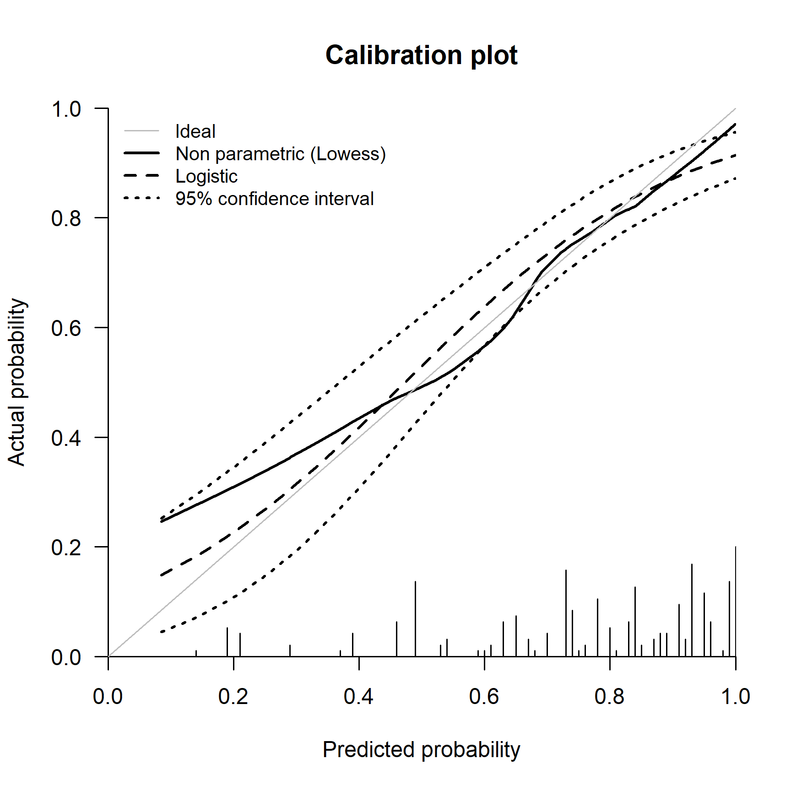

Validation of logistic regression risk prediction models
================

-   [Steps](#steps)
    -   [Installing and loading packages and import
        data](#installing-and-loading-packages-and-import-data)
    -   [Data description](#data-description)
        -   [Descriptive statistics](#descriptive-statistics)
-   [Goal 1 - Assessing performance of a logistic regression risk
    prediction
    model](#goal-1---assessing-performance-of-a-logistic-regression-risk-prediction-model)
    -   [1.1 Estimate the predicted probabilities in the validation
        data](#11-estimate-the-predicted-probabilities-in-the-validation-data)
    -   [1.1 Discrimination](#11-discrimination)
    -   [2.2 Calibration](#22-calibration)
        -   [2.2.1 Mean calibration](#221-mean-calibration)
        -   [2.2.2 Weak calibration](#222-weak-calibration)
        -   [2.2.3 Moderate calibration](#223-moderate-calibration)
    -   [2.3 Overall performance
        measures](#23-overall-performance-measures)
-   [Goal 2 - Clinical utility](#goal-2---clinical-utility)
-   [Reproducibility ticket](#reproducibility-ticket)

## Steps

The steps taken in this file are:  
1. To assess the performance of the model in terms of calibration,
discrimination and overall prediction error in a new independent
(external) data.  
2. To assess the potential clinical utility the model using decision
curve analysis.

### Installing and loading packages and import data

The following libraries are used in this file, the code chunk below will
a) check whether you already have them installed, b) install them for
you if not already present, and c) load the packages into the session.

``` r
# Use pacman to check whether packages are installed, if not load
if (!require("pacman")) install.packages("pacman")
library(pacman)

pacman::p_load(
  rio,
  rms,
  riskRegression,
  plotrix,
  knitr,
  splines,
  kableExtra,
  gtsummary,
  boot,
  tidyverse,
  rsample,
  gridExtra,
  webshot
)

# Import data ------------------
vdata <- readRDS(here::here("Data/vdata.rds"))
```

### Data description

Men with metastatic non-seminomatous testicular cancer can often be
cured nowadays by cisplatin based chemotherapy. After chemotherapy,
surgical resection is a generally accepted treatment to remove remnants
of the initial metastases, since residual tumor may still be present. In
the absence of tumor, resection has no therapeutic benefits, while it is
associated with hospital admission, and risks of permanent morbidity and
mortality. Logistic regression models were developed to predict the
presence of residual tumor, combining well-known predictors, such as the
histology of the primary tumor, pre-chemotherapy levels of tumor
markers, and (reduction in) residual mass size.  
The risk prediction model was developed in 544 patients using logistic
regression with 5 predictors.

We externally validated the 5 predictor model in 273 patients from a
tertiary referral center (vdata) using the results (i.e., the
coefficients) of the developed model. We illustrate ways to assess the
usefulness of a model in a new setting.

More details about development and validation data are provided in the
manuscript [“Assessing the performance of prediction models: a framework
for some traditional and novel
measures”](https://www.ncbi.nlm.nih.gov/pmc/articles/PMC3575184/) by
Steyerberg et al. (2010).

#### Descriptive statistics

<table class="table table-striped" style="margin-left: auto; margin-right: auto;">
<thead>
<tr>
<th style="text-align:left;">
Characteristic
</th>
<th style="text-align:left;">
N = 273
</th>
</tr>
</thead>
<tbody>
<tr>
<td style="text-align:left;">
Residual tumor at postchemotherapy resection
</td>
<td style="text-align:left;">
197 (72%)
</td>
</tr>
<tr>
<td style="text-align:left;">
Primary tumor teratoma positive
</td>
<td style="text-align:left;">
169 (62%)
</td>
</tr>
<tr>
<td style="text-align:left;">
Elevated prechemotherapy AFP
</td>
<td style="text-align:left;">
205 (75%)
</td>
</tr>
<tr>
<td style="text-align:left;">
Elevated Prechemotherapy HCG
</td>
<td style="text-align:left;">
198 (73%)
</td>
</tr>
<tr>
<td style="text-align:left;">
Square root of postchemotherapy mass size (mm)
</td>
<td style="text-align:left;">
</td>
</tr>
<tr>
<td style="text-align:left;padding-left: 2em;" indentlevel="1">
Mean (SD)
</td>
<td style="text-align:left;">
7.79 (3.08)
</td>
</tr>
<tr>
<td style="text-align:left;padding-left: 2em;" indentlevel="1">
Median (Range)
</td>
<td style="text-align:left;">
8.02 (1.41, 17.32)
</td>
</tr>
<tr>
<td style="text-align:left;">
Reduction in mass size per 10%
</td>
<td style="text-align:left;">
</td>
</tr>
<tr>
<td style="text-align:left;padding-left: 2em;" indentlevel="1">
Mean (SD)
</td>
<td style="text-align:left;">
1 (6)
</td>
</tr>
<tr>
<td style="text-align:left;padding-left: 2em;" indentlevel="1">
Median (Range)
</td>
<td style="text-align:left;">
1 (-15, 10)
</td>
</tr>
</tbody>
</table>

## Goal 1 - Assessing performance of a logistic regression risk prediction model

Here we evaluate the performance of the prediction model in terms of
discrimination, calibration and overall prediction error.

### 1.1 Estimate the predicted probabilities in the validation data

Logistic regression is used to predict the class (or category) of
individuals based on one or multiple predictor variables (X). It is used
to model a binary outcome, that is a variable, which can have only two
possible values: 0 or 1, yes or no, diseased or non-diseased.  
The standard logistic regression function, for predicting the outcome of
an observation given a predictor variable X), is:


By a bit of manipulation, it can be demonstrated that, the formula
becomes a linear combination of predictors:


<details>
<summary>
Click to expand code
</summary>

``` r
# Design matrix of predictors
des_matr <- as.data.frame(model.matrix(~ 
                                         ter_pos + 
                                         preafp +
                                         prehcg + 
                                         sqpost + 
                                         reduc10,
                                       data = vdata))

# Coefficients of the developed model
coeff <- c(-0.302, 0.995, 0.859, 0.554, 0.074, -0.264)
# Linear predictor and the estimated predicted probability
# in the validation data
vdata$lp <- as.vector(as.matrix(des_matr) %*% cbind(coeff))
vdata$pred <- exp(vdata$lp) / (1 + exp(vdata$lp))
```

</details>

### 1.1 Discrimination

We here calculate:

-   The c-statistic: it is a rank order statistic for predictions
    against true outcomes. The concordance (c) statistic is the most
    commonly used performance measure to indicate the discriminative
    ability of generalized linear regression models. For a binary
    outcome, c is identical to the area under the Receiver Operating
    Characteristic (ROC) curve, which plots the sensitivity (true
    positive rate) against 1 – (false positive rate) for consecutive
    cutoffs for the probability of an outcome. Accurate predictions
    discriminate between those with and those without the outcome.

-   Discrimination slope: it can be used as a simple measure for how
    well subjects with and without the outcome are separated. It is
    calculated as the absolute difference in average predictions for
    those with and without the outcome. Visualization is readily
    possible with a box plot or a histogram, which will show less
    overlap between those with and those without the outcome for a
    better discriminating model.

More details are in [“Assessing the performance of prediction models: a
framework for some traditional and novel
measures”](https://www.ncbi.nlm.nih.gov/pmc/articles/PMC3575184/) by
Steyerberg et al. (2010);

<details>
<summary>
Click to expand code
</summary>

``` r
# C-index
source(here::here('Functions/c_stat_ci.R'))

# External validation
val_vdata <- rcorr.cens(
  x = vdata$pred, 
  S = vdata$tum_res)

c_val <- c_stat_ci(val_vdata)

# Discrimination slope
# Load function to calculate discrimination slope
source(here::here('Functions/discr_slope_vdata.R'))

dslope_vdata <- discr_slope(pred = vdata$pred,
                            y = vdata$tum_res)

# Bootstrap confidence intervals for discrimination slope
set.seed(2022)
vboot <- bootstraps(vdata, B = 1000)

# Modify the function using the name of the variables
# indicating the estimated predicted probability 
# (in this case vdata$pred) and the binary outcome
# (in this case vdata$tum_res)
dslope_boot <- function(split) {
  discr_slope(pred = analysis(split)$pred,
         y = analysis(split)$tum_res)
}
vboot <- vboot |>
  mutate(dslope = map_dbl(splits, dslope_boot))
```

</details>
<table class="table table-striped" style="margin-left: auto; margin-right: auto;">
<thead>
<tr>
<th style="empty-cells: hide;border-bottom:hidden;" colspan="1">
</th>
<th style="border-bottom:hidden;padding-bottom:0; padding-left:3px;padding-right:3px;text-align: center; " colspan="3">

<div style="border-bottom: 1px solid #ddd; padding-bottom: 5px; ">

External validation

</div>

</th>
</tr>
<tr>
<th style="text-align:left;">
</th>
<th style="text-align:right;">
Estimate
</th>
<th style="text-align:right;">
Lower .95
</th>
<th style="text-align:right;">
Upper .95
</th>
</tr>
</thead>
<tbody>
<tr>
<td style="text-align:left;">
C-statistic
</td>
<td style="text-align:right;">
0.78
</td>
<td style="text-align:right;">
0.73
</td>
<td style="text-align:right;">
0.84
</td>
</tr>
<tr>
<td style="text-align:left;">
Discrimination slope
</td>
<td style="text-align:right;">
0.24
</td>
<td style="text-align:right;">
0.18
</td>
<td style="text-align:right;">
0.28
</td>
</tr>
</tbody>
</table>

C-statistic was 0.78 (95% CI: 0.73-0.84) in the validation data.
Discrimination slope was 0.24 (95% CI: 0.18-0.28).

### 2.2 Calibration

Calibration refers to the agreement between observed outcomes and
predictions. For example, if we predict a 20% risk of residual tumor for
a testicular cancer patient, the observed frequency of tumor should be
approximately 20 out of 100 patients with such a prediction.

Different level of calibration can be estimated: mean, weak, and
moderate calibration according to the calibration hierarchy defined by
Van Calster et
al. [here](https://www.sciencedirect.com/science/article/pii/S0895435615005818).

#### 2.2.1 Mean calibration

Mean calibration refers how systematically the model might under- or
over- predicts the actual risk.

The mean calibration can be estimated:

-   using the Observed and Expected ratio. The observed number of events
    is the sum of the events (or cases) present in the data. The
    expected is estimated summing the predicted probability of the event
    estimated by the model. Ratio equals to 1 indicates perfect (mean)
    calibration, values lower or greater than 1 indicate over- and
    under- prediction, respectively.

-   calibration intercept (or calibration-in-the-large): indicates the
    extent that predictions are systematically too low or too high.

<details>
<summary>
Click to expand code
</summary>

``` r
# Calibration-in-the-large
vdata$y <- as.numeric(vdata$tum_res) - 1 # convert outcome to numeric
cal_intercept <- glm(y  ~ offset(lp), 
                     family = binomial,
                     data = vdata)
intercept_CI <- confint(cal_intercept) # confidence intervals

# Observed/Expected ratio
Obs <- sum(vdata$y)
Expct <- sum(vdata$pred)

OE <- Obs / Expct
```

</details>

    ## Waiting for profiling to be done...

<table class="table table-striped" style="margin-left: auto; margin-right: auto;">
<thead>
<tr>
<th style="text-align:left;">
</th>
<th style="text-align:right;">
Estimate
</th>
<th style="text-align:right;">
Lower .95
</th>
<th style="text-align:right;">
Upper .95
</th>
</tr>
</thead>
<tbody>
<tr>
<td style="text-align:left;">
Calibration intercept
</td>
<td style="text-align:right;">
-0.03
</td>
<td style="text-align:right;">
-0.34
</td>
<td style="text-align:right;">
0.29
</td>
</tr>
<tr>
<td style="text-align:left;">
O/E ratio
</td>
<td style="text-align:right;">
0.99
</td>
<td style="text-align:right;">
0.86
</td>
<td style="text-align:right;">
1.14
</td>
</tr>
</tbody>
</table>

Both calibration intercept and O/E ratio showed good mean calibration.
The prediction model did not systematically over or underestimate the
actual risk.

#### 2.2.2 Weak calibration

The term ‘weak’ refers to the limited flexibility in assessing
calibration. We are essentially summarizing calibration of the observed
proportions of outcomes versus predicted probabilities using only two
parameters i.e. a straight line. In other words, perfect weak
calibration is defined as mean calibration ratio and calibration slope
of unity(or calibration intercept equals to zero). The calibration slope
indicates the overall strength of the linear predictor (LP), which can
be interpreted as the level of overfitting (slope \<1) or underfitting
(slope>1). A value of slope smaller than 1 can also be interpreted as
reflecting a need for shrinkage of regression coefficients in a
prediction model.

<details>
<summary>
Click to expand code
</summary>

``` r
# Calibration slope
cal_slope <- glm(y  ~ lp,
                 family = binomial,
                 data = vdata)
slope_CI <- confint(cal_slope) # Confidence interval
```

</details>

    ## Waiting for profiling to be done...

<table class="table table-striped" style="margin-left: auto; margin-right: auto;">
<thead>
<tr>
<th style="text-align:left;">
</th>
<th style="text-align:right;">
Estimate
</th>
<th style="text-align:right;">
Lower .95
</th>
<th style="text-align:right;">
Upper .95
</th>
</tr>
</thead>
<tbody>
<tr>
<td style="text-align:left;">
Calibration slope
</td>
<td style="text-align:right;">
0.74
</td>
<td style="text-align:right;">
-0.19
</td>
<td style="text-align:right;">
0.52
</td>
</tr>
</tbody>
</table>

#### 2.2.3 Moderate calibration

Moderate calibration concerns whether among patients with the same
predicted risk, the observed event rate equals the predicted risk. A
graphical assessment of calibration is possible with predictions on the
x-axis, and the outcome on the y-axis. Perfect predictions should be on
the 45° line. For binary outcomes, the plot contains only 0 and 1 values
for the y-axis. Smoothing techniques can be used to estimate the
observed probabilities of the outcome (p(y=1)) in relation to the
predicted probabilities, e.g. using the lowess algorithm. The observed
probabilities can be also estimated using a secondary logistic
regression model using the predicted probability as predictor modelled
with splines. We may however expect that the specific type of smoothing
may affect the graphical impression, especially in smaller data sets.

<details>
<summary>
Click to expand code
</summary>

``` r
## Calibration plot
# First, prepare histogram of estimated risks for x-axis
spike_bounds <- c(0, 0.20)
bin_breaks <- seq(0, 1, length.out = 100 + 1)
freqs <- table(cut(vdata$pred, breaks = bin_breaks))
bins <- bin_breaks[-1]
freqs_valid <- freqs[freqs > 0]
freqs_rescaled <- spike_bounds[1] + (spike_bounds[2] - spike_bounds[1]) * (freqs_valid - min(freqs_valid)) / (max(freqs_valid) - min(freqs_valid))

vdata$y <- as.numeric(vdata$tum_res) - 1

# Calibration based on a secondary logistic regression
fit_cal <- glm(y ~ pred,
               x = T,
               y = T,
               data = vdata)
# NOTE: we can also model using splines (e.g. y ~ rcs(pred, 5),
# restricted cubic splies with five knots

cal_obs <- predict(fit_cal,  
                   type = "response",
                   se.fit = TRUE)
alpha <- .05
dt_cal <- cbind.data.frame("obs" = cal_obs$fit,
                           
                           "lower" = 
                             cal_obs$fit - 
                             qnorm(1 - alpha / 2)*cal_obs$se.fit,
                           
                           "upper" = cal_obs$fit + 
                             qnorm(1 - alpha / 2)*cal_obs$se.fit,
                           
                           "pred" = vdata$pred)
dt_cal <- dt_cal[order(dt_cal$pred),]

cal_lowess <- lowess(vdata$pred, vdata$y, iter = 0)
par(xaxs = "i", yaxs = "i", las = 1)
plot(cal_lowess,
     type = "l",
     xlim = c(0, 1),
     ylim = c(-.1, 1),
     xlab = "Predicted probability",
     ylab = "Actual probability",
     bty = "n",
     lwd = 2,
     main = "Calibration plot")
lines(dt_cal$pred, dt_cal$obs, lwd = 2, lty = 2)
lines(dt_cal$pred, dt_cal$lower, lwd = 2, lty = 3)
lines(dt_cal$pred, dt_cal$upper, lwd = 2, lty = 3)
segments(
  x0 = bins[freqs > 0], 
  y0 = spike_bounds[1], 
  x1 = bins[freqs > 0], 
  y1 = freqs_rescaled
)
abline(a = 0, b = 1, col = "gray")
legend("topleft",
       c("Ideal", "Non parametric (Lowess)", 
         "Logistic",
         "95% confidence interval"),
       lwd = c(1, 2, 2, 2),
       lty = c(1, 1, 2, 3),
       col = c("gray", "black", "black", "black"),
       bty = "n",
       cex = .85)

# Calibration measures ICI, E50, E90 based on secondary logistic regression
res_calmeas <-
  c(
    "ICI" = mean(abs(dt_cal$obs - dt_cal$pred)),
    "E50" = median(abs(dt_cal$obs - dt_cal$pred)),
    "E90" = unname(quantile(abs(dt_cal$obs - dt_cal$pred), 
                            probs = .90))
)

## Bootstrap confidence intervals
## for the calibration  measures (ICI, E50, E90) ------
alpha <- .05
B <- 1000 # Set B = 2000 although it takes more time
set.seed(2022)
vboot <- bootstraps(vdata, times = B)

# Bootstrap calibration measures
numsum_boot <- function(split) {
 
# Estimate actual risk - basic model
  vcal <- glm(y ~ pred,
              x = T,
              y = T,
              data = analysis(split)
) 
 
cal_obs_boot <- predict(vcal, 
                        type = "response",
                        se.fit = TRUE,
                        newdata = analysis(split))
 # Save objects needed
db_cal_boot <- data.frame(
  "obs" = cal_obs_boot$fit,
  
  "lower" = cal_obs_boot$fit - 
    qnorm(1 - alpha / 2)*cal_obs_boot$se.fit,
                           
  "upper" = cal_obs_boot$fit +  
    qnorm(1 - alpha / 2)*cal_obs_boot$se.fit,
                      
  "pred" = analysis(split)$pred
)

absdiff_boot <- abs(db_cal_boot$obs - db_cal_boot$pred)

res_cal_boot <- data.frame(
  "ICI" = mean(absdiff_boot),
  "E50" = quantile(absdiff_boot, probs = .5),
  "E90" = quantile(absdiff_boot, probs = .9)
)
}
numsum_b <- vboot |>
  mutate(num_cal_boot = map(splits, numsum_boot),
         
         ICI = map_dbl(num_cal_boot, ~ .x$ICI),
         
         E50 = map_dbl(num_cal_boot, ~ .x$E50),
         
         E90 = map_dbl(num_cal_boot, ~ .x$E90)
         )
```

</details>



<table class="table table-striped" style="margin-left: auto; margin-right: auto;">
<thead>
<tr>
<th style="empty-cells: hide;border-bottom:hidden;" colspan="1">
</th>
<th style="border-bottom:hidden;padding-bottom:0; padding-left:3px;padding-right:3px;text-align: center; " colspan="3">

<div style="border-bottom: 1px solid #ddd; padding-bottom: 5px; ">

ICI

</div>

</th>
<th style="border-bottom:hidden;padding-bottom:0; padding-left:3px;padding-right:3px;text-align: center; " colspan="3">

<div style="border-bottom: 1px solid #ddd; padding-bottom: 5px; ">

E50

</div>

</th>
<th style="border-bottom:hidden;padding-bottom:0; padding-left:3px;padding-right:3px;text-align: center; " colspan="3">

<div style="border-bottom: 1px solid #ddd; padding-bottom: 5px; ">

E90

</div>

</th>
</tr>
<tr>
<th style="text-align:left;">
</th>
<th style="text-align:right;">
Estimate
</th>
<th style="text-align:right;">
Lower.95
</th>
<th style="text-align:right;">
Upper.95
</th>
<th style="text-align:right;">
Estimate
</th>
<th style="text-align:right;">
Lower.95
</th>
<th style="text-align:right;">
Upper.95
</th>
<th style="text-align:right;">
Estimate
</th>
<th style="text-align:right;">
Lower.95
</th>
<th style="text-align:right;">
Upper.95
</th>
</tr>
</thead>
<tbody>
<tr>
<td style="text-align:left;">
External data
</td>
<td style="text-align:right;">
0.03
</td>
<td style="text-align:right;">
0.01
</td>
<td style="text-align:right;">
0.07
</td>
<td style="text-align:right;">
0.03
</td>
<td style="text-align:right;">
0.01
</td>
<td style="text-align:right;">
0.07
</td>
<td style="text-align:right;">
0.04
</td>
<td style="text-align:right;">
0.01
</td>
<td style="text-align:right;">
0.16
</td>
</tr>
</tbody>
</table>

Calibration measures (i.e., ICI, E50, E90) using a ‘secondary’ logistic
regression to estimate the observed probability of the event indicate
good calibration.  
Calibration measures might also be calculated using the non-parametric
method (e.g., lowess) to estimate the observed probability of the event.
In this setting, the user can use the results of `stats::lowess()`
function to calculate the absolute difference between the estimated
observed and predicted probabilities. Another nice function to provide
the calibration plot and the corresponding performance measures is
`rms::val.prob()`. Another alternative is `riskRegression::Score()`.

### 2.3 Overall performance measures

The overall performance measures generally estimate the distance between
the predicted outcome and actual outcome.  
We calculate the Brier Score, and the scaled Brier scale (also known as
index of prediction accuracy) and the corresponding confidence
intervals.

Some confidence intervals are calculated using the bootstrap percentile
method.

<details>
<summary>
Click to expand code
</summary>

``` r
# Overall performance measures ----------------

# Validation data
score_vdata <- Score(
  list("Validation set" = vdata$pred),
  formula = tum_res ~ 1,
  data = vdata,
  conf.int = TRUE,
  metrics = c("auc", "brier"),
  summary = c("ipa"),
  plots = "calibration"
)


# Bootstrap confidence intervals for scaled Brier score -------
# For Brier, bootstrap should be computationally faster when
# data has more than 2000 rows (see ?riskRegression::Score).
# Our data has 1000 row so we will need only bootstrap to calculate
# confidence intervals of the scaled Brier (IPA) since
# it is not provided by riskRegression::Score() function.

# Bootstrapping data
set.seed(2022)
B <- 50 # number of bootstrap samples
vboot <- bootstraps(vdata, times = B)

# Score functions in any bootstrap data
score_boot <- function(split) {
  Score(
    list("Logistic" = analysis(split)$pred),
    formula = tum_res ~ 1,
    data = analysis(split),
    conf.int = TRUE,
    metrics = c("auc","brier"),
    summary = c("ipa"),
    plots = "calibration"
  )
}


# Validation data
vboot <- vboot |> mutate(
  score = map(splits, score_boot),
  scaled_brier = map_dbl(score, function(x) {
    x$Brier$score[model == "Logistic"]$IPA
  })
)
```

</details>
<table class="table table-striped" style="margin-left: auto; margin-right: auto;">
<thead>
<tr>
<th style="empty-cells: hide;border-bottom:hidden;" colspan="1">
</th>
<th style="border-bottom:hidden;padding-bottom:0; padding-left:3px;padding-right:3px;text-align: center; " colspan="3">

<div style="border-bottom: 1px solid #ddd; padding-bottom: 5px; ">

External validation

</div>

</th>
</tr>
<tr>
<th style="text-align:left;">
</th>
<th style="text-align:right;">
Estimate
</th>
<th style="text-align:right;">
Lower.95
</th>
<th style="text-align:right;">
Upper.95
</th>
</tr>
</thead>
<tbody>
<tr>
<td style="text-align:left;">
Brier
</td>
<td style="text-align:right;">
0.16
</td>
<td style="text-align:right;">
0.13
</td>
<td style="text-align:right;">
0.19
</td>
</tr>
<tr>
<td style="text-align:left;">
scaled Brier (IPA)
</td>
<td style="text-align:right;">
0.20
</td>
<td style="text-align:right;">
0.08
</td>
<td style="text-align:right;">
0.29
</td>
</tr>
</tbody>
</table>

## Goal 2 - Clinical utility

Discrimination and calibration measures are essential to assess the
prediction performance but insufficient to evaluate the potential
clinical utility of a risk prediction model for decision making. When
new markers are available, clinical utility assessment evaluates whether
the extended model helps to improve decision making.  
Clinical utility is measured by the net benefit that includes the number
of true positives and the number of false positives. Generally, in
medicine, clinicians accepts to treat a certain number of patients for
which interventions are unnecessary to be event free for a given time
horizon. So, false negatives (the harm of not being event free for a
given time horizon) are more important than false positives (the harm of
unnecessary interventions). Thus, net benefit is the number of true
positives classifications minus the false positives classifications
weighted by a factor related to the harm of not preventing the event
versus unnecessary interventions. The weighting is derived from the
threshold probability to the event of interest (e.g. residual tumor).
For example, a threshold of 20% implies that additional interventions
for 4 patients of whom one would have experience the event if untreated
is acceptable (thus treating 3 unnecessary patients). This strategy is
compared with the strategies of treat all and treat none patients. If
overtreatment is harmful, a higher threshold should be used.

The net benefit is calculated as:


*TP*=true positive patients  
*FP*=false positive patients  
*n*=number of patients and *p*<sub>t</sub> is the risk threshold.

The decision curve is calculated as follows:

1.  Choose a time horizon;
2.  Specify a risk threshold which reflects the ratio between harms and
    benefit of an additional intervention;
3.  Calculate the number of true positive and false positive given the
    threshold specified in (2);
4.  Calculate the net benefit of the risk prediction model;
5.  Plot net benefit on the *y-axis* against the risk threshold on the
    *x-axis*;
6.  Repeat steps 2-4 for each model consideration;
7.  Repeat steps 2-4 for the strategy of assuming all patients are
    treated;
8.  Draw a straight line parallel to the *x-axis* at y=0 representing
    the net benefit associated with the strategy of assuming that all
    patients are not treated.

Given some thresholds, the model/strategy with higher net benefit
represents the one that potentially improves clinical decision making.
However, poor discrimination and calibration lead to lower net benefit.

More details are available in the paper of Vickers et
al. [here](https://www.ncbi.nlm.nih.gov/pmc/articles/PMC2577036/).

<details>
<summary>
Click to expand code
</summary>

``` r
# Run the stdca function to calculate the net benefit and the elements needed to develop decision curve analysis
source(here::here("Functions/dca.R"))

# Validation data
vdata <- as.data.frame(vdata)
# Run decision curve analysis
# Development data
# Model without PGR
dca_vdata <- dca(
  data = vdata,
  outcome = "y",
  predictors = "pred",
  graph = FALSE,
)
# Decision curves plot
oldpar <- par(
  xaxs = "i",
  yaxs = "i",
  las = 1,
  mar = c(6.1, 5.8, 4.1, 2.1),
  mgp = c(4.25, 1, 0)
)
plot(dca_vdata$net.benefit$threshold,
  dca_vdata$net.benefit$pred,
  type = "l",
  lwd = 2,
  lty = 1,
  xlab = "",
  ylab = "Net Benefit",
  xlim = c(0, 1),
  ylim = c(-0.10, 0.8),
  bty = "n",
  xaxt = "n"
)
lines(dca_vdata$net.benefit$threshold,
  dca_vdata$net.benefit$none,
  type = "l",
  lwd = 2,
  lty = 4
)
lines(dca_vdata$net.benefit$threshold,
  dca_vdata$net.benefit$all,
  type = "l",
  lwd = 2,
  col = "darkgray"
)
legend("topright",
  c("Treat all", "Treat none", "Prediction model"),
  lwd = c(2, 2, 2),
  lty = c(1, 2, 1),
  col = c("darkgray", "black", "black"),
  bty = "n",
  cex = .85
)
axis(1,
  at = c(0, 0.1, 0.2, 0.3, 0.4, 0.5, 0.6, 0.7, 0.8, 0.9, 1.0)
)
#axis(1,
#  pos = -0.145,
#  at = c(0.1, 0.2, 0.3, 0.4, 0.5, 0.6, 0.7, 0.8, 0.9, 1.0),
#  labels = c("1:9", "1:4", "3:7", "2:3", "1:1")
#)
mtext("Threshold probability", 1, line = 2)
# mtext("Harm to benefit ratio", 1, line = 5)
title("Validation data")
par(oldpar)
```

</details>


<table class="table table-striped" style="margin-left: auto; margin-right: auto;">
<thead>
<tr>
<th style="empty-cells: hide;border-bottom:hidden;" colspan="1">
</th>
<th style="border-bottom:hidden;padding-bottom:0; padding-left:3px;padding-right:3px;text-align: center; " colspan="2">

<div style="border-bottom: 1px solid #ddd; padding-bottom: 5px; ">

Net benefit

</div>

</th>
</tr>
<tr>
<th style="text-align:right;">
Threshold
</th>
<th style="text-align:right;">
Treat all
</th>
<th style="text-align:right;">
Model
</th>
</tr>
</thead>
<tbody>
<tr>
<td style="text-align:right;">
0.2
</td>
<td style="text-align:right;">
0.652
</td>
<td style="text-align:right;">
0.653
</td>
</tr>
</tbody>
</table>

A cut-off of 20% implies a relative weight of 1:4 for false-positive
decisions against true-positive decisions. In the development data, the
Net Benefit (NB) was 0.653. This means that the model might identify
approximately 65 patients out of 100 who may have residuals tumors and
then tumor resection might be useful. If we would do resection in all,
the NB would however be similar: 0.652 so the clinical utility of the
model at 20% threshold is very limited.

However, the decision curve shows that the NB would be much larger for
higher threshold values, i.e. patients accepting higher risks of
residual tumor.

Moreover, potential net benefit can be defined in terms of reduction of
avoidable interventions (e.g tumor resection per 100 patients) by:


where *NB*<sub>model</sub> is the net benefit of the prediction model,
*NB*<sub>all</sub> is the net benefit of the strategy treat all and
*p*<sub>*t*</sub> is the risk threshold.

## Reproducibility ticket

``` r
sessionInfo()
```

    ## R version 4.1.2 (2021-11-01)
    ## Platform: x86_64-w64-mingw32/x64 (64-bit)
    ## Running under: Windows 10 x64 (build 19044)
    ## 
    ## Matrix products: default
    ## 
    ## locale:
    ## [1] LC_COLLATE=English_United States.1252 
    ## [2] LC_CTYPE=English_United States.1252   
    ## [3] LC_MONETARY=English_United States.1252
    ## [4] LC_NUMERIC=C                          
    ## [5] LC_TIME=English_United States.1252    
    ## 
    ## attached base packages:
    ## [1] splines   stats     graphics  grDevices utils     datasets  methods  
    ## [8] base     
    ## 
    ## other attached packages:
    ##  [1] webshot_0.5.2             gridExtra_2.3            
    ##  [3] rsample_0.1.1             forcats_0.5.1            
    ##  [5] stringr_1.4.0             dplyr_1.0.7              
    ##  [7] purrr_0.3.4               readr_2.1.1              
    ##  [9] tidyr_1.1.4               tibble_3.1.6             
    ## [11] tidyverse_1.3.1           boot_1.3-28              
    ## [13] gtsummary_1.5.0           kableExtra_1.3.4         
    ## [15] knitr_1.36                plotrix_3.8-2            
    ## [17] riskRegression_2021.10.10 rms_6.2-0                
    ## [19] SparseM_1.81              Hmisc_4.6-0              
    ## [21] ggplot2_3.3.5             Formula_1.2-4            
    ## [23] survival_3.2-13           lattice_0.20-45          
    ## [25] rio_0.5.29                pacman_0.5.1             
    ## 
    ## loaded via a namespace (and not attached):
    ##   [1] readxl_1.3.1         backports_1.3.0      systemfonts_1.0.3   
    ##   [4] plyr_1.8.6           listenv_0.8.0        TH.data_1.1-0       
    ##   [7] digest_0.6.29        foreach_1.5.1        htmltools_0.5.2     
    ##  [10] fansi_0.5.0          magrittr_2.0.1       checkmate_2.0.0     
    ##  [13] cluster_2.1.2        tzdb_0.2.0           openxlsx_4.2.4      
    ##  [16] recipes_0.1.17       globals_0.14.0       modelr_0.1.8        
    ##  [19] mets_1.2.9           gower_0.2.2          matrixStats_0.61.0  
    ##  [22] sandwich_3.0-1       svglite_2.0.0        jpeg_0.1-9          
    ##  [25] colorspace_2.0-2     rvest_1.0.2          haven_2.4.3         
    ##  [28] xfun_0.28            crayon_1.4.2         jsonlite_1.7.2      
    ##  [31] zoo_1.8-9            iterators_1.0.13     glue_1.5.1          
    ##  [34] gtable_0.3.0         ipred_0.9-12         MatrixModels_0.5-0  
    ##  [37] future.apply_1.8.1   scales_1.1.1         mvtnorm_1.1-3       
    ##  [40] DBI_1.1.1            Rcpp_1.0.7           viridisLite_0.4.0   
    ##  [43] cmprsk_2.2-10        htmlTable_2.3.0      foreign_0.8-81      
    ##  [46] stats4_4.1.2         lava_1.6.10          prodlim_2019.11.13  
    ##  [49] htmlwidgets_1.5.4    httr_1.4.2           RColorBrewer_1.1-2  
    ##  [52] ellipsis_0.3.2       pkgconfig_2.0.3      nnet_7.3-16         
    ##  [55] dbplyr_2.1.1         here_1.0.1           utf8_1.2.2          
    ##  [58] caret_6.0-90         tidyselect_1.1.1     rlang_0.4.12        
    ##  [61] reshape2_1.4.4       munsell_0.5.0        cellranger_1.1.0    
    ##  [64] tools_4.1.2          cli_3.1.0            generics_0.1.1      
    ##  [67] broom_0.7.10         evaluate_0.14        fastmap_1.1.0       
    ##  [70] yaml_2.2.1           ModelMetrics_1.2.2.2 fs_1.5.1            
    ##  [73] timereg_2.0.1        zip_2.2.0            future_1.23.0       
    ##  [76] nlme_3.1-153         quantreg_5.86        xml2_1.3.3          
    ##  [79] compiler_4.1.2       rstudioapi_0.13      curl_4.3.2          
    ##  [82] png_0.1-7            gt_0.3.1             reprex_2.0.1        
    ##  [85] broom.helpers_1.5.0  stringi_1.7.6        highr_0.9           
    ##  [88] Matrix_1.3-4         vctrs_0.3.8          pillar_1.6.4        
    ##  [91] lifecycle_1.0.1      furrr_0.2.3          data.table_1.14.2   
    ##  [94] conquer_1.2.1        R6_2.5.1             latticeExtra_0.6-29 
    ##  [97] parallelly_1.29.0    codetools_0.2-18     polspline_1.1.19    
    ## [100] MASS_7.3-54          assertthat_0.2.1     rprojroot_2.0.2     
    ## [103] withr_2.4.3          multcomp_1.4-17      parallel_4.1.2      
    ## [106] hms_1.1.1            grid_4.1.2           rpart_4.1-15        
    ## [109] timeDate_3043.102    class_7.3-19         rmarkdown_2.11      
    ## [112] pROC_1.18.0          numDeriv_2016.8-1.1  lubridate_1.8.0     
    ## [115] base64enc_0.1-3
