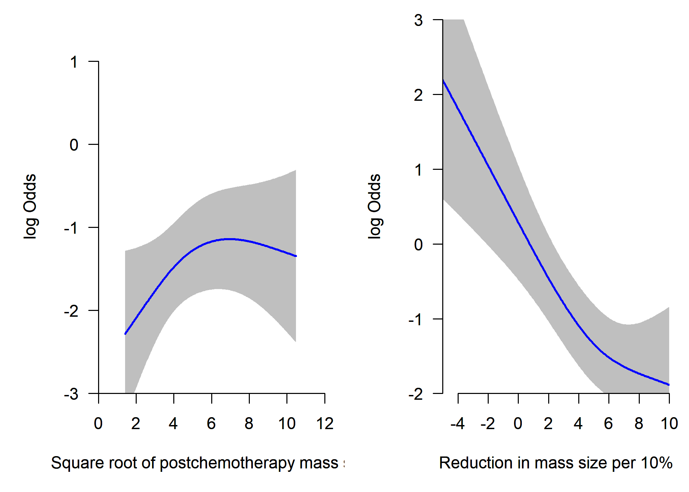
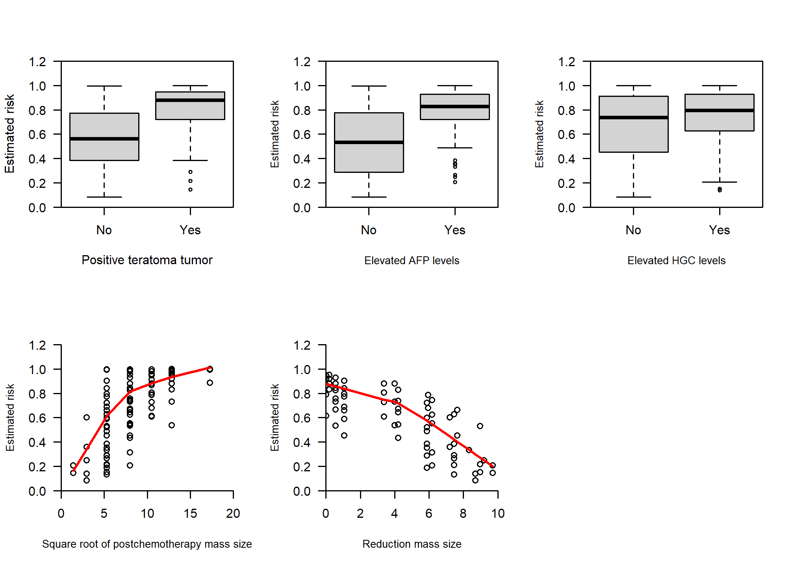
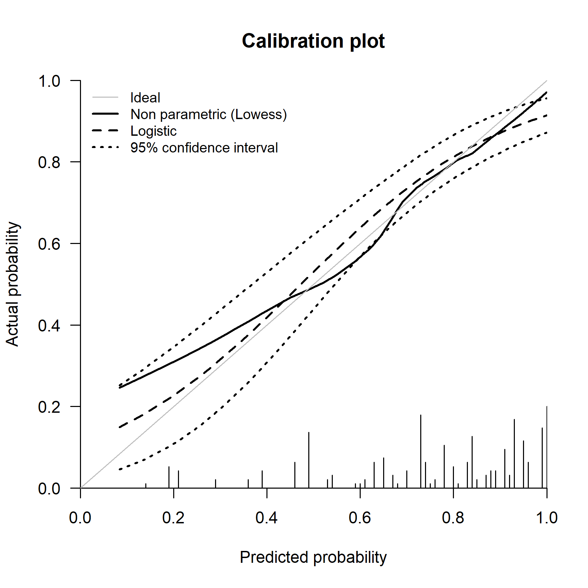
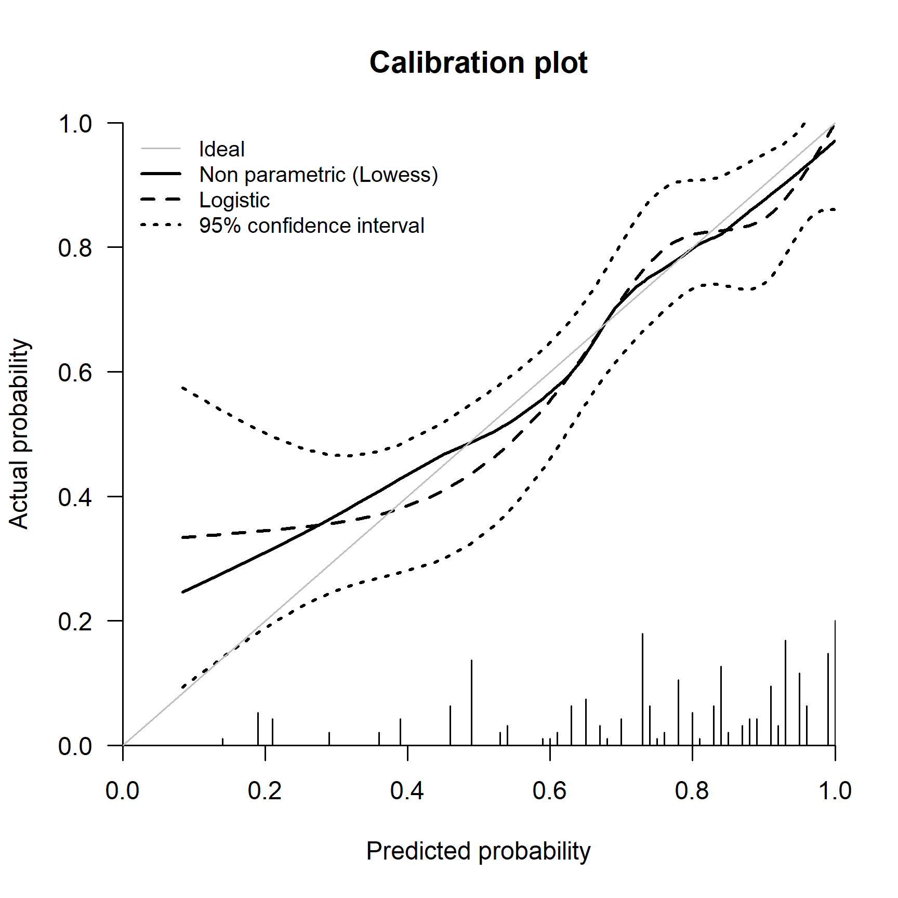
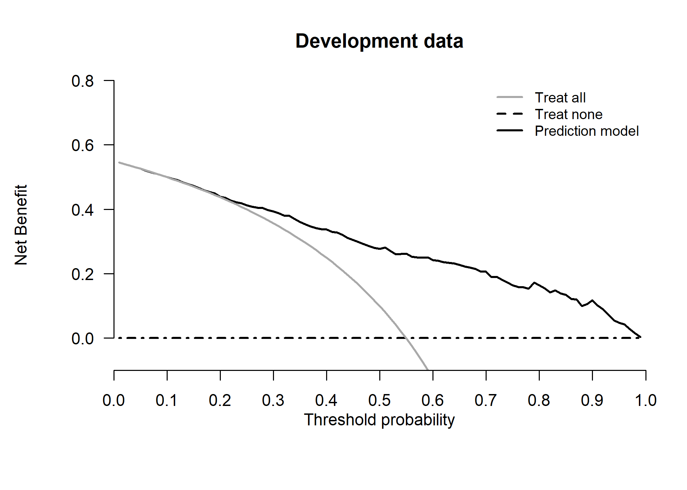
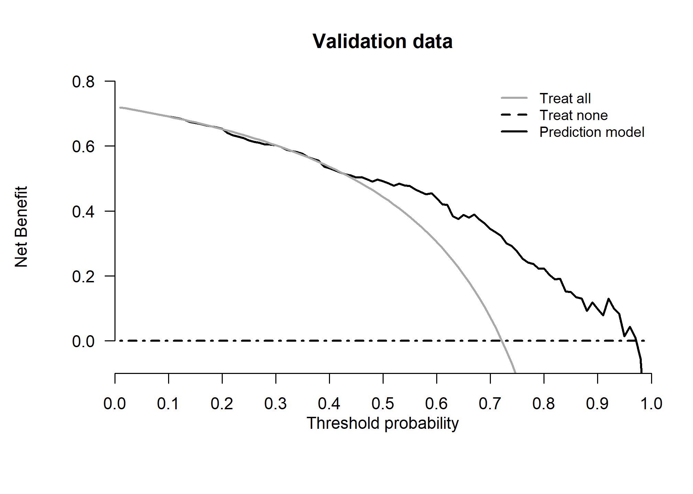

Development and validation of logistic regression risk prediction models
================

- <a href="#steps" id="toc-steps">Steps</a>
  - <a href="#installing-and-loading-packages-and-import-data"
    id="toc-installing-and-loading-packages-and-import-data">Installing and
    loading packages and import data</a>
  - <a href="#data-description" id="toc-data-description">Data
    description</a>
    - <a href="#descriptive-statistics"
      id="toc-descriptive-statistics">Descriptive statistics</a>
- <a href="#goal-1---develop-a-logistic-regression-risk-prediction-model"
  id="toc-goal-1---develop-a-logistic-regression-risk-prediction-model">Goal
  1 - Develop a logistic regression risk prediction model</a>
  - <a href="#11-check-non-linearity-of-continuous-predictors"
    id="toc-11-check-non-linearity-of-continuous-predictors">1.1 Check
    non-linearity of continuous predictors</a>
  - <a href="#12-examine-the-fit-of-the-models"
    id="toc-12-examine-the-fit-of-the-models">1.2 Examine the fit of the
    models</a>
  - <a href="#13-plot-of-predictors-vs-estimated-in-the-validation-data"
    id="toc-13-plot-of-predictors-vs-estimated-in-the-validation-data">1.3
    Plot of predictors vs estimated in the validation data</a>
- <a
  href="#goal-2---assessing-performance-of-a-logistic-regression-risk-prediction-model"
  id="toc-goal-2---assessing-performance-of-a-logistic-regression-risk-prediction-model">Goal
  2 - Assessing performance of a logistic regression risk prediction
  model</a>
  - <a href="#21-discrimination" id="toc-21-discrimination">2.1
    Discrimination</a>
  - <a href="#22-calibration" id="toc-22-calibration">2.2 Calibration</a>
    - <a href="#221-mean-calibration" id="toc-221-mean-calibration">2.2.1 Mean
      calibration</a>
    - <a href="#222-weak-calibration" id="toc-222-weak-calibration">2.2.2 Weak
      calibration</a>
    - <a href="#223-moderate-calibration"
      id="toc-223-moderate-calibration">2.2.3 Moderate calibration</a>
  - <a href="#23-overall-performance-measures"
    id="toc-23-overall-performance-measures">2.3 Overall performance
    measures</a>
- <a href="#goal-3---clinical-utility"
  id="toc-goal-3---clinical-utility">Goal 3 - Clinical utility</a>
- <a href="#reproducibility-ticket"
  id="toc-reproducibility-ticket">Reproducibility ticket</a>

## Steps

The steps taken in this file are:  
1. To develop a logistic regression risk prediction model.  
2. To assess the performance of the model in terms of calibration,
discrimination and overall prediction error. We calculate the apparent,
internal (optimism-corrected) validation and the external validation.  
3. To assess the potential clinical utility the model using decision
curve analysis.

### Installing and loading packages and import data

The following libraries are used in this file, the code chunk below will
a) check whether you already have them installed, b) install them for
you if not already present, and c) load the packages into the session.

``` r
# Use pacman to check whether packages are installed, if not load
if (!require("pacman")) install.packages("pacman")
library(pacman)

pacman::p_load(
  rio,
  rms,
  riskRegression,
  plotrix,
  knitr,
  splines,
  kableExtra,
  gtsummary,
  boot,
  tidyverse,
  rsample,
  gridExtra,
  webshot
)

# Import data ------------------
rdata <- readRDS(here::here("Data/rdata.rds"))
vdata <- readRDS(here::here("Data/vdata.rds"))
```

### Data description

Men with metastatic non-seminomatous testicular cancer can often be
cured nowadays by cisplatin based chemotherapy. After chemotherapy,
surgical resection is a generally accepted treatment to remove remnants
of the initial metastases, since residual tumor may still be present. In
the absence of tumor, resection has no therapeutic benefits, while it is
associated with hospital admission, and risks of permanent morbidity and
mortality. Logistic regression models were developed to predict the
presence of residual tumor, combining well-known predictors, such as the
histology of the primary tumor, pre-chemotherapy levels of tumor
markers, and (reduction in) residual mass size.  
We first consider a data set (rdata) with 544 patients to develop a
prediction model that includes 5 predictors. We then extend this model
with the pre-chemotherapy level of the tumor marker lactate
dehydrogenase (LDH). This illustrates ways to assess the incremental
value of a marker. LDH values were log transformed, after standardizing
by dividing by the local upper levels of normal values, after
examination of non-linearity with restricted cubic spline functions.

We first consider a data set with 544 patients to develop a prediction
model that includes 5 predictors (rdata). In a later study, we
externally validated the 5 predictor model in 273 patients from a
tertiary referral center (vdata). We illustrate ways to assess the
usefulness of a model in a new setting.  
We then extend the developed model with the pre-chemotherapy level of
the tumor marker lactate dehydrogenase (LDH). Since the validation data
(vdata) did not have information about LDH, we assess the prediction
performances of the basic model in the development (rdata) and in the
validation data (vdata).

Thus, we loaded the development data (rdata) and the validation data
(vdata).

More details about development and validation data are provided in the
manuscript [“Assessing the performance of prediction models: a framework
for some traditional and novel
measures”](https://www.ncbi.nlm.nih.gov/pmc/articles/PMC3575184/) by
Steyerberg et al. (2010).

#### Descriptive statistics

<table style="NAborder-bottom: 0; margin-left: auto; margin-right: auto;" class="table table-striped">
<thead>
<tr>
<th style="text-align:left;">
Characteristic
</th>
<th style="text-align:center;">
Development data, N = 544
</th>
<th style="text-align:center;">
Validation data, N = 273
</th>
</tr>
</thead>
<tbody>
<tr>
<td style="text-align:left;">
Residual tumor at postchemotherapy resection
</td>
<td style="text-align:center;">
299 (55%)
</td>
<td style="text-align:center;">
197 (72%)
</td>
</tr>
<tr>
<td style="text-align:left;">
Primary tumor teratoma positive
</td>
<td style="text-align:center;">
292 (54%)
</td>
<td style="text-align:center;">
169 (62%)
</td>
</tr>
<tr>
<td style="text-align:left;">
Elevated prechemotherapy AFP
</td>
<td style="text-align:center;">
358 (66%)
</td>
<td style="text-align:center;">
205 (75%)
</td>
</tr>
<tr>
<td style="text-align:left;">
Elevated Prechemotherapy HCG
</td>
<td style="text-align:center;">
339 (62%)
</td>
<td style="text-align:center;">
198 (73%)
</td>
</tr>
<tr>
<td style="text-align:left;">
Square root of postchemotherapy mass size (mm)
</td>
<td style="text-align:center;">
</td>
<td style="text-align:center;">
</td>
</tr>
<tr>
<td style="text-align:left;padding-left: 2em;" indentlevel="1">
Mean (SD)
</td>
<td style="text-align:center;">
5.13 (2.63)
</td>
<td style="text-align:center;">
7.79 (3.08)
</td>
</tr>
<tr>
<td style="text-align:left;padding-left: 2em;" indentlevel="1">
Median (Range)
</td>
<td style="text-align:center;">
4.47 (1.41, 17.32)
</td>
<td style="text-align:center;">
8.02 (1.41, 17.32)
</td>
</tr>
<tr>
<td style="text-align:left;">
Reduction in mass size per 10%
</td>
<td style="text-align:center;">
</td>
<td style="text-align:center;">
</td>
</tr>
<tr>
<td style="text-align:left;padding-left: 2em;" indentlevel="1">
Mean (SD)
</td>
<td style="text-align:center;">
4.5 (3.9)
</td>
<td style="text-align:center;">
1.4 (5.7)
</td>
</tr>
<tr>
<td style="text-align:left;padding-left: 2em;" indentlevel="1">
Median (Range)
</td>
<td style="text-align:center;">
5.2 (-13.8, 10.0)
</td>
<td style="text-align:center;">
1.1 (-15.0, 9.7)
</td>
</tr>
<tr>
<td style="text-align:left;">
Prechemotherapy LDH
</td>
<td style="text-align:center;">
</td>
<td style="text-align:center;">
</td>
</tr>
<tr>
<td style="text-align:left;padding-left: 2em;" indentlevel="1">
Mean (SD)
</td>
<td style="text-align:center;">
0.46 (0.66)
</td>
<td style="text-align:center;">
NA (NA)
</td>
</tr>
<tr>
<td style="text-align:left;padding-left: 2em;" indentlevel="1">
Median (Range)
</td>
<td style="text-align:center;">
0.31 (-1.07, 2.77)
</td>
<td style="text-align:center;">
NA (Inf, -Inf)
</td>
</tr>
<tr>
<td style="text-align:left;padding-left: 2em;" indentlevel="1">
Unknown
</td>
<td style="text-align:center;">
0
</td>
<td style="text-align:center;">
273
</td>
</tr>
</tbody>
<tfoot>
<tr>
<td style="padding: 0; " colspan="100%">
<sup>1</sup> n (%)
</td>
</tr>
</tfoot>
</table>

## Goal 1 - Develop a logistic regression risk prediction model

### 1.1 Check non-linearity of continuous predictors

Here we investigate the potential non-linear relation between continuous
predictors and the outcomes. We apply three-knot restricted cubic
splines using `rms::rcs()` function (details are given in e.g. Frank
Harrell’s book ‘Regression Model Strategies (second edition)’, page 27.
We assess the potential non-linearity graphically (plotting the two
continuous predictors against the log odds (XB or linear predictor) of
both event types. Also, we compare the models with and without splines
based on the AIC.

<details>
<summary>
Click to expand code
</summary>

``` r
# Models without splines
dd <- rms::datadist(rdata, adjto.cat = "first")
options(datadist = "dd")
fit_lrm <- rms::lrm(tum_res ~
                      ter_pos + preafp + prehcg +
                      sqpost + reduc10,
                    data = rdata, x = T, y = T)
options(datadist = NULL)

# Models with splines
dd <- rms::datadist(rdata, adjto.cat = "first")
options(datadist = "dd")
fit_lrm_rcs <- rms::lrm(tum_res ~
                          ter_pos + preafp + prehcg +
                          rcs(sqpost, 3) + rcs(reduc10, 3),
                        data = rdata, x = T, y = T)
options(datadist = NULL)


# print(fit_lrm_rcs)
# print(summary(fit_lrm_rcs))
# print(anova(fit_lrm_rcs))
P_lrm_sqpost_rcs <- rms::Predict(fit_lrm_rcs, "sqpost")
P_lrm_reduc10_rcs <- rms::Predict(fit_lrm_rcs, "reduc10")
options(datadist = NULL)

oldpar <- par(mfrow = c(1, 2), mar = c(5, 5, 1, 1))
par(xaxs = "i", yaxs = "i", las = 1)
# Square root of postchemotherapy mass size
plot(
  P_lrm_sqpost_rcs$sqpost,
  P_lrm_sqpost_rcs$yhat,
  type = "l",
  lwd = 2,
  col = "blue",
  bty = "n",
  xlab = "Square root of postchemotherapy mass size",
  ylab = "log Odds",
  ylim = c(-3, 1.5),
  xlim = c(0, 12)
)
polygon(
  c(P_lrm_sqpost_rcs$sqpost, rev(P_lrm_sqpost_rcs$sqpost)),
  c(P_lrm_sqpost_rcs$upper, rev(P_lrm_sqpost_rcs$lower)),
  col = "grey75",
  border = FALSE
)
par(new = TRUE)
plot(
  P_lrm_sqpost_rcs$sqpost,
  P_lrm_sqpost_rcs$yhat,
  type = "l",
  lwd = 2,
  col = "blue",
  bty = "n",
  xlab = "Square root of postchemotherapy mass size",
  ylab = "log Odds",
  ylim = c(-3, 1.5),
  xlim = c(0, 12)
)

# Reduction in mass size per 10%
plot(
  P_lrm_reduc10_rcs$reduc10,
  P_lrm_reduc10_rcs$yhat,
  type = "l",
  lwd = 2,
  col = "blue",
  bty = "n",
  xlab = "Reduction in mass size per 10%",
  ylab = "log Odds",
  xlim = c(-5, 10),
  ylim = c(-2, 3)
)
polygon(
  c(P_lrm_reduc10_rcs$reduc10, rev(P_lrm_reduc10_rcs$reduc10)),
  c(P_lrm_reduc10_rcs$upper, rev(P_lrm_reduc10_rcs$lower)),
  col = "grey75",
  border = FALSE
)
par(new = TRUE)
plot(
  P_lrm_reduc10_rcs$reduc10,
  P_lrm_reduc10_rcs$yhat,
  type = "l",
  lwd = 2,
  col = "blue",
  bty = "n",
  xlab = "Reduction in mass size per 10%",
  ylab = "log Odds",
  xlim = c(-5, 10),
  ylim = c(-2, 3)
)
options(datadist = NULL)
par(oldpar)
```

</details>



<table class="table table-striped" style="margin-left: auto; margin-right: auto;">
<thead>
<tr>
<th style="text-align:left;">
</th>
<th style="text-align:right;">
AIC without splines
</th>
<th style="text-align:right;">
AIC with splines
</th>
</tr>
</thead>
<tbody>
<tr>
<td style="text-align:left;">
Residual tumor at postchemotherapy resection
</td>
<td style="text-align:right;">
573.8713
</td>
<td style="text-align:right;">
574.5499
</td>
</tr>
</tbody>
</table>

Both the graphical comparison and the AIC comparison suggested no
relevant departure from linear relations between the continuous
predictors (square root of post-chemotherapy mass size and reduction in
mass size) and the risk of residual tumor at post-chemotherapy
resection.

### 1.2 Examine the fit of the models

- Logistic regression risk prediction model without LDH

 <strong>Logistic Regression Model</strong>
 
 <pre>
 rms::lrm(formula = tum_res ~ ter_pos + preafp + prehcg + sqpost + 
     reduc10, data = rdata, x = T, y = T)
 </pre>
 
 <table class='gmisc_table' style='border-collapse: collapse; margin-top: 1em; margin-bottom: 1em;' >
<thead>
<tr>
<th style='font-weight: 900; border-bottom: 1px solid grey; border-top: 2px solid grey; border-left: 1px solid black; border-right: 1px solid black; text-align: center;'></th>
<th style='font-weight: 900; border-bottom: 1px solid grey; border-top: 2px solid grey; border-right: 1px solid black; text-align: center;'>Model Likelihood<br>Ratio Test</th>
<th style='font-weight: 900; border-bottom: 1px solid grey; border-top: 2px solid grey; border-right: 1px solid black; text-align: center;'>Discrimination<br>Indexes</th>
<th style='font-weight: 900; border-bottom: 1px solid grey; border-top: 2px solid grey; border-right: 1px solid black; text-align: center;'>Rank Discrim.<br>Indexes</th>
</tr>
</thead>
<tbody>
<tr>
<td style='min-width: 9em; border-left: 1px solid black; border-right: 1px solid black; text-align: center;'>Obs 544</td>
<td style='min-width: 9em; border-right: 1px solid black; text-align: center;'>LR χ<sup>2</sup> 186.90</td>
<td style='min-width: 9em; border-right: 1px solid black; text-align: center;'><i>R</i><sup>2</sup> 0.389</td>
<td style='min-width: 9em; border-right: 1px solid black; text-align: center;'><i>C</i> 0.818</td>
</tr>
<tr>
<td style='min-width: 9em; border-left: 1px solid black; border-right: 1px solid black; text-align: center;'> 0 245</td>
<td style='min-width: 9em; border-right: 1px solid black; text-align: center;'>d.f. 5</td>
<td style='min-width: 9em; border-right: 1px solid black; text-align: center;'><i>R</i><sup><span style='font-size: 70%;'>2</span></sup><sub style='position: relative; left: -.47em; bottom: -.4em;'><span style='font-size: 70%;'>5,544</span></sub> 0.284</td>
<td style='min-width: 9em; border-right: 1px solid black; text-align: center;'><i>D</i><sub>xy</sub> 0.636</td>
</tr>
<tr>
<td style='min-width: 9em; border-left: 1px solid black; border-right: 1px solid black; text-align: center;'> 1 299</td>
<td style='min-width: 9em; border-right: 1px solid black; text-align: center;'>Pr(>χ<sup>2</sup>) <0.0001</td>
<td style='min-width: 9em; border-right: 1px solid black; text-align: center;'><i>R</i><sup><span style='font-size: 70%;'>2</span></sup><sub style='position: relative; left: -.47em; bottom: -.4em;'><span style='font-size: 70%;'>5,404</span></sub> 0.363</td>
<td style='min-width: 9em; border-right: 1px solid black; text-align: center;'>γ 0.637</td>
</tr>
<tr>
<td style='min-width: 9em; border-bottom: 2px solid grey; border-left: 1px solid black; border-right: 1px solid black; text-align: center;'>max |∂log <i>L</i>/∂β| 8×10<sup>-9</sup></td>
<td style='min-width: 9em; border-bottom: 2px solid grey; border-right: 1px solid black; text-align: center;'></td>
<td style='min-width: 9em; border-bottom: 2px solid grey; border-right: 1px solid black; text-align: center;'>Brier 0.174</td>
<td style='min-width: 9em; border-bottom: 2px solid grey; border-right: 1px solid black; text-align: center;'>τ<sub>a</sub> 0.315</td>
</tr>
</tbody>
</table>

 
 <table class='gmisc_table' style='border-collapse: collapse; margin-top: 1em; margin-bottom: 1em;' >
<thead>
<tr><th style='border-bottom: 1px solid grey; font-weight: 900; border-top: 2px solid grey; min-width: 7em; text-align: center;'></th>
<th style='font-weight: 900; border-bottom: 1px solid grey; border-top: 2px solid grey; text-align: right;'>β</th>
<th style='font-weight: 900; border-bottom: 1px solid grey; border-top: 2px solid grey; text-align: right;'>S.E.</th>
<th style='font-weight: 900; border-bottom: 1px solid grey; border-top: 2px solid grey; text-align: right;'>Wald <i>Z</i></th>
<th style='font-weight: 900; border-bottom: 1px solid grey; border-top: 2px solid grey; text-align: right;'>Pr(>|<i>Z</i>|)</th>
</tr>
</thead>
<tbody>
<tr>
<td style='min-width: 7em; text-align: left;'>Intercept</td>
<td style='min-width: 7em; text-align: right;'> -0.3016</td>
<td style='min-width: 7em; text-align: right;'> 0.5488</td>
<td style='min-width: 7em; text-align: right;'>-0.55</td>
<td style='min-width: 7em; text-align: right;'>0.5826</td>
</tr>
<tr>
<td style='min-width: 7em; text-align: left;'>ter_pos=Yes</td>
<td style='min-width: 7em; text-align: right;'>  0.9955</td>
<td style='min-width: 7em; text-align: right;'> 0.2082</td>
<td style='min-width: 7em; text-align: right;'> 4.78</td>
<td style='min-width: 7em; text-align: right;'><0.0001</td>
</tr>
<tr>
<td style='min-width: 7em; text-align: left;'>preafp=Yes</td>
<td style='min-width: 7em; text-align: right;'>  0.8592</td>
<td style='min-width: 7em; text-align: right;'> 0.2281</td>
<td style='min-width: 7em; text-align: right;'> 3.77</td>
<td style='min-width: 7em; text-align: right;'>0.0002</td>
</tr>
<tr>
<td style='min-width: 7em; text-align: left;'>prehcg=Yes</td>
<td style='min-width: 7em; text-align: right;'>  0.5541</td>
<td style='min-width: 7em; text-align: right;'> 0.2190</td>
<td style='min-width: 7em; text-align: right;'> 2.53</td>
<td style='min-width: 7em; text-align: right;'>0.0114</td>
</tr>
<tr>
<td style='min-width: 7em; text-align: left;'>sqpost</td>
<td style='min-width: 7em; text-align: right;'>  0.0737</td>
<td style='min-width: 7em; text-align: right;'> 0.0658</td>
<td style='min-width: 7em; text-align: right;'> 1.12</td>
<td style='min-width: 7em; text-align: right;'>0.2626</td>
</tr>
<tr>
<td style='min-width: 7em; border-bottom: 2px solid grey; text-align: left;'>reduc10</td>
<td style='min-width: 7em; border-bottom: 2px solid grey; text-align: right;'> -0.2644</td>
<td style='min-width: 7em; border-bottom: 2px solid grey; text-align: right;'> 0.0495</td>
<td style='min-width: 7em; border-bottom: 2px solid grey; text-align: right;'>-5.35</td>
<td style='min-width: 7em; border-bottom: 2px solid grey; text-align: right;'><0.0001</td>
</tr>
</tbody>
</table>

- Logistic regression risk prediction model with LDH

 <strong>Logistic Regression Model</strong>
 
 <pre>
 rms::lrm(formula = tum_res ~ ter_pos + preafp + prehcg + sqpost + 
     reduc10 + lnldhst, data = rdata, x = T, y = T)
 </pre>
 
 <table class='gmisc_table' style='border-collapse: collapse; margin-top: 1em; margin-bottom: 1em;' >
<thead>
<tr>
<th style='font-weight: 900; border-bottom: 1px solid grey; border-top: 2px solid grey; border-left: 1px solid black; border-right: 1px solid black; text-align: center;'></th>
<th style='font-weight: 900; border-bottom: 1px solid grey; border-top: 2px solid grey; border-right: 1px solid black; text-align: center;'>Model Likelihood<br>Ratio Test</th>
<th style='font-weight: 900; border-bottom: 1px solid grey; border-top: 2px solid grey; border-right: 1px solid black; text-align: center;'>Discrimination<br>Indexes</th>
<th style='font-weight: 900; border-bottom: 1px solid grey; border-top: 2px solid grey; border-right: 1px solid black; text-align: center;'>Rank Discrim.<br>Indexes</th>
</tr>
</thead>
<tbody>
<tr>
<td style='min-width: 9em; border-left: 1px solid black; border-right: 1px solid black; text-align: center;'>Obs 544</td>
<td style='min-width: 9em; border-right: 1px solid black; text-align: center;'>LR χ<sup>2</sup> 211.56</td>
<td style='min-width: 9em; border-right: 1px solid black; text-align: center;'><i>R</i><sup>2</sup> 0.431</td>
<td style='min-width: 9em; border-right: 1px solid black; text-align: center;'><i>C</i> 0.839</td>
</tr>
<tr>
<td style='min-width: 9em; border-left: 1px solid black; border-right: 1px solid black; text-align: center;'> 0 245</td>
<td style='min-width: 9em; border-right: 1px solid black; text-align: center;'>d.f. 6</td>
<td style='min-width: 9em; border-right: 1px solid black; text-align: center;'><i>R</i><sup><span style='font-size: 70%;'>2</span></sup><sub style='position: relative; left: -.47em; bottom: -.4em;'><span style='font-size: 70%;'>6,544</span></sub> 0.315</td>
<td style='min-width: 9em; border-right: 1px solid black; text-align: center;'><i>D</i><sub>xy</sub> 0.677</td>
</tr>
<tr>
<td style='min-width: 9em; border-left: 1px solid black; border-right: 1px solid black; text-align: center;'> 1 299</td>
<td style='min-width: 9em; border-right: 1px solid black; text-align: center;'>Pr(>χ<sup>2</sup>) <0.0001</td>
<td style='min-width: 9em; border-right: 1px solid black; text-align: center;'><i>R</i><sup><span style='font-size: 70%;'>2</span></sup><sub style='position: relative; left: -.47em; bottom: -.4em;'><span style='font-size: 70%;'>6,404</span></sub> 0.399</td>
<td style='min-width: 9em; border-right: 1px solid black; text-align: center;'>γ 0.678</td>
</tr>
<tr>
<td style='min-width: 9em; border-bottom: 2px solid grey; border-left: 1px solid black; border-right: 1px solid black; text-align: center;'>max |∂log <i>L</i>/∂β| 4×10<sup>-8</sup></td>
<td style='min-width: 9em; border-bottom: 2px solid grey; border-right: 1px solid black; text-align: center;'></td>
<td style='min-width: 9em; border-bottom: 2px solid grey; border-right: 1px solid black; text-align: center;'>Brier 0.163</td>
<td style='min-width: 9em; border-bottom: 2px solid grey; border-right: 1px solid black; text-align: center;'>τ<sub>a</sub> 0.336</td>
</tr>
</tbody>
</table>

 
 <table class='gmisc_table' style='border-collapse: collapse; margin-top: 1em; margin-bottom: 1em;' >
<thead>
<tr><th style='border-bottom: 1px solid grey; font-weight: 900; border-top: 2px solid grey; min-width: 7em; text-align: center;'></th>
<th style='font-weight: 900; border-bottom: 1px solid grey; border-top: 2px solid grey; text-align: right;'>β</th>
<th style='font-weight: 900; border-bottom: 1px solid grey; border-top: 2px solid grey; text-align: right;'>S.E.</th>
<th style='font-weight: 900; border-bottom: 1px solid grey; border-top: 2px solid grey; text-align: right;'>Wald <i>Z</i></th>
<th style='font-weight: 900; border-bottom: 1px solid grey; border-top: 2px solid grey; text-align: right;'>Pr(>|<i>Z</i>|)</th>
</tr>
</thead>
<tbody>
<tr>
<td style='min-width: 7em; text-align: left;'>Intercept</td>
<td style='min-width: 7em; text-align: right;'> -1.5521</td>
<td style='min-width: 7em; text-align: right;'> 0.6021</td>
<td style='min-width: 7em; text-align: right;'>-2.58</td>
<td style='min-width: 7em; text-align: right;'>0.0099</td>
</tr>
<tr>
<td style='min-width: 7em; text-align: left;'>ter_pos=Yes</td>
<td style='min-width: 7em; text-align: right;'>  0.9094</td>
<td style='min-width: 7em; text-align: right;'> 0.2140</td>
<td style='min-width: 7em; text-align: right;'> 4.25</td>
<td style='min-width: 7em; text-align: right;'><0.0001</td>
</tr>
<tr>
<td style='min-width: 7em; text-align: left;'>preafp=Yes</td>
<td style='min-width: 7em; text-align: right;'>  0.9025</td>
<td style='min-width: 7em; text-align: right;'> 0.2333</td>
<td style='min-width: 7em; text-align: right;'> 3.87</td>
<td style='min-width: 7em; text-align: right;'>0.0001</td>
</tr>
<tr>
<td style='min-width: 7em; text-align: left;'>prehcg=Yes</td>
<td style='min-width: 7em; text-align: right;'>  0.7827</td>
<td style='min-width: 7em; text-align: right;'> 0.2305</td>
<td style='min-width: 7em; text-align: right;'> 3.40</td>
<td style='min-width: 7em; text-align: right;'>0.0007</td>
</tr>
<tr>
<td style='min-width: 7em; text-align: left;'>sqpost</td>
<td style='min-width: 7em; text-align: right;'>  0.2915</td>
<td style='min-width: 7em; text-align: right;'> 0.0815</td>
<td style='min-width: 7em; text-align: right;'> 3.58</td>
<td style='min-width: 7em; text-align: right;'>0.0003</td>
</tr>
<tr>
<td style='min-width: 7em; text-align: left;'>reduc10</td>
<td style='min-width: 7em; text-align: right;'> -0.1576</td>
<td style='min-width: 7em; text-align: right;'> 0.0519</td>
<td style='min-width: 7em; text-align: right;'>-3.04</td>
<td style='min-width: 7em; text-align: right;'>0.0024</td>
</tr>
<tr>
<td style='min-width: 7em; border-bottom: 2px solid grey; text-align: left;'>lnldhst</td>
<td style='min-width: 7em; border-bottom: 2px solid grey; text-align: right;'> -0.9854</td>
<td style='min-width: 7em; border-bottom: 2px solid grey; text-align: right;'> 0.2089</td>
<td style='min-width: 7em; border-bottom: 2px solid grey; text-align: right;'>-4.72</td>
<td style='min-width: 7em; border-bottom: 2px solid grey; text-align: right;'><0.0001</td>
</tr>
</tbody>
</table>

The coefficients of the models indicated that positive tumor teratoma,
elevated prechemoterapy AFP levels, elevated prechemoterapy HCG levels,
postchemotherapy mass size (mm) (expressed in square root) are
associated with higher risk to residual tumor after resection. Reduction
in mass size is associated with a reduced risk to have residual tumor
after resection.

### 1.3 Plot of predictors vs estimated in the validation data

To get further insight into the effect of the covariates, we plot the
covariate values observed in the validation set against the estimated
absolute risk of having residual tumor after resection. This gives an
idea of the size of the effects.

<details>
<summary>
Click to expand code
</summary>

``` r
# Models -------------
dd <- rms::datadist(rdata)
options(datadist = "dd")
options(prType = "html")
fit_lrm1 <- rms::lrm(tum_res ~ 
                       ter_pos + preafp + prehcg + 
                       sqpost + reduc10,
                     data = rdata, x = T, y = T)
# print(summary(fit_lrm))
options(datadist = NULL)


# Calculate predicted probabilities in the validation data
vdata$pred <- predict(fit_lrm1,
              type = "fitted.ind",
              newdata = vdata)

# Positive teratoma tumor
oldpar <- par(mfrow = c(2, 3))
par(xaxs = "i", yaxs = "i", las = 1)
plot(vdata$ter_pos,
  vdata$pred,
  bty = "n",
  ylim = c(0, 1.2),
  xlab = "Positive teratoma tumor",
  ylab = "Estimated risk"
)
# Elevated AFP
par(xaxs = "i", yaxs = "i", las = 1)
plot(vdata$preafp,
  vdata$pred,
  bty = "n",
  ylim = c(0, 1.2),
  xlab = "Elevated AFP levels",
  ylab = "Estimated risk",
  cex.lab = .85
)

# Elevated HCG
par(xaxs = "i", yaxs = "i", las = 1)
plot(vdata$prehcg,
  vdata$pred,
  bty = "n",
  ylim = c(0, 1.2),
  xlab = "Elevated HGC levels",
  ylab = "Estimated risk",
  cex.lab = .85
)

# Postchemotherapy mass size
par(xaxs = "i", yaxs = "i", las = 1)
plot(vdata$sqpost,
  vdata$pred,
  bty = "n",
  xlim = c(0, 20),
  ylim = c(0, 1.2),
  xlab = "Square root of postchemotherapy mass size",
  ylab = "Estimated risk",
  cex.lab = .85
)
lines(
  lowess(vdata$sqpost, vdata$pred),
  col = "red",
  lwd = 2
)

# Reduction mass size
par(xaxs = "i", yaxs = "i", las = 1)
plot(vdata$reduc10,
  vdata$pred,
  bty = "n",
  xlim = c(0, 10),
  ylim = c(0, 1.2),
  xlab = "Reduction mass size",
  ylab = "Estimated risk",
  cex.lab = .85
)
lines(
  lowess(vdata$reduc10, vdata$pred),
  col = "red",
  lwd = 2
)
```

</details>



## Goal 2 - Assessing performance of a logistic regression risk prediction model

Here we evaluate the performance of the prediction model in terms of
discrimination, calibration and overall prediction error. We assess the
prediction performance of the developed model not including LDH
internally and in an external data.

### 2.1 Discrimination

We here calculate:

- The c-statistic: it is a rank order statistic for predictions against
  true outcomes. The concordance (c) statistic is the most commonly used
  performance measure to indicate the discriminative ability of
  generalized linear regression models. For a binary outcome, c is
  identical to the area under the Receiver Operating Characteristic
  (ROC) curve, which plots the sensitivity (true positive rate) against
  1 – (false positive rate) for consecutive cutoffs for the probability
  of an outcome. Accurate predictions discriminate between those with
  and those without the outcome.

- Discrimination slope: it can be used as a simple measure for how well
  subjects with and without the outcome are separated. It is calculated
  as the absolute difference in average predictions for those with and
  without the outcome. Visualization is readily possible with a box plot
  or a histogram, which will show less overlap between those with and
  those without the outcome for a better discriminating model.

More details are in [“Assessing the performance of prediction models: a
framework for some traditional and novel
measures”](https://www.ncbi.nlm.nih.gov/pmc/articles/PMC3575184/) by
Steyerberg et al. (2010);

<details>
<summary>
Click to expand code
</summary>

``` r
# Models
dd <- rms::datadist(rdata, adjto.cat = "first")
options(datadist = "dd")
fit_lrm <- rms::lrm(tum_res ~ 
                      ter_pos + preafp + prehcg +
                      sqpost + reduc10,
                    data = rdata, x = T, y = T)
options(datadist = NULL)


# C-index
# Apparent validation
val_rdata <- Hmisc::rcorr.cens(predict(fit_lrm),
                               S = rdata$tum_res)

# Load function to calculate confidence intervals of c-statistic
source(here::here('Functions/c_stat_ci.R'))
c_dev <- c_stat_ci(val_rdata)


# Internal validation (bootstrapping)
val_opt <- rms::validate(fit = fit_lrm, B = 500)
c_optimism <- round(0.5 * 
                      (1 +
                      val_opt["Dxy","index.corrected"]), 2)

# External validation
val_vdata <- Hmisc::rcorr.cens(
  predict(fit_lrm, newdata = vdata), 
  S = vdata$tum_res)

c_val <- c_stat_ci(val_vdata)

res_c <- rbind(c_dev, c_val)

# Discrimination slope
# Load function to calculate discrimination slope
source(here::here('Functions/discr_slope.R'))
dslope_rdata <- discr_slope(fit_lrm,
                            y = rdata$tum_res,
                            new_data = rdata)
dslope_vdata <- discr_slope(fit_lrm,
                            y = vdata$tum_res,
                            new_data = vdata)

# Bootstrap confidence intervals for discrimination slope
rboot <- rsample::bootstraps(rdata, B = 1000)
vboot <- rsample::bootstraps(vdata, B = 1000)

discr_slope_boot <- function(split) {
  discr_slope(fit = fit_lrm,
              y = rsample::analysis(split)$tum_res,
              new_data = rsample::analysis(split))
}

rboot <- rboot |>
  dplyr::mutate(dslope = purrr::map_dbl(splits, discr_slope_boot))

vboot <- vboot |>
  dplyr::mutate(dslope = purrr::map_dbl(splits, discr_slope_boot))

# Optimism-corrected discrimination slope
source(here::here("Functions/internal_cv_lrm.R"))

optim_measures <- bootstrap_cv_lrm(
  db = rdata, 
  B = 50, # set B lower to speed up the computation
  outcome = "tum_res", 
  formula = "tum_res ~ 
                  ter_pos + preafp + prehcg + 
                  sqpost + reduc10", 
  formula_score = "tum_res ~ 1")
```

</details>

    ## Joining, by = "id_boot"

<table class="table table-striped" style="margin-left: auto; margin-right: auto;">
<thead>
<tr>
<th style="empty-cells: hide;border-bottom:hidden;" colspan="1">
</th>
<th style="border-bottom:hidden;padding-bottom:0; padding-left:3px;padding-right:3px;text-align: center; " colspan="3">

<div style="border-bottom: 1px solid #ddd; padding-bottom: 5px; ">

Apparent

</div>

</th>
<th style="border-bottom:hidden;padding-bottom:0; padding-left:3px;padding-right:3px;text-align: center; " colspan="3">

<div style="border-bottom: 1px solid #ddd; padding-bottom: 5px; ">

Internal

</div>

</th>
<th style="border-bottom:hidden;padding-bottom:0; padding-left:3px;padding-right:3px;text-align: center; " colspan="3">

<div style="border-bottom: 1px solid #ddd; padding-bottom: 5px; ">

External

</div>

</th>
</tr>
<tr>
<th style="text-align:left;">
</th>
<th style="text-align:right;">
Estimate
</th>
<th style="text-align:right;">
Lower .95
</th>
<th style="text-align:right;">
Upper .95
</th>
<th style="text-align:right;">
Estimate
</th>
<th style="text-align:right;">
Lower .95
</th>
<th style="text-align:right;">
Upper .95
</th>
<th style="text-align:right;">
Estimate
</th>
<th style="text-align:right;">
Lower .95
</th>
<th style="text-align:right;">
Upper .95
</th>
</tr>
</thead>
<tbody>
<tr>
<td style="text-align:left;">
C-statistic
</td>
<td style="text-align:right;">
0.82
</td>
<td style="text-align:right;">
0.78
</td>
<td style="text-align:right;">
0.85
</td>
<td style="text-align:right;">
0.81
</td>
<td style="text-align:right;">
NA
</td>
<td style="text-align:right;">
NA
</td>
<td style="text-align:right;">
0.78
</td>
<td style="text-align:right;">
0.73
</td>
<td style="text-align:right;">
0.84
</td>
</tr>
<tr>
<td style="text-align:left;">
Discrimination slope
</td>
<td style="text-align:right;">
0.30
</td>
<td style="text-align:right;">
0.25
</td>
<td style="text-align:right;">
0.33
</td>
<td style="text-align:right;">
0.29
</td>
<td style="text-align:right;">
NA
</td>
<td style="text-align:right;">
NA
</td>
<td style="text-align:right;">
0.24
</td>
<td style="text-align:right;">
0.18
</td>
<td style="text-align:right;">
0.30
</td>
</tr>
</tbody>
</table>

C-statistic was 0.82 (95% confidence interval, CI: 0.78-0.85), and 0.78
(95% CI: 0.73-0.84) in the development and validation data,
respectively. Internal cross-validation based on optimism-corrected
bootstrapping showed a C-statistic of 0.81.

Discrimination slope was 0.30 (95% CI: 0.27-0.32), and 0.24 (95% CI:
0.17-0.29) for the development and validation data, respectively.

### 2.2 Calibration

Calibration refers to the agreement between observed outcomes and
predictions. For example, if we predict a 20% risk of residual tumor for
a testicular cancer patient, the observed frequency of tumor should be
approximately 20 out of 100 patients with such a prediction.

Different level of calibration can be estimated: mean, weak, and
moderate calibration according to the calibration hierarchy defined by
Van Calster et
al. [here](https://www.sciencedirect.com/science/article/pii/S0895435615005818).

#### 2.2.1 Mean calibration

Mean calibration refers how systematically the model might under- or
over- predicts the actual risk.

The mean calibration can be estimated:

- using the Observed and Expected ratio. The observed number of events
  is the sum of the events (or cases) present in the data. The expected
  is estimated summing the predicted probability of the event estimated
  by the model. Ratio equals to 1 indicates perfect (mean) calibration,
  values lower or greater than 1 indicate over- and under- prediction,
  respectively.

- calibration intercept (or calibration-in-the-large): indicates the
  extent that predictions are systematically too low or too high.

<details>
<summary>
Click to expand code
</summary>

``` r
# Models
dd <- rms::datadist(rdata, adjto.cat = "first")
options(datadist = "dd")
fit_lrm <- rms::lrm(tum_res ~
                      ter_pos + preafp + prehcg +
                      sqpost + reduc10,
                    data = rdata, x = T, y = T)
options(datadist = NULL)

# Calibration-in-the-large
lp <- predict(fit_lrm, newdata = vdata)
vdata$y <- as.numeric(vdata$tum_res) - 1 # convert outcome to numeric
cal_intercept <- glm(y  ~ offset(lp), 
                     family = binomial,
                     data = vdata)
intercept_CI <- confint(cal_intercept) # confidence intervals

# Observed/Expected ratio
Obs <- sum(vdata$y)
vdata$pred <- predict(fit_lrm, 
                      newdata = vdata,
                      type = "fitted.ind")
Expct <- sum(vdata$pred)

OE <- Obs / Expct
```

</details>

    ## Waiting for profiling to be done...

<table class="table table-striped" style="margin-left: auto; margin-right: auto;">
<thead>
<tr>
<th style="text-align:left;">
</th>
<th style="text-align:right;">
Estimate
</th>
<th style="text-align:right;">
Lower .95
</th>
<th style="text-align:right;">
Upper .95
</th>
</tr>
</thead>
<tbody>
<tr>
<td style="text-align:left;">
Calibration intercept
</td>
<td style="text-align:right;">
-0.03
</td>
<td style="text-align:right;">
-0.34
</td>
<td style="text-align:right;">
0.29
</td>
</tr>
<tr>
<td style="text-align:left;">
O/E ratio
</td>
<td style="text-align:right;">
0.99
</td>
<td style="text-align:right;">
0.86
</td>
<td style="text-align:right;">
1.14
</td>
</tr>
</tbody>
</table>

Both calibration intercept and O/E ratio showed good mean calibration.
The prediction model did not systematically over or underestimate the
actual risk.

#### 2.2.2 Weak calibration

The term ‘weak’ refers to the limited flexibility in assessing
calibration. We are essentially summarizing calibration of the observed
proportions of outcomes versus predicted probabilities using only two
parameters i.e. a straight line. In other words, perfect weak
calibration is defined as mean calibration ratio and calibration slope
of unity(or calibration intercept equals to zero). The calibration slope
indicates the overall strength of the linear predictor (LP), which can
be interpreted as the level of overfitting (slope \<1) or underfitting
(slope\>1). A value of slope smaller than 1 can also be interpreted as
reflecting a need for shrinkage of regression coefficients in a
prediction model.

<details>
<summary>
Click to expand code
</summary>

``` r
# Models
vdata$y <- as.numeric(vdata$tum_res) - 1
dd <- rms::datadist(rdata, adjto.cat = "first")
options(datadist = "dd")
fit_lrm <- rms::lrm(tum_res ~ 
                      ter_pos + preafp + prehcg + 
                      sqpost + reduc10,
                    data = rdata, x = T, y = T)
options(datadist = NULL)

# Calibration slope
vdata$lp <- predict(fit_lrm, newdata = vdata)
cal_slope <- glm(y  ~ lp,
                 family = binomial,
                 data = vdata)
slope_CI <- confint(cal_slope) # Confidence interval
```

</details>

    ## Waiting for profiling to be done...

<table class="table table-striped" style="margin-left: auto; margin-right: auto;">
<thead>
<tr>
<th style="text-align:left;">
</th>
<th style="text-align:right;">
Estimate
</th>
<th style="text-align:right;">
Lower .95
</th>
<th style="text-align:right;">
Upper .95
</th>
</tr>
</thead>
<tbody>
<tr>
<td style="text-align:left;">
Calibration slope
</td>
<td style="text-align:right;">
0.74
</td>
<td style="text-align:right;">
0.51
</td>
<td style="text-align:right;">
0.99
</td>
</tr>
</tbody>
</table>

#### 2.2.3 Moderate calibration

Moderate calibration concerns whether among patients with the same
predicted risk, the observed event rate equals the predicted risk. A
graphical assessment of calibration is possible with predictions on the
x-axis, and the outcome on the y-axis. Perfect predictions should be on
the 45° line. For binary outcomes, the plot contains only 0 and 1 values
for the y-axis. Smoothing techniques can be used to estimate the
observed probabilities of the outcome (p(y=1)) in relation to the
predicted probabilities, e.g. using the lowess algorithm. The observed
probabilities can be also estimated using a secondary logistic
regression model using the predicted probability as a covariate. We can
assume linearity or a more flexible relation between the covariate and
the observed probabilties using, for example, splines. We may however
expect that the specific type of smoothing may affect the graphical
impression, especially in smaller data sets.

<details>
<summary>
Click to expand code
</summary>

``` r
# Models
dd <- rms::datadist(rdata, adjto.cat = "first")
options(datadist = "dd")
fit_lrm <- rms::lrm(tum_res ~
                      ter_pos + preafp + prehcg + 
                      sqpost + reduc10,
                    data = rdata, x = T, y = T)
options(datadist = NULL)

## Calibration plot
# First, prepare histogram of estimated risks for x-axis
spike_bounds <- c(0, 0.20)
bin_breaks <- seq(0, 1, length.out = 100 + 1)
freqs <- table(cut(vdata$pred, breaks = bin_breaks))
bins <- bin_breaks[-1]
freqs_valid <- freqs[freqs > 0]
freqs_rescaled <- spike_bounds[1] + (spike_bounds[2] - spike_bounds[1]) * (freqs_valid - min(freqs_valid)) / (max(freqs_valid) - min(freqs_valid))

vdata$y <- as.numeric(vdata$tum_res) - 1
vdata$pred <- predict(fit_lrm,
                      newdata = vdata,
                      type = "fitted.ind")

# Calibration based on a secondary logistic regression
fit_cal <- glm(y ~ pred,
               family = binomial,
               x = T,
               y = T,
               data = vdata)
# NOTE: we can also model using splines (e.g. y ~ rcs(pred, 5),
# restricted cubic splies with five knots

cal_obs <- predict(fit_cal,  
                   type = "response",
                   se.fit = TRUE)
alpha <- .05
dt_cal <- cbind.data.frame("obs" = cal_obs$fit,
                           
                           "lower" = 
                             cal_obs$fit - 
                             qnorm(1 - alpha / 2)*cal_obs$se.fit,
                           
                           "upper" = cal_obs$fit + 
                             qnorm(1 - alpha / 2)*cal_obs$se.fit,
                           
                           "pred" = vdata$pred)
dt_cal <- dt_cal[order(dt_cal$pred),]

cal_lowess <- lowess(vdata$pred, vdata$y, iter = 0)
par(xaxs = "i", yaxs = "i", las = 1)
plot(cal_lowess,
     type = "l",
     xlim = c(0, 1),
     ylim = c(-.1, 1),
     xlab = "Predicted probability",
     ylab = "Actual probability",
     bty = "n",
     lwd = 2,
     main = "Calibration plot")
lines(dt_cal$pred, dt_cal$obs, lwd = 2, lty = 2)
lines(dt_cal$pred, dt_cal$lower, lwd = 2, lty = 3)
lines(dt_cal$pred, dt_cal$upper, lwd = 2, lty = 3)
segments(
  x0 = bins[freqs > 0], 
  y0 = spike_bounds[1], 
  x1 = bins[freqs > 0], 
  y1 = freqs_rescaled
)
abline(a = 0, b = 1, col = "gray")
legend("topleft",
       c("Ideal", "Non parametric (Lowess)", 
         "Logistic",
         "95% confidence interval"),
       lwd = c(1, 2, 2, 2),
       lty = c(1, 1, 2, 3),
       col = c("gray", "black", "black", "black"),
       bty = "n",
       cex = .85)

# Calibration measures ICI, E50, E90 based on secondary logistic regression
res_calmeas <-
  c(
    "ICI" = mean(abs(dt_cal$obs - dt_cal$pred)),
    "E50" = median(abs(dt_cal$obs - dt_cal$pred)),
    "E90" = unname(quantile(abs(dt_cal$obs - dt_cal$pred), 
                            probs = .90))
)

## Bootstrap confidence intervals
## for the calibration  measures (ICI, E50, E90) ------
alpha <- .05
B <- 1000 # Set B = 2000 although it takes more time
set.seed(2022)
vboot <- rsample::bootstraps(vdata, times = B)

# Bootstrap calibration measures
numsum_boot <- function(split) {
  
  pred <- predict(fit_lrm,
                  type = "fitted.ind",
                  newdata = rsample::analysis(split))

 
# Estimate actual risk - basic model
  vcal <- glm(y ~ pred,
              x = T,
              y = T,
              family = binomial,
              data = rsample::analysis(split)
) 
 
cal_obs_boot <- predict(vcal, 
                        type = "response",
                        se.fit = TRUE,
                        newdata = rsample::analysis(split))
 # Save objects needed
db_cal_boot <- data.frame(
  "obs" = cal_obs_boot$fit,
  
  "lower" = cal_obs_boot$fit - 
    qnorm(1 - alpha / 2)*cal_obs_boot$se.fit,
                           
  "upper" = cal_obs_boot$fit +  
    qnorm(1 - alpha / 2)*cal_obs_boot$se.fit,
                      
  "pred" = pred
)

absdiff_boot <- abs(db_cal_boot$obs - db_cal_boot$pred)

res_cal_boot <- data.frame(
  "ICI" = mean(absdiff_boot),
  "E50" = quantile(absdiff_boot, probs = .5),
  "E90" = quantile(absdiff_boot, probs = .9)
)
}
numsum_b <- vboot |>
  dplyr::mutate(num_cal_boot = purrr::map(splits, numsum_boot),
                
                ICI = purrr::map_dbl(num_cal_boot, ~ .x$ICI),
         
                E50 = purrr::map_dbl(num_cal_boot, ~ .x$E50),
         
                E90 = purrr::map_dbl(num_cal_boot, ~ .x$E90)
         )
```

</details>



<table class="table table-striped" style="margin-left: auto; margin-right: auto;">
<thead>
<tr>
<th style="empty-cells: hide;border-bottom:hidden;" colspan="1">
</th>
<th style="border-bottom:hidden;padding-bottom:0; padding-left:3px;padding-right:3px;text-align: center; " colspan="3">

<div style="border-bottom: 1px solid #ddd; padding-bottom: 5px; ">

ICI

</div>

</th>
<th style="border-bottom:hidden;padding-bottom:0; padding-left:3px;padding-right:3px;text-align: center; " colspan="3">

<div style="border-bottom: 1px solid #ddd; padding-bottom: 5px; ">

E50

</div>

</th>
<th style="border-bottom:hidden;padding-bottom:0; padding-left:3px;padding-right:3px;text-align: center; " colspan="3">

<div style="border-bottom: 1px solid #ddd; padding-bottom: 5px; ">

E90

</div>

</th>
</tr>
<tr>
<th style="text-align:left;">
</th>
<th style="text-align:right;">
Estimate
</th>
<th style="text-align:right;">
Lower.95
</th>
<th style="text-align:right;">
Upper.95
</th>
<th style="text-align:right;">
Estimate
</th>
<th style="text-align:right;">
Lower.95
</th>
<th style="text-align:right;">
Upper.95
</th>
<th style="text-align:right;">
Estimate
</th>
<th style="text-align:right;">
Lower.95
</th>
<th style="text-align:right;">
Upper.95
</th>
</tr>
</thead>
<tbody>
<tr>
<td style="text-align:left;">
External data
</td>
<td style="text-align:right;">
0.04
</td>
<td style="text-align:right;">
0.03
</td>
<td style="text-align:right;">
0.08
</td>
<td style="text-align:right;">
0.03
</td>
<td style="text-align:right;">
0.02
</td>
<td style="text-align:right;">
0.07
</td>
<td style="text-align:right;">
0.08
</td>
<td style="text-align:right;">
0.06
</td>
<td style="text-align:right;">
0.15
</td>
</tr>
</tbody>
</table>

Calibration measures (i.e., ICI, E50, E90) using a ‘secondary’ logistic
regression to estimate the observed probability of the event indicate
good calibration.  
Calibration measures might also be calculated using the non-parametric
method (e.g., lowess) to estimate the observed probability of the event.
In this setting, the user can use the results of `stats::lowess()`
function to calculate the absolute difference between the estimated
observed and predicted probabilities. Another nice function to provide
the calibration plot and the corresponding performance measures is
`rms::val.prob()`. Another alternative is `riskRegression::Score()`.

More flexible, nonlinear, calibration curve can be considered using the
‘secondary’ logistic regression using splines transformations of the
predicted probabilities. Here we provide an example using a five-knot
restricted cubic splines using `rms::rcs()`.

<details>
<summary>
Click to expand code
</summary>

``` r
# Models
dd <- rms::datadist(rdata, adjto.cat = "first")
options(datadist = "dd")
fit_lrm <- rms::lrm(tum_res ~
                      ter_pos + preafp + prehcg + 
                      sqpost + reduc10,
                    data = rdata, x = T, y = T)
options(datadist = NULL)

## Calibration plot
# First, prepare histogram of estimated risks for x-axis
spike_bounds <- c(0, 0.20)
bin_breaks <- seq(0, 1, length.out = 100 + 1)
freqs <- table(cut(vdata$pred, breaks = bin_breaks))
bins <- bin_breaks[-1]
freqs_valid <- freqs[freqs > 0]
freqs_rescaled <- spike_bounds[1] + (spike_bounds[2] - spike_bounds[1]) * (freqs_valid - min(freqs_valid)) / (max(freqs_valid) - min(freqs_valid))

vdata$y <- as.numeric(vdata$tum_res) - 1
vdata$pred <- predict(fit_lrm,
                      newdata = vdata,
                      type = "fitted.ind")

# Calibration based on a secondary logistic regression using 5-knot rcs
fit_cal <- glm(y ~ rcs(pred, 5),
               x = T,
               y = T,
               data = vdata)
# NOTE: we can also model using splines (e.g. y ~ rcs(pred, 5),
# restricted cubic splies with five knots

cal_obs <- predict(fit_cal,  
                   type = "response",
                   se.fit = TRUE)
alpha <- .05
dt_cal <- cbind.data.frame("obs" = cal_obs$fit,
                           
                           "lower" = 
                             cal_obs$fit - 
                             qnorm(1 - alpha / 2)*cal_obs$se.fit,
                           
                           "upper" = cal_obs$fit + 
                             qnorm(1 - alpha / 2)*cal_obs$se.fit,
                           
                           "pred" = vdata$pred)
dt_cal <- dt_cal[order(dt_cal$pred),]

cal_lowess <- lowess(vdata$pred, vdata$y, iter = 0)
par(xaxs = "i", yaxs = "i", las = 1)
plot(cal_lowess,
     type = "l",
     xlim = c(0, 1),
     ylim = c(-.1, 1),
     xlab = "Predicted probability",
     ylab = "Actual probability",
     bty = "n",
     lwd = 2,
     main = "Calibration plot")
lines(dt_cal$pred, dt_cal$obs, lwd = 2, lty = 2)
lines(dt_cal$pred, dt_cal$lower, lwd = 2, lty = 3)
lines(dt_cal$pred, dt_cal$upper, lwd = 2, lty = 3)
segments(
  x0 = bins[freqs > 0], 
  y0 = spike_bounds[1], 
  x1 = bins[freqs > 0], 
  y1 = freqs_rescaled
)
abline(a = 0, b = 1, col = "gray")
legend("topleft",
       c("Ideal", "Non parametric (Lowess)", 
         "Logistic",
         "95% confidence interval"),
       lwd = c(1, 2, 2, 2),
       lty = c(1, 1, 2, 3),
       col = c("gray", "black", "black", "black"),
       bty = "n",
       cex = .85)
```

</details>



The corresponding calibration measures ICI, E50, and E90 may be
calculated based on the estimated predicted probabilities using the a
more flexible ‘secondary’ logistic regression model.

### 2.3 Overall performance measures

The overall performance measures generally estimate the distance between
the predicted outcome and actual outcome.  
We calculate the Brier Score, and the scaled Brier scale (also known as
index of prediction accuracy) and the corresponding confidence
intervals.

Some confidence intervals are calculated using the bootstrap percentile
method.

<details>
<summary>
Click to expand code
</summary>

``` r
# Models -------------------
dd <- rms::datadist(rdata, adjto.cat = "first")
options(datadist = "dd")
fit_lrm <- rms::lrm(tum_res ~
                      ter_pos + preafp + prehcg +
                      sqpost + reduc10,
                    data = rdata, x = T, y = T)
options(datadist = NULL)


# Overall performance measures ----------------

# Development data
score_rdata <- riskRegression::Score(
  list("Development set" = fit_lrm),
  formula = tum_res ~ 1,
  data = rdata,
  conf.int = TRUE,
  metrics = c("auc", "brier"),
  summary = c("ipa"),
  plots = "calibration"
)

# Validation data
score_vdata <- riskRegression::Score(
  list("Validation set" = fit_lrm),
  formula = tum_res ~ 1,
  data = vdata,
  conf.int = TRUE,
  metrics = c("auc", "brier"),
  summary = c("ipa"),
  plots = "calibration"
)

# Optimism-corrected Brier and scaled Brier (IPA)
source(here::here("Functions/internal_cv_lrm.R"))

optim_measures <- bootstrap_cv_lrm(
  db = rdata, 
  B = 50, # set B lower to speed up the computation
  outcome = "tum_res", 
  formula = "tum_res ~ 
                  ter_pos + preafp + prehcg + 
                  sqpost + reduc10", 
  formula_score = "tum_res ~ 1")


# Bootstrap confidence intervals for scaled Brier score -------
# For Brier, bootstrap should be computationally faster when
# data has more than 2000 rows (see ?riskRegression::Score).
# Our data has 1000 row so we will need only bootstrap to calculate
# confidence intervals of the scaled Brier (IPA) since
# it is not provided by riskRegression::Score() function.

# Bootstrapping data
set.seed(2022)
B <- 50 # number of bootstrap samples
rboot <- rsample::bootstraps(rdata, times = B)
vboot <- rsample::bootstraps(vdata, times = B)

# Score functions in any bootstrap data
score_boot <- function(split) {
  riskRegression::Score(
    list("Logistic" = fit_lrm),
    formula = tum_res ~ 1,
    data = rsample::analysis(split),
    conf.int = TRUE,
    metrics = c("auc","brier"),
    summary = c("ipa"),
    plots = "calibration"
  )
}

# Development data
rboot <- rboot |> dplyr::mutate(
  score = purrr::map(splits, score_boot),
  scaled_brier = purrr::map_dbl(score, function(x) {
    x$Brier$score[model == "Logistic"]$IPA
  })
)
# Validation data
vboot <- vboot |> dplyr::mutate(
  score = purrr::map(splits, score_boot),
  scaled_brier = purrr::map_dbl(score, function(x) {
    x$Brier$score[model == "Logistic"]$IPA
  })
)
```

</details>

    ## Joining, by = "id_boot"

<table class="table table-striped" style="margin-left: auto; margin-right: auto;">
<thead>
<tr>
<th style="empty-cells: hide;border-bottom:hidden;" colspan="1">
</th>
<th style="border-bottom:hidden;padding-bottom:0; padding-left:3px;padding-right:3px;text-align: center; " colspan="3">

<div style="border-bottom: 1px solid #ddd; padding-bottom: 5px; ">

Apparent

</div>

</th>
<th style="border-bottom:hidden;padding-bottom:0; padding-left:3px;padding-right:3px;text-align: center; " colspan="3">

<div style="border-bottom: 1px solid #ddd; padding-bottom: 5px; ">

Internal

</div>

</th>
<th style="border-bottom:hidden;padding-bottom:0; padding-left:3px;padding-right:3px;text-align: center; " colspan="3">

<div style="border-bottom: 1px solid #ddd; padding-bottom: 5px; ">

External

</div>

</th>
</tr>
<tr>
<th style="text-align:left;">
</th>
<th style="text-align:right;">
Estimate
</th>
<th style="text-align:right;">
Lower.95
</th>
<th style="text-align:right;">
Upper.95
</th>
<th style="text-align:right;">
Estimate
</th>
<th style="text-align:right;">
Lower.95
</th>
<th style="text-align:right;">
Upper.95
</th>
<th style="text-align:right;">
Estimate
</th>
<th style="text-align:right;">
Lower.95
</th>
<th style="text-align:right;">
Upper.95
</th>
</tr>
</thead>
<tbody>
<tr>
<td style="text-align:left;">
Brier
</td>
<td style="text-align:right;">
0.17
</td>
<td style="text-align:right;">
0.16
</td>
<td style="text-align:right;">
0.19
</td>
<td style="text-align:right;">
0.18
</td>
<td style="text-align:right;">
NA
</td>
<td style="text-align:right;">
NA
</td>
<td style="text-align:right;">
0.16
</td>
<td style="text-align:right;">
0.13
</td>
<td style="text-align:right;">
0.19
</td>
</tr>
<tr>
<td style="text-align:left;">
scaled Brier (IPA)
</td>
<td style="text-align:right;">
0.30
</td>
<td style="text-align:right;">
0.24
</td>
<td style="text-align:right;">
0.37
</td>
<td style="text-align:right;">
0.28
</td>
<td style="text-align:right;">
NA
</td>
<td style="text-align:right;">
NA
</td>
<td style="text-align:right;">
0.20
</td>
<td style="text-align:right;">
0.10
</td>
<td style="text-align:right;">
0.32
</td>
</tr>
</tbody>
</table>

## Goal 3 - Clinical utility

Discrimination and calibration measures are essential to assess the
prediction performance but insufficient to evaluate the potential
clinical utility of a risk prediction model for decision making. When
new markers are available, clinical utility assessment evaluates whether
the extended model helps to improve decision making.  
Clinical utility is measured by the net benefit that includes the number
of true positives and the number of false positives. Generally, in
medicine, clinicians accepts to treat a certain number of patients for
which interventions are unnecessary to be event free for a given time
horizon. So, false negatives (the harm of not being event free for a
given time horizon) are more important than false positives (the harm of
unnecessary interventions). Thus, net benefit is the number of true
positives classifications minus the false positives classifications
weighted by a factor related to the harm of not preventing the event
versus unnecessary interventions. The weighting is derived from the
threshold probability to the event of interest (e.g. residual tumor).
For example, a threshold of 20% implies that additional interventions
for 4 patients of whom one would have experience the event if untreated
is acceptable (thus treating 3 unnecessary patients). This strategy is
compared with the strategies of treat all and treat none patients. If
overtreatment is harmful, a higher threshold should be used.

The net benefit is calculated as:


*TP*=true positive patients  
*FP*=false positive patients  
*n*=number of patients and *p*<sub>t</sub> is the risk threshold.

The decision curve is calculated as follows:

1.  Choose a time horizon;
2.  Specify a risk threshold which reflects the ratio between harms and
    benefit of an additional intervention;
3.  Calculate the number of true positive and false positive given the
    threshold specified in (2);
4.  Calculate the net benefit of the risk prediction model;
5.  Plot net benefit on the *y-axis* against the risk threshold on the
    *x-axis*;
6.  Repeat steps 2-4 for each model consideration;
7.  Repeat steps 2-4 for the strategy of assuming all patients are
    treated;
8.  Draw a straight line parallel to the *x-axis* at y=0 representing
    the net benefit associated with the strategy of assuming that all
    patients are not treated.

Given some thresholds, the model/strategy with higher net benefit
represents the one that potentially improves clinical decision making.
However, poor discrimination and calibration lead to lower net benefit.

More details are available in the paper of Vickers et
al. [here](https://www.ncbi.nlm.nih.gov/pmc/articles/PMC2577036/).

<details>
<summary>
Click to expand code
</summary>

``` r
# Run the stdca function to calculate the net benefit and the elements needed to develop decision curve analysis
source(here::here("Functions/dca.R"))

# Models ------------------------------
dd <- rms::datadist(rdata, adjto.cat = "first")
options(datadist = "dd")
fit_lrm <- rms::lrm(tum_res ~ 
                      ter_pos + preafp + prehcg +
                      sqpost + reduc10,
                    data = rdata, x = T, y = T)
options(datadist = NULL)

# Development data
# calculation estimated risk
rdata$y <- as.numeric(rdata$tum_res) - 1
rdata$pred <- predict(fit_lrm,
                      type = "fitted.ind")
rdata <- as.data.frame(rdata)
dca_rdata <- dca(
  data = rdata,
  outcome = "y",
  predictors = "pred",
  graph = FALSE
)
# Decision curves plot
oldpar <- par(
  xaxs = "i",
  yaxs = "i",
  las = 1,
  mar = c(6.1, 5.8, 4.1, 2.1),
  mgp = c(4.25, 1, 0)
)
plot(dca_rdata$net.benefit$threshold,
  dca_rdata$net.benefit$pred,
  type = "l",
  lwd = 2,
  lty = 1,
  xlab = "",
  ylab = "Net Benefit",
  xlim = c(0, 1),
  ylim = c(-0.10, 0.8),
  bty = "n",
  xaxt = "n"
)
legend("topright",
  c("Treat all", "Treat none", "Prediction model"),
  lwd = c(2, 2, 2),
  lty = c(1, 2, 1),
  col = c("darkgray", "black", "black"),
  bty = "n",
  cex = .85
)
lines(dca_rdata$net.benefit$threshold,
  dca_rdata$net.benefit$none,
  type = "l",
  lwd = 2,
  lty = 4
)
lines(dca_rdata$net.benefit$threshold,
  dca_rdata$net.benefit$all,
  type = "l",
  lwd = 2,
  col = "darkgray"
)
axis(1,
  at = c(0, 0.1, 0.2, 0.3, 0.4, 0.5, 0.6, 0.7, 0.8, 0.9, 1.0)
)
# axis(1,
#   pos = -0.145,
#   at = c(0.1, 0.2, 0.3, 0.4, 0.5),
#   labels = c("1:9", "1:4", "3:7", "2:3", "1:1")
# )
mtext("Threshold probability", 1, line = 2)
# mtext("Harm to benefit ratio", 1, line = 5)
title("Development data")
par(oldpar)


# Validation data
# Predicted probability calculation
vdata$y <- as.numeric(vdata$tum_res) - 1
vdata$pred <- predict(fit_lrm,
                       newdata = vdata,
                       type = "fitted.ind")
vdata <- as.data.frame(vdata)
# Run decision curve analysis
# Development data
# Model without PGR
dca_vdata <- dca(
  data = vdata,
  outcome = "y",
  predictors = "pred",
  graph = FALSE,
)
# Decision curves plot
oldpar <- par(
  xaxs = "i",
  yaxs = "i",
  las = 1,
  mar = c(6.1, 5.8, 4.1, 2.1),
  mgp = c(4.25, 1, 0)
)
plot(dca_vdata$net.benefit$threshold,
  dca_vdata$net.benefit$pred,
  type = "l",
  lwd = 2,
  lty = 1,
  xlab = "",
  ylab = "Net Benefit",
  xlim = c(0, 1),
  ylim = c(-0.10, 0.8),
  bty = "n",
  xaxt = "n"
)
lines(dca_vdata$net.benefit$threshold,
  dca_vdata$net.benefit$none,
  type = "l",
  lwd = 2,
  lty = 4
)
lines(dca_vdata$net.benefit$threshold,
  dca_vdata$net.benefit$all,
  type = "l",
  lwd = 2,
  col = "darkgray"
)
legend("topright",
  c("Treat all", "Treat none", "Prediction model"),
  lwd = c(2, 2, 2),
  lty = c(1, 2, 1),
  col = c("darkgray", "black", "black"),
  bty = "n",
  cex = .85
)
axis(1,
  at = c(0, 0.1, 0.2, 0.3, 0.4, 0.5, 0.6, 0.7, 0.8, 0.9, 1.0)
)
#axis(1,
#  pos = -0.145,
#  at = c(0.1, 0.2, 0.3, 0.4, 0.5, 0.6, 0.7, 0.8, 0.9, 1.0),
#  labels = c("1:9", "1:4", "3:7", "2:3", "1:1")
#)
mtext("Threshold probability", 1, line = 2)
# mtext("Harm to benefit ratio", 1, line = 5)
title("Validation data")
par(oldpar)
```

</details>



<table class="table table-striped" style="margin-left: auto; margin-right: auto;">
<thead>
<tr>
<th style="empty-cells: hide;border-bottom:hidden;" colspan="1">
</th>
<th style="border-bottom:hidden;padding-bottom:0; padding-left:3px;padding-right:3px;text-align: center; " colspan="2">

<div style="border-bottom: 1px solid #ddd; padding-bottom: 5px; ">

Net benefit

</div>

</th>
</tr>
<tr>
<th style="text-align:right;">
Threshold
</th>
<th style="text-align:right;">
Treat all
</th>
<th style="text-align:right;">
Model
</th>
</tr>
</thead>
<tbody>
<tr>
<td style="text-align:right;">
0.2
</td>
<td style="text-align:right;">
0.437
</td>
<td style="text-align:right;">
0.439
</td>
</tr>
<tr>
<td style="text-align:right;">
0.2
</td>
<td style="text-align:right;">
0.652
</td>
<td style="text-align:right;">
0.653
</td>
</tr>
</tbody>
</table>

A cut-off of 20% implies a relative weight of 1:4 for false-positive
decisions against true-positive decisions. In the development data, the
Net Benefit (NB) was 0.439. This means that the model might identify
approximately 44 patients out of 100 who may have residuals tumors and
then tumor resection might be useful. If we would do resection in all,
the NB would however be similar: 0.437 so the clinical utility of the
model at 20% threshold is very limited.

Similar results were estimated during external validation. In the
validation data, the NB of the risk regression model was 0.653. If we
would do resection in all patients, the NB would be similar 0.652.

However, the decision curve shows that the NB would be much larger for
higher threshold values, i.e. patients accepting higher risks of
residual tumor.

Moreover, potential net benefit can be defined in terms of reduction of
avoidable interventions (e.g tumor resection per 100 patients) by:


where *NB*<sub>model</sub> is the net benefit of the prediction model,
*NB*<sub>all</sub> is the net benefit of the strategy treat all and
$p_{t}$ is the risk threshold.

## Reproducibility ticket

``` r
sessionInfo()
```

    ## R version 4.2.1 (2022-06-23 ucrt)
    ## Platform: x86_64-w64-mingw32/x64 (64-bit)
    ## Running under: Windows 10 x64 (build 22621)
    ## 
    ## Matrix products: default
    ## 
    ## locale:
    ## [1] LC_COLLATE=English_Netherlands.utf8  LC_CTYPE=English_Netherlands.utf8   
    ## [3] LC_MONETARY=English_Netherlands.utf8 LC_NUMERIC=C                        
    ## [5] LC_TIME=English_Netherlands.utf8    
    ## 
    ## attached base packages:
    ## [1] splines   stats     graphics  grDevices utils     datasets  methods  
    ## [8] base     
    ## 
    ## other attached packages:
    ##  [1] webshot_0.5.4             gridExtra_2.3            
    ##  [3] rsample_1.1.0             forcats_0.5.2            
    ##  [5] stringr_1.4.1             dplyr_1.0.10             
    ##  [7] purrr_0.3.5               readr_2.1.3              
    ##  [9] tidyr_1.2.1               tibble_3.1.8             
    ## [11] tidyverse_1.3.2           boot_1.3-28              
    ## [13] gtsummary_1.6.2           kableExtra_1.3.4         
    ## [15] knitr_1.40                plotrix_3.8-2            
    ## [17] riskRegression_2022.09.23 rms_6.3-0                
    ## [19] SparseM_1.81              Hmisc_4.7-1              
    ## [21] ggplot2_3.3.6             Formula_1.2-4            
    ## [23] survival_3.3-1            lattice_0.20-45          
    ## [25] rio_0.5.29                pacman_0.5.1             
    ## 
    ## loaded via a namespace (and not attached):
    ##   [1] googledrive_2.0.0   TH.data_1.1-1       colorspace_2.0-3   
    ##   [4] deldir_1.0-6        ellipsis_0.3.2      rprojroot_2.0.3    
    ##   [7] htmlTable_2.4.1     fs_1.5.2            base64enc_0.1-3    
    ##  [10] rstudioapi_0.14     furrr_0.3.1         listenv_0.8.0      
    ##  [13] MatrixModels_0.5-1  lubridate_1.8.0     prodlim_2019.11.13 
    ##  [16] fansi_1.0.3         mvtnorm_1.1-3       xml2_1.3.3         
    ##  [19] codetools_0.2-18    jsonlite_1.8.2      gt_0.7.0           
    ##  [22] broom_1.0.1         dbplyr_2.2.1        cluster_2.1.3      
    ##  [25] png_0.1-7           compiler_4.2.1      httr_1.4.4         
    ##  [28] backports_1.4.1     assertthat_0.2.1    Matrix_1.5-1       
    ##  [31] fastmap_1.1.0       gargle_1.2.1        cli_3.4.1          
    ##  [34] htmltools_0.5.3     quantreg_5.94       tools_4.2.1        
    ##  [37] gtable_0.3.1        glue_1.6.2          Rcpp_1.0.9         
    ##  [40] cellranger_1.1.0    vctrs_0.4.2         svglite_2.1.0      
    ##  [43] nlme_3.1-157        iterators_1.0.14    broom.helpers_1.9.0
    ##  [46] xfun_0.33           globals_0.16.1      openxlsx_4.2.5     
    ##  [49] rvest_1.0.3         lifecycle_1.0.3     googlesheets4_1.0.1
    ##  [52] future_1.28.0       polspline_1.1.20    MASS_7.3-57        
    ##  [55] zoo_1.8-11          scales_1.2.1        hms_1.1.2          
    ##  [58] parallel_4.2.1      sandwich_3.0-2      RColorBrewer_1.1-3 
    ##  [61] yaml_2.3.5          curl_4.3.3          rpart_4.1.16       
    ##  [64] latticeExtra_0.6-30 stringi_1.7.8       highr_0.9          
    ##  [67] foreach_1.5.2       checkmate_2.1.0     zip_2.2.1          
    ##  [70] lava_1.6.10         mets_1.3.1          rlang_1.0.6        
    ##  [73] pkgconfig_2.0.3     systemfonts_1.0.4   evaluate_0.17      
    ##  [76] htmlwidgets_1.5.4   cmprsk_2.2-11       tidyselect_1.2.0   
    ##  [79] here_1.0.1          parallelly_1.32.1   magrittr_2.0.3     
    ##  [82] R6_2.5.1            generics_0.1.3      multcomp_1.4-20    
    ##  [85] DBI_1.1.3           pillar_1.8.1        haven_2.5.1        
    ##  [88] foreign_0.8-82      withr_2.5.0         nnet_7.3-17        
    ##  [91] future.apply_1.9.1  crayon_1.5.2        modelr_0.1.9       
    ##  [94] interp_1.1-3        utf8_1.2.2          tzdb_0.3.0         
    ##  [97] rmarkdown_2.17      timereg_2.0.2       jpeg_0.1-9         
    ## [100] grid_4.2.1          readxl_1.4.1        data.table_1.14.2  
    ## [103] reprex_2.0.2        digest_0.6.29       numDeriv_2016.8-1.1
    ## [106] munsell_0.5.0       viridisLite_0.4.1
