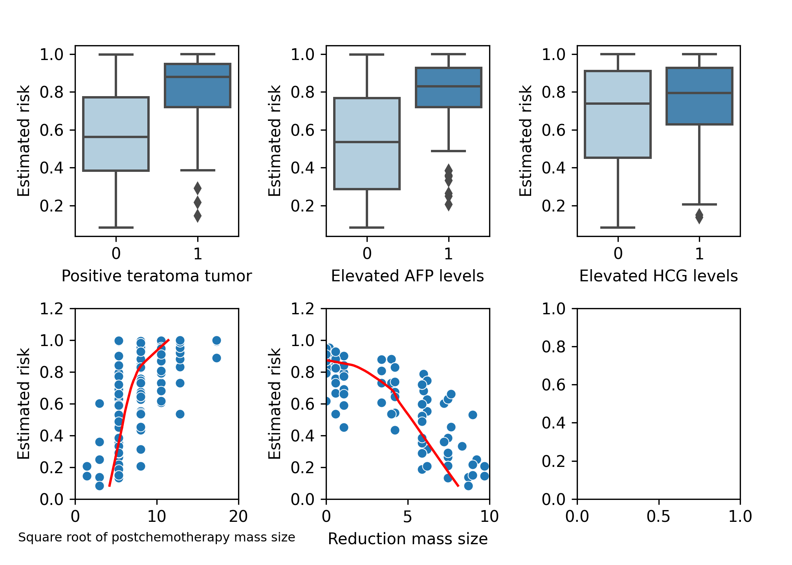
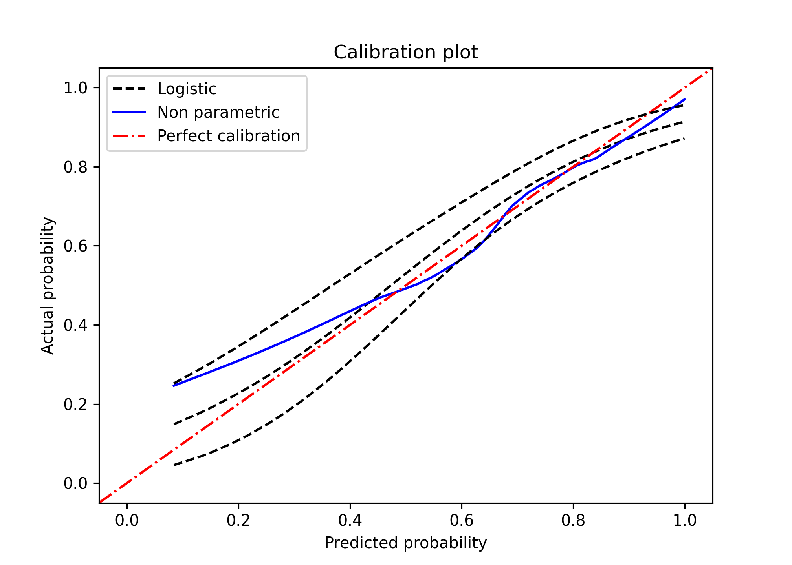
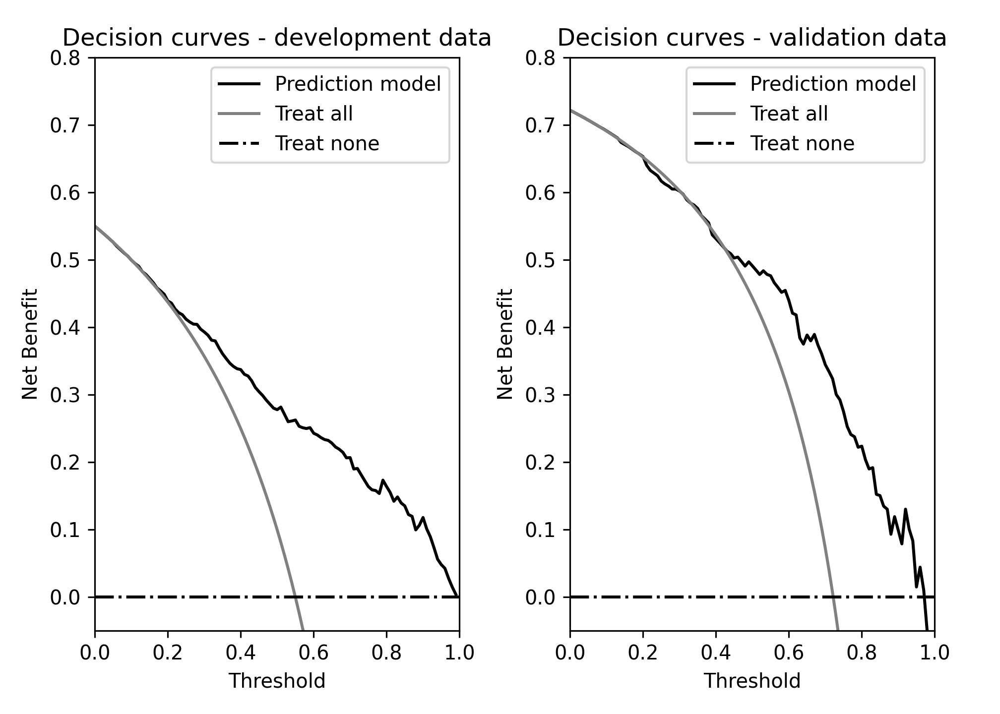

Development and validation of logistic regression risk prediction models
================

-   [Steps](#steps)
    -   [Installing and loading packages and import
        data](#installing-and-loading-packages-and-import-data)
    -   [Data description](#data-description)
        -   [Descriptive statistics](#descriptive-statistics)
-   [Goal 1 - Develop a logistic regression risk prediction
    model](#goal-1---develop-a-logistic-regression-risk-prediction-model)
    -   [1.1 Check non-linearity of continuous
        predictors](#11-check-non-linearity-of-continuous-predictors)
    -   [1.2 Examine the fit of the
        models](#12-examine-the-fit-of-the-models)
    -   [1.3 Plot of predictors vs estimated in the validation
        data](#13-plot-of-predictors-vs-estimated-in-the-validation-data)
-   [Goal 2 - Assessing performance of a logistic regression risk
    prediction
    model](#goal-2---assessing-performance-of-a-logistic-regression-risk-prediction-model)
    -   [2.1 Discrimination](#21-discrimination)
    -   [2.2 Calibration](#22-calibration)
        -   [2.2.1 Mean calibration](#221-mean-calibration)
        -   [2.2.2 Weak calibration](#222-weak-calibration)
        -   [2.2.3 Moderate calibration](#223-moderate-calibration)
    -   [2.3 Overall performance
        measures](#23-overall-performance-measures)
-   [Goal 3 - Clinical utility](#goal-3---clinical-utility)

## Steps

The steps taken in this file are:  
1. To develop a logistic regression risk prediction model.  
2. To assess the performance of the model in terms of calibration,
discrimination and overall prediction error. We calculate the apparent,
internal (optimism-corrected) validation and the external validation.  
3. To assess the potential clinical utility the model using decision
curve analysis.

### Installing and loading packages and import data

The following libraries are used in this file, the code chunk below will
a) check whether you already have them installed, b) install them for
you if not already present, and c) load the packages into the session.

<details>
<summary>
Click to expand code
</summary>

``` r
# Use pacman to check whether packages are installed, if not load
if (!require("pacman")) install.packages("pacman")
library(pacman)

pacman::p_load(
  reticulate,
  tidyverse,
  knitr,
  kableExtra
)
```

</details>

    ## Loading required package: pacman

<details>
<summary>
Click to expand code
</summary>

``` python
# Load libraries and data
import warnings
warnings.simplefilter(action = "ignore", category = FutureWarning)
warnings.filterwarnings("ignore", category = RuntimeWarning) # suppressing warnings
import pandas as pd # For data frames
import numpy as np
import scipy as sp
import tableone as tb
import statsmodels.api as smf # For models
import matplotlib.pyplot as plt # For plots
import sklearn as sk # Also for bootstrap (resample)
import seaborn as sns # For plots
from sklearn.metrics import brier_score_loss # For Brier score calculation


# Get work directory
# os.getcwd()
url_rdata = "https://raw.githubusercontent.com/danielegiardiello/ValLogRegMod/main/Data/rdata.csv"
url_vdata = "https://raw.githubusercontent.com/danielegiardiello/ValLogRegMod/main/Data/vdata.csv"
# NOTE: go to 
# "https://github.com/danielegiardiello/ValLogRegMod/blob/main/Data/vdata.csv"
# then click" Raw" button to the upper right corner of the file preview.
# Copy and paste the url link to have the raw gitHub version of the data
rdata = pd.read_csv(url_rdata)
vdata = pd.read_csv(url_vdata)
# Inspect data:
# print(rdata.head(5)) # print the first five rows
# print(vdata.head(5)) # print the first five rows
# rdata.info() # inspect data as in R str()
# vdata.info() # inspect data as in R str()

## Data manipulation ----
# Development data 
# Converting categorical variables to dummies
rdata = pd.get_dummies(data = rdata, 
                       columns = ["ter_pos", "preafp", "prehcg"])
# Dropping columns not needed
rdata.drop(["ter_pos_No", "preafp_No", "prehcg_No"], 
           axis = 1, inplace = True)

# Validation data 
vdata = pd.get_dummies(data = vdata, 
                       columns=["ter_pos", "preafp", "prehcg"])
# Dropping columns not needed
vdata.drop(["ter_pos_No", "preafp_No", "prehcg_No"],
            axis = 1,
            inplace = True)
```

</details>

    ## C:\Users\DGIARD~1\AppData\Local\Programs\Python\PYTHON~1\lib\site-packages\seaborn\rcmod.py:82: DeprecationWarning: distutils Version classes are deprecated. Use packaging.version instead.
    ##   if LooseVersion(mpl.__version__) >= "3.0":
    ## C:\Users\DGIARD~1\AppData\Local\Programs\Python\PYTHON~1\lib\site-packages\setuptools\_distutils\version.py:351: DeprecationWarning: distutils Version classes are deprecated. Use packaging.version instead.
    ##   other = LooseVersion(other)

### Data description

Men with metastatic non-seminomatous testicular cancer can often be
cured nowadays by cisplatin based chemotherapy. After chemotherapy,
surgical resection is a generally accepted treatment to remove remnants
of the initial metastases, since residual tumor may still be present. In
the absence of tumor, resection has no therapeutic benefits, while it is
associated with hospital admission, and risks of permanent morbidity and
mortality. Logistic regression models were developed to predict the
presence of residual tumor, combining well-known predictors, such as the
histology of the primary tumor, pre-chemotherapy levels of tumor
markers, and (reduction in) residual mass size.  
We first consider a data set (rdata) with 544 patients to develop a
prediction model that includes 5 predictors. We then extend this model
with the pre-chemotherapy level of the tumor marker lactate
dehydrogenase (LDH). This illustrates ways to assess the incremental
value of a marker. LDH values were log transformed, after standardizing
by dividing by the local upper levels of normal values, after
examination of non-linearity with restricted cubic spline functions.

We first consider a data set with 544 patients to develop a prediction
model that includes 5 predictors (rdata). In a later study, we
externally validated the 5 predictor model in 273 patients from a
tertiary referral center (vdata). We illustrate ways to assess the
usefulness of a model in a new setting.  
We then extend the developed model with the pre-chemotherapy level of
the tumor marker lactate dehydrogenase (LDH). Since the validation data
(vdata) did not have information about LDH, we assess the prediction
performances of the basic model in the development (rdata) and in the
validation data (vdata). Thus, we loaded the development data (rdata)
and the validation data (vdata).  
More details about development and validation data are provided in the
manuscript [“Assessing the performance of prediction models: a framework
for some traditional and novel
measures”](https://www.ncbi.nlm.nih.gov/pmc/articles/PMC3575184/) by
Steyerberg et al. (2010).

#### Descriptive statistics

    FALSE ╒══════════════════════════════════════════════════╤═════╤════════════════════╤═══════════════════╕
    FALSE │                                                  │     │ Development data   │ Validation data   │
    FALSE ╞══════════════════════════════════════════════════╪═════╪════════════════════╪═══════════════════╡
    FALSE │ n                                                │     │ 544                │ 273               │
    FALSE ├──────────────────────────────────────────────────┼─────┼────────────────────┼───────────────────┤
    FALSE │ Residual tumor resection, n (%)                  │ 0   │ 245 (45.0)         │ 76 (27.8)         │
    FALSE ├──────────────────────────────────────────────────┼─────┼────────────────────┼───────────────────┤
    FALSE │                                                  │ 1   │ 299 (55.0)         │ 197 (72.2)        │
    FALSE ├──────────────────────────────────────────────────┼─────┼────────────────────┼───────────────────┤
    FALSE │ Primary tumor teratoma positive, n (%)           │ No  │ 252 (46.3)         │ 104 (38.1)        │
    FALSE ├──────────────────────────────────────────────────┼─────┼────────────────────┼───────────────────┤
    FALSE │                                                  │ Yes │ 292 (53.7)         │ 169 (61.9)        │
    FALSE ├──────────────────────────────────────────────────┼─────┼────────────────────┼───────────────────┤
    FALSE │ Elevated prechemotherapy AFP, n (%)              │ No  │ 186 (34.2)         │ 68 (24.9)         │
    FALSE ├──────────────────────────────────────────────────┼─────┼────────────────────┼───────────────────┤
    FALSE │                                                  │ Yes │ 358 (65.8)         │ 205 (75.1)        │
    FALSE ├──────────────────────────────────────────────────┼─────┼────────────────────┼───────────────────┤
    FALSE │ Elevated Prechemotherapy HCG, n (%)              │ No  │ 205 (37.7)         │ 75 (27.5)         │
    FALSE ├──────────────────────────────────────────────────┼─────┼────────────────────┼───────────────────┤
    FALSE │                                                  │ Yes │ 339 (62.3)         │ 198 (72.5)        │
    FALSE ├──────────────────────────────────────────────────┼─────┼────────────────────┼───────────────────┤
    FALSE │ Square root of mass size, median [min,max]       │     │ 4.5 [1.4,17.3]     │ 8.0 [1.4,17.3]    │
    FALSE ├──────────────────────────────────────────────────┼─────┼────────────────────┼───────────────────┤
    FALSE │ Reduction in mass size per 10%, median [min,max] │     │ 5.2 [-13.8,10.0]   │ 1.1 [-15.0,9.7]   │
    FALSE ├──────────────────────────────────────────────────┼─────┼────────────────────┼───────────────────┤
    FALSE │ log(LDH), median [min,max]                       │     │ 0.3 [-1.1,2.8]     │ nan [nan,nan]     │
    FALSE ╘══════════════════════════════════════════════════╧═════╧════════════════════╧═══════════════════╛

## Goal 1 - Develop a logistic regression risk prediction model

### 1.1 Check non-linearity of continuous predictors

Here we investigate the potential non-linear relation between continuous
predictors and the outcomes. We apply three-knot restricted cubic
splines (details are given in e.g. Frank Harrell’s book ‘Regression
Model Strategies (second edition)’, page 27. We assess the potential
non-linearity graphically (plotting the two continuous predictors
against the log odds (XB or linear predictor) of both event types. Also,
we compare the models with and without splines based on the AIC.

<details>
<summary>
Click to expand code
</summary>

``` python
# Formula restricted cubic spline
# k = #knots
# X1 = X
# X_j+1 = (X - t_j)_+**3 - (X - t_k-1)_+**3 * (t_k - t_j) / (t_k - t_k-1)
# + (X - t_k)_+**3 (t_k-1 - t_j)((t_k - t_k-1))
# Models without splines

# Models with splines
# Create function to calculate restricted cubic splines with three knots
def rcs_3(x):
    res_x = np.zeros((len(rdata), 1))
    qknots = [.1, .5, .9]
    knots = np.quantile(x, q = qknots)
    res_x[:, 0] = (np.power(np.clip((x - knots[0]), a_min = 0, a_max = None), 3) - np.power(np.clip((x - knots[1]), a_min = 0, a_max = None), 3) *((knots[2] - knots[0])/(knots[2] - knots[1])) + np.power(np.clip((x - knots[2]), a_min = 0, a_max = None), 3) * ((knots[1] - knots[0])/(knots[2] - knots[1]))) / ((knots[2] - knots[0])**2)
    return(res_x)
# NOTE: to be extended for 4,5, 6 and 7 knots

# Add splines to data frame
rdata["sq_rcs1"] = rcs_3(rdata.sqpost)
rdata["reduc10_rcs1"] = rcs_3(rdata.reduc10)

# Predictors data with splines
X =  rdata[["ter_pos_Yes", "preafp_Yes", "prehcg_Yes", 
            "sqpost", "sq_rcs1", "reduc10", "reduc10_rcs1"]]
X = X.assign(intercept = 1.0)

# Predictors without splines
X2 =  rdata[["ter_pos_Yes", "preafp_Yes", "prehcg_Yes", 
            "sqpost", "reduc10"]]
X2 = X2.assign(intercept = 1.0)
 
# Fitting Generalised linear model on transformed dataset
fit_rcs = smf.GLM(rdata.tum_res, X,  family = smf.families.Binomial()).fit()
fit = smf.GLM(rdata.tum_res, X2, family = smf.families.Binomial()).fit()

# Save predictors of the validation model
coeff_rcs = fit_rcs.params
cov_rcs = X         

# Calculating the linear predictor (X*beta)
lp_rcs = np.matmul(cov_rcs, coeff_rcs)

# Non-lineary of sqpost adjusted for the other predictors
cov_rcs = cov_rcs.assign(ter_pos_Yes = 0,
                         preafp_Yes = 0,
                         prehcg_Yes = 0,
                         reduc10 = np.median(rdata.reduc10),
                         reduc10_rcs1 = np.median(rdata.reduc10_rcs1))


# Calculating the lp of sqpost adjusted for the other predictors
lp_rcs_sq = np.matmul(cov_rcs, coeff_rcs)

# Calculating standard errors
vcov = fit_rcs.cov_params()

# Matrix X *%* vcov *%* t(X) (sqrt of the diagonal)
std_err = np.power(np.diagonal(cov_rcs.dot(vcov).dot(pd.DataFrame.transpose((cov_rcs)))), 1/2)

# Save to df
alpha = 0.05
df_rcs_sq = pd.DataFrame(
  {"sq" : rdata.sqpost,
   "lp_rcs_sq" : lp_rcs_sq,
   "std_err" : std_err,
   'lower_95' :  lp_rcs_sq - sp.stats.norm.ppf(1 - alpha / 2) * std_err,
   'upper_95' : lp_rcs_sq + sp.stats.norm.ppf(1 - alpha / 2) * std_err}
)

# Sorting by sqpost
df_rcs_sq = df_rcs_sq.sort_values(by = ['sq']) # sort
# df_rcs = pd.Series({c: df_rcs[c].unique() for c in df_rcs}) # unique values

# Non-lineary assessment of reduc10 adjusted for the other covariates
cov_rcs = cov_rcs.assign(ter_pos_Yes = 0,
                         preafp_Yes = 0,
                         prehcg_Yes = 0,
                         sqpost = np.median(rdata.sqpost),
                         sq_rcs1 = np.median(rdata.sq_rcs1),
                         reduc10 = rdata.reduc10,
                         reduc10_rcs1 = rdata.reduc10_rcs1)

lp_rcs_reduc10 = np.matmul(cov_rcs, coeff_rcs)

# Matrix X *%* vcov *%* t(X) (sqrt of the diagonal)
std_err = np.power(np.diagonal(cov_rcs.dot(vcov).dot(pd.DataFrame.transpose((cov_rcs)))), 1/2)

# Save to df
alpha = 0.05
df_rcs_rd = pd.DataFrame(
  {"reduc10" : rdata.reduc10,
   "lp_rcs_reduc10" : lp_rcs_reduc10,
   "std_err" : std_err,
   'lower_95' :  lp_rcs_reduc10 - sp.stats.norm.ppf(1 - alpha / 2) * std_err,
   'upper_95' : lp_rcs_reduc10 + sp.stats.norm.ppf(1 - alpha / 2) * std_err}
)

df_rcs_rd = df_rcs_rd.sort_values(by = ['reduc10']) # sort

# Plotting
fig, (ax1, ax2) = plt.subplots(1, 2)

# First plot - predictor: sq ---
ax1.plot(df_rcs_sq.sq, df_rcs_sq.lp_rcs_sq, "-", 
         color = "black")
ax1.plot(df_rcs_sq.sq, df_rcs_sq.lower_95, "--", 
         color = "black")
ax1.plot(df_rcs_sq.sq, df_rcs_sq.upper_95, "--", 
         color = "black")
plt.setp(ax1, xlabel = 'Square root of postchemotherapy mass size')
plt.setp(ax1, ylabel = 'log Odds')

# Second plot - predictor: reduc10 ---
ax2.plot(df_rcs_rd.reduc10, df_rcs_rd.lp_rcs_reduc10, "-", 
         color = "black")
ax2.plot(df_rcs_rd.reduc10, df_rcs_rd.lower_95, "--", 
         color = "black")
ax2.plot(df_rcs_rd.reduc10, df_rcs_rd.upper_95, "--", 
         color = "black")
plt.setp(ax2, xlabel = 'Reduction in mass size per 10%')
plt.show()
plt.clf()
plt.cla()
plt.close('all')
```

</details>


<table class="table table-striped" style="margin-left: auto; margin-right: auto;">
<thead>
<tr>
<th style="text-align:right;">
AIC without splines
</th>
<th style="text-align:right;">
AIC with splines
</th>
</tr>
</thead>
<tbody>
<tr>
<td style="text-align:right;">
573.8713
</td>
<td style="text-align:right;">
574.5499
</td>
</tr>
</tbody>
</table>

Both the graphical comparison and the AIC comparison suggested no
relevant departure from linear relations between the continuous
predictors (square root of post-chemotherapy mass size and reduction in
mass size) and the risk of residual tumor at post-chemotherapy
resection.

### 1.2 Examine the fit of the models

-   Logistic regression risk prediction model without LDH

<!-- -->

    ## <class 'statsmodels.iolib.summary.Summary'>
    ## """
    ##                  Generalized Linear Model Regression Results                  
    ## ==============================================================================
    ## Dep. Variable:                tum_res   No. Observations:                  544
    ## Model:                            GLM   Df Residuals:                      538
    ## Model Family:                Binomial   Df Model:                            5
    ## Link Function:                  Logit   Scale:                          1.0000
    ## Method:                          IRLS   Log-Likelihood:                -280.94
    ## Date:                Thu, 26 May 2022   Deviance:                       561.87
    ## Time:                        16:51:05   Pearson chi2:                     520.
    ## No. Iterations:                     5   Pseudo R-squ. (CS):             0.2908
    ## Covariance Type:            nonrobust                                         
    ## ===============================================================================
    ##                   coef    std err          z      P>|z|      [0.025      0.975]
    ## -------------------------------------------------------------------------------
    ## intercept      -0.3016      0.549     -0.550      0.583      -1.377       0.774
    ## ter_pos_Yes     0.9955      0.208      4.782      0.000       0.587       1.403
    ## preafp_Yes      0.8592      0.228      3.766      0.000       0.412       1.306
    ## prehcg_Yes      0.5541      0.219      2.531      0.011       0.125       0.983
    ## sqpost          0.0737      0.066      1.120      0.263      -0.055       0.203
    ## reduc10        -0.2644      0.049     -5.346      0.000      -0.361      -0.167
    ## ===============================================================================
    ## """

-   Logistic regression risk prediction model with LDH

<!-- -->

    ## <class 'statsmodels.iolib.summary.Summary'>
    ## """
    ##                  Generalized Linear Model Regression Results                  
    ## ==============================================================================
    ## Dep. Variable:                tum_res   No. Observations:                  544
    ## Model:                            GLM   Df Residuals:                      537
    ## Model Family:                Binomial   Df Model:                            6
    ## Link Function:                  Logit   Scale:                          1.0000
    ## Method:                          IRLS   Log-Likelihood:                -268.61
    ## Date:                Thu, 26 May 2022   Deviance:                       537.21
    ## Time:                        16:51:06   Pearson chi2:                     546.
    ## No. Iterations:                     5   Pseudo R-squ. (CS):             0.3222
    ## Covariance Type:            nonrobust                                         
    ## ===============================================================================
    ##                   coef    std err          z      P>|z|      [0.025      0.975]
    ## -------------------------------------------------------------------------------
    ## intercept      -1.5521      0.602     -2.578      0.010      -2.732      -0.372
    ## ter_pos_Yes     0.9094      0.214      4.250      0.000       0.490       1.329
    ## preafp_Yes      0.9025      0.233      3.868      0.000       0.445       1.360
    ## prehcg_Yes      0.7827      0.230      3.396      0.001       0.331       1.234
    ## sqpost          0.2915      0.081      3.578      0.000       0.132       0.451
    ## reduc10        -0.1576      0.052     -3.038      0.002      -0.259      -0.056
    ## lnldhst        -0.9854      0.209     -4.717      0.000      -1.395      -0.576
    ## ===============================================================================
    ## """

The coefficients of the models indicated that positive tumor teratoma,
elevated prechemoterapy AFP levels, elevated prechemoterapy HCG levels,
postchemotherapy mass size (mm) (expressed in square root) are
associated with higher risk to residual tumor after resection. Reduction
in mass size is associated with a reduced risk to have residual tumor
after resection.

### 1.3 Plot of predictors vs estimated in the validation data

To get further insight into the effect of the covariates, we plot the
covariate values observed in the validation set against the estimated
absolute risk of having residual tumor after resection. This gives an
idea of the size of the effects.

<details>
<summary>
Click to expand code
</summary>

``` python
# Models -------------
X = rdata[["ter_pos_Yes", "preafp_Yes", "prehcg_Yes", "sqpost", "reduc10"]]
X = X.assign(intercept = 1.0)

fit_lrm = smf.GLM(rdata.tum_res, X, family = smf.families.Binomial()).fit()

# Predictors - validation data                
X_val =  vdata[["ter_pos_Yes", "preafp_Yes", "prehcg_Yes", "sqpost", "reduc10"]]
X_val = X_val.assign(intercept = 1.0)

# Predicted probabilities estimated by the model in the validation data
vdata = vdata.assign(pred = fit_lrm.predict(X_val))

fig, (ax1, ax2) = plt.subplots(nrows = 2, ncols = 3)
fig.tight_layout(pad = 2.5) 
# Or:
# subplots_adjust(left = None, bottom = None, right = None, top = None, 
#                 wspace = None, hspace=None) # to modify margins
#

# Positive teratoma tumor
sns.boxplot(x = "ter_pos_Yes", y = "pred", 
            data = vdata, palette = "Blues", ax = ax1[0]).set(
      xlabel = "Positive teratoma tumor",
      ylabel = "Estimated risk"
            )
            
## Elevated AFP levels           
sns.boxplot(x = "preafp_Yes",
            y = "pred",
            data = vdata, palette = "Blues", ax = ax1[1]).set(
              xlabel = "Elevated AFP levels",
              ylabel = "Estimated risk"
            )
            
# Elevated HCG
sns.boxplot(x = "prehcg_Yes",
            y = "pred",
            data = vdata, palette = "Blues", ax = ax1[2]).set(
              xlabel = "Elevated HCG levels",
              ylabel = "Estimated risk"
)
            
# Square root of postchemotherapy mass size
# Perform lowess
lowess = smf.nonparametric.lowess
fit_lowess = lowess(vdata.sqpost,
                    vdata.pred,
                    frac = 2/3,
                    it = 0) # same f and iter parameters as R
sns.scatterplot(x = "sqpost",
                y = "pred",
                data = vdata, ax = ax2[0])
ax2[0].set_xlim(0, 20)
ax2[0].set_ylim(0, 1.2)
ax2[0].set_xlabel("Square root of postchemotherapy mass size", fontsize = 8)
ax2[0].set_ylabel("Estimated risk")
ax2[0].plot(fit_lowess[:, 1], fit_lowess[:, 0], "-", color = "red")

           
# Reduction mass size
# Perform lowess
lowess = smf.nonparametric.lowess
fit_lowess = lowess(vdata.reduc10,
                    vdata.pred, 
                    frac = 2/3,
                    it = 0) # same f and iter parameters as R
sns.scatterplot(x = "reduc10",
                y = "pred",
                data = vdata, ax = ax2[1]).set(
                  xlabel = "Reduction mass size",
                  ylabel = "Estimated risk"
)
ax2[1].set_xlim(0, 10)
ax2[1].set_ylim(0, 1.2)
ax2[1].plot(fit_lowess[:, 1], fit_lowess[:, 0], "-", color = "red")
plt.show()
plt.clf()
plt.cla()
plt.close('all')
```

</details>

    ## (0.0, 20.0)

    ## (0.0, 1.2)

    ## (0.0, 10.0)

    ## (0.0, 1.2)



## Goal 2 - Assessing performance of a logistic regression risk prediction model

Here we evaluate the performance of the prediction model in terms of
discrimination, calibration and overall prediction error. We assess the
prediction performance of the developed model not including LDH
internally and in an external data.

### 2.1 Discrimination

We here calculate:

-   The c-statistic: it is a rank order statistic for predictions
    against true outcomes. The concordance (c) statistic is the most
    commonly used performance measure to indicate the discriminative
    ability of generalized linear regression models. For a binary
    outcome, c is identical to the area under the Receiver Operating
    Characteristic (ROC) curve, which plots the sensitivity (true
    positive rate) against 1 – (false positive rate) for consecutive
    cutoffs for the probability of an outcome. Accurate predictions
    discriminate between those with and those without the outcome.

-   Discrimination slope: it can be used as a simple measure for how
    well subjects with and without the outcome are separated. It is
    calculated as the absolute difference in average predictions for
    those with and without the outcome. Visualization is readily
    possible with a box plot or a histogram, which will show less
    overlap between those with and those without the outcome for a
    better discriminating model.

More details are in [“Assessing the performance of prediction models: a
framework for some traditional and novel
measures”](https://www.ncbi.nlm.nih.gov/pmc/articles/PMC3575184/) by
Steyerberg et al. (2010);

<details>
<summary>
Click to expand code
</summary>

``` python
## Fitting the logistic regression model ------------------
# Logistic regression using statsmodels library
y = rdata["tum_res"]
X_rdata = rdata[["ter_pos_Yes", "preafp_Yes", "prehcg_Yes", "sqpost", "reduc10"]]
X_rdata = X_rdata.assign(intercept = 1.0)

lrm = smf.GLM(y, X_rdata, family = smf.families.Binomial())
result_lrm = lrm.fit()

# Create dataframe dev_out and val_out containing all info useful
# to assess prediction performance in the development and in the validation data

# Save estimated predicted probabilities in the development data
pred_rdata = result_lrm.predict(X_rdata)

# Save predictors of the validation model
X_vdata = vdata         
X_vdata = X_vdata.assign(intercept = 1.0)
X_vdata = X_vdata[["ter_pos_Yes", "preafp_Yes","prehcg_Yes", "sqpost", "reduc10", "intercept"]]

# Save estimated predicted probabilities in the validation data
pred_vdata = result_lrm.predict(X_vdata)

# Save coefficients of the developed model
coeff = result_lrm.params

# Calculating the linear predictor (X*beta)
lp_rdata = np.matmul(X_rdata, coeff)
lp_vdata = np.matmul(X_vdata, coeff)

# Create the dataframe including all useful info 
# y_dev = outcome of the development
# lp_dev = linear predictor calculated in the developement data
# pred_dev = estimated predicted probability in the development data
dev_out =  pd.DataFrame({'y_dev': rdata["tum_res"], 
                         'lp_dev' : lp_rdata,
                         'pred_dev' : pred_rdata})                      
dev_out = dev_out.assign(intercept = 1.0) # Add intercept

# Validation data --
# y_val = outcome of the validation data
# lp_val = linear predictor calculated in the validation data
# pred_val = estimated predicted probability in the validation data
val_out =  pd.DataFrame({'y_val': vdata["tum_res"], 
                         'lp_val' : lp_vdata,
                         'pred_val' : pred_vdata})                      
val_out = val_out.assign(intercept = 1.0) # Add intercept


# Discrimination -------------------

import lifelines 
from lifelines.utils import concordance_index


## C-statistic ---
cstat_rdata = concordance_index(dev_out.y_dev, dev_out.lp_dev) # development data
cstat_vdata = concordance_index(val_out.y_val, val_out.lp_val) # validation data

## Discrimination slope ---

### Development data ----
#### Apparent validation
dev_out_group = dev_out.groupby("y_dev").mean()
dslope_rdata = abs(dev_out_group.pred_dev[1] - dev_out_group.pred_dev[0])

### Validation data ----
val_out_group = val_out.groupby("y_val").mean()
dslope_vdata = abs(val_out_group.pred_val[1] - val_out_group.pred_val[0])

#### Bootstrap percentile confidence intervals
# Bootstrap confidence intervals for development and validation set
# NOTE: I need to understand how to set up a random seed to reproduce
# the same boostrapped data
B = 2000
bdev_out = {}
bval_out = {}
cstat_dev_b = [0] * B
dev_bgroup = {}
dslope_dev_b = [0] * B
cstat_val_b = [0] * B
val_bgroup = {}
dslope_val_b = [0] * B
for j in range(B): 
  
  bdev_out[j] = sk.utils.resample(dev_out, 
      replace = True, 
      n_samples = len(dev_out)) # bootstrapping development data
      
  bval_out[j] = sk.utils.resample(val_out, 
      replace = True, 
      n_samples = len(val_out)) # bootstrapping validation data
  
  # Bootstrapped discrimination measures - development data     
  cstat_dev_b[j] = concordance_index(bdev_out[j].y_dev, bdev_out[j].lp_dev)
  dev_bgroup[j] = bdev_out[j].groupby("y_dev").mean().pred_dev
  dslope_dev_b[j] = abs(dev_bgroup[j][1] - dev_bgroup[j][0])
  
  # Bootstrapped discrimination measures - validation data  
  cstat_val_b[j] = concordance_index(bval_out[j].y_val, bval_out[j].lp_val)
  val_bgroup[j] = bval_out[j].groupby("y_val").mean().pred_val
  dslope_val_b[j] = abs(val_bgroup[j][1] - val_bgroup[j][0])
  
# Internal validation function
#
# Calculate optimism-corrected bootstrap internal validation for c-statistic and 
# discrimination slope.
# 
# @type  data: pandas.core.frame.DataFrame
# @param data: data frame
# @type  y:  str 
# @param y:  variabile identifying the binary outcome
# @type  X:  pandas.core.frame.DataFrame
# @param X:  predictors including the intercept
# @type  B:  integer
# @param B:  number of bootstrap sample (default B = 2000)
# @rtype:    pandas.core.frame.DataFrame 
# @return:   pandas.core.frame.DataFrame including optimism-corrected bootstrap internal
#            validation prediction performance measures.
# 

def bootstrap_cv_lrm(data, y, X, B = 2000):

  bdata = {}
  X_boot = {}
  lrm_boot = {}
  lrm_boot_null = {}
  coeff_boot = {}
  lp_boot = {}
  lp_orig = {}
  pred_boot = {}
  pred_orig = {}
  cstat_boot = [0] * B
  cstat_orig = [0] * B
  boot_out_group = {}
  orig_out_group = {}
  dslope_boot = [0] * B
  dslope_orig = [0] * B
  bs_boot = [0] * B
  bs_orig = [0] * B
  
  # Predictors of original (development) data
  X_rdata = data[X]
  X_rdata = X_rdata.assign(intercept = 1.0)
  # Run original model
  lrm_app = smf.GLM(data[y], X_rdata, family = smf.families.Binomial()).fit()
  # Null model for Scaled Brier score calculation
  lrm_null = smf.GLM(data[y], X_rdata.intercept, family = smf.families.Binomial()).fit()
  
  # Save predictors of the original model
  coeff_apparent = lrm_app.params
  # Calculating the linear predictor (X*beta)
  lp_apparent = np.matmul(X_rdata, coeff_apparent)
  pred_apparent = lrm_app.predict(X_rdata)
  pred_null = lrm_null.predict(X_rdata.intercept)
  # Apparent C-statistic and discrimination slope
  cstat_app = concordance_index(data[y], lp_apparent)  # c-statistic
  app_out_group = pred_apparent.groupby(data[y]).mean()
  dslope_app = abs(app_out_group[1] - app_out_group[0])
  bs_app = brier_score_loss(data[y], pred_apparent) 
  bs_null = brier_score_loss(data[y], pred_null)
  scaled_bs_app = 1 - bs_app / bs_null
  
  for j in range(B):
    # Bootstrapping development data
    bdata[j] = sk.utils.resample(data, replace = True, n_samples = len(data)) 
    bdata[j] = bdata[j].assign(intercept = 1.0)
    X_boot[j] =  bdata[j][pd.Index(X_rdata.columns)]
    # Logistic regression model in every bootstrapped data
    lrm_boot[j] = smf.GLM(bdata[j][y], X_boot[j], family = smf.families.Binomial())
    coeff_boot[j] = lrm_boot[j].fit().params # coefficients
    # Linear predictor and predicted probabilities 
    # in every bootstrapped model and in every bootstrapped data
    lp_boot[j] = np.matmul(X_boot[j], coeff_boot[j])
    pred_boot[j] = lrm_boot[j].fit().predict(X_boot[j])
    
    # Linear predictor and predicted probabilities 
    # in every bootstrapped model in the original data
    lp_orig[j] = np.matmul(X_rdata, coeff_boot[j])
    pred_orig[j] = lrm_boot[j].fit().predict(X_rdata)
    
    # Discrimination --
    ## C-statistic --
    cstat_boot[j] = concordance_index(bdata[j][y], lp_boot[j]) 
    cstat_orig[j] = concordance_index(rdata[y], lp_orig[j]) 
    cstat_diff = np.subtract(cstat_boot, cstat_orig)
    cstat_opt = np.mean(cstat_diff)
 
    ## Discrimination slope --
    boot_out_group[j] = pred_boot[j].groupby(bdata[j][y]).mean()
    dslope_boot[j] = abs(boot_out_group[j][1] - boot_out_group[j][0])
  
    orig_out_group[j] = pred_orig[j].groupby(rdata[y]).mean()
    dslope_orig[j] = abs(orig_out_group[j][1] - orig_out_group[j][0])
    dslope_diff = np.subtract(dslope_boot, dslope_orig)
    dslope_opt = np.mean(dslope_diff)
    
    # Brier score ---
    bs_boot[j] = brier_score_loss(bdata[j][y], pred_boot[j])
    bs_orig[j] = brier_score_loss(rdata[y], pred_orig[j])
    bs_diff = np.subtract(bs_boot, bs_orig)
    bs_opt = np.mean(bs_diff)
    
    res_int = pd.DataFrame(
      {"C-statistic": cstat_app - cstat_opt,
       "Discrimination slope": dslope_app - dslope_opt,
       "Brier score": bs_app - bs_opt,
       "Scaled brier score": 1 - ((bs_app - bs_opt) / bs_null)},
       index = ["Optimism-corrected bootstrap"]
    )
    
  return(res_int)

res_int = bootstrap_cv_lrm(rdata, 
                           y = "tum_res",
                           X = {"ter_pos_Yes", "preafp_Yes",
                                 "prehcg_Yes", "sqpost", "reduc10"},
                           B = 2000)
```

</details>
<table class="table table-striped" style="margin-left: auto; margin-right: auto;">
<thead>
<tr>
<th style="empty-cells: hide;border-bottom:hidden;" colspan="1">
</th>
<th style="border-bottom:hidden;padding-bottom:0; padding-left:3px;padding-right:3px;text-align: center; " colspan="3">

<div style="border-bottom: 1px solid #ddd; padding-bottom: 5px; ">

Apparent

</div>

</th>
<th style="border-bottom:hidden;padding-bottom:0; padding-left:3px;padding-right:3px;text-align: center; " colspan="3">

<div style="border-bottom: 1px solid #ddd; padding-bottom: 5px; ">

Internal

</div>

</th>
<th style="border-bottom:hidden;padding-bottom:0; padding-left:3px;padding-right:3px;text-align: center; " colspan="3">

<div style="border-bottom: 1px solid #ddd; padding-bottom: 5px; ">

External

</div>

</th>
</tr>
<tr>
<th style="text-align:left;">
</th>
<th style="text-align:left;">
Estimate
</th>
<th style="text-align:left;">
2.5 %
</th>
<th style="text-align:left;">
97.5 %
</th>
<th style="text-align:left;">
Estimate
</th>
<th style="text-align:left;">
2.5 %
</th>
<th style="text-align:left;">
97.5 %
</th>
<th style="text-align:left;">
Estimate
</th>
<th style="text-align:left;">
2.5 %
</th>
<th style="text-align:left;">
97.5 %
</th>
</tr>
</thead>
<tbody>
<tr>
<td style="text-align:left;">
C-statistic
</td>
<td style="text-align:left;">
0.82
</td>
<td style="text-align:left;">
0.78
</td>
<td style="text-align:left;">
0.85
</td>
<td style="text-align:left;">
0.81
</td>
<td style="text-align:left;">
NULL
</td>
<td style="text-align:left;">
NULL
</td>
<td style="text-align:left;">
0.79
</td>
<td style="text-align:left;">
0.72
</td>
<td style="text-align:left;">
0.84
</td>
</tr>
<tr>
<td style="text-align:left;">
Discrimination slope
</td>
<td style="text-align:left;">
0.3
</td>
<td style="text-align:left;">
0.26
</td>
<td style="text-align:left;">
0.34
</td>
<td style="text-align:left;">
0.29
</td>
<td style="text-align:left;">
NULL
</td>
<td style="text-align:left;">
NULL
</td>
<td style="text-align:left;">
0.24
</td>
<td style="text-align:left;">
0.18
</td>
<td style="text-align:left;">
0.3
</td>
</tr>
</tbody>
</table>

C-statistic was 0.82 (95% confidence interval, CI: 0.78-0.85), and 0.79
(95% CI: 0.72-0.84) in the development and validation data,
respectively. Internal cross-validation based on optimism-corrected
bootstrapping showed a C-statistic of 0.81.

Discrimination slope was 0.30 (95% CI: 0.26-0.34), and 0.24 (95% CI:
0.18-0.30) for the development and validation data, respectively.
Internal cross-validation based on optimism-corrected bootstrapping
showed a discrimination slope of 0.29.

### 2.2 Calibration

Calibration refers to the agreement between observed outcomes and
predictions. For example, if we predict a 20% risk of residual tumor for
a testicular cancer patient, the observed frequency of tumor should be
approximately 20 out of 100 patients with such a prediction.

Different level of calibration can be estimated: mean, weak, and
moderate calibration according to the calibration hierarchy defined by
Van Calster et
al. [here](https://www.sciencedirect.com/science/article/pii/S0895435615005818).

#### 2.2.1 Mean calibration

Mean calibration refers how systematically the model might under- or
over- predicts the actual risk.

The mean calibration can be estimated:

-   using the Observed and Expected ratio. The observed number of events
    is the sum of the events (or cases) present in the data. The
    expected is estimated summing the predicted probability of the event
    estimated by the model. Ratio equals to 1 indicates perfect (mean)
    calibration, values lower or greater than 1 indicate over- and
    under- prediction, respectively.

-   calibration intercept (or calibration-in-the-large): indicates the
    extent that predictions are systematically too low or too high.

<details>
<summary>
Click to expand code
</summary>

``` python
## Fitting the logistic regression model ------------------
y = rdata["tum_res"]
X_rdata = rdata[["ter_pos_Yes", "preafp_Yes", "prehcg_Yes", "sqpost", "reduc10"]]
X_rdata = X_rdata.assign(intercept = 1.0)

lrm = smf.GLM(y, X_rdata, family = smf.families.Binomial())
result_lrm = lrm.fit()


# Save predictors of the validation model
X_vdata = vdata         
X_vdata = X_vdata.assign(intercept = 1.0)
X_vdata = X_vdata[["ter_pos_Yes", "preafp_Yes","prehcg_Yes", "sqpost", "reduc10", "intercept"]]

# Save estimated predicted probabilities in the validation data
pred_vdata = result_lrm.predict(X_vdata)

# Save coefficients of the developed model
coeff = result_lrm.params

# Calculating the linear predictor (X*beta)
lp_vdata = np.matmul(X_vdata, coeff)

# Create the dataframe including all useful info
# Validation data --
# y_val = outcome of the validation data
# lp_val = linear predictor calculated in the validation data
val_out =  pd.DataFrame({'y_val' : vdata["tum_res"], 
                         'lp_val' : lp_vdata,
                         'pred_val' : pred_vdata})                      
val_out = val_out.assign(intercept = 1.0) # Add intercept

# Calibration intercept (calibration-in-the-large) -------------
# df_cal_int = pd.concat(y_val, lp_val)
cal_int = smf.GLM(val_out.y_val, 
                  val_out.intercept, 
                  family = smf.families.Binomial(),
                  offset = val_out.lp_val)
res_cal_int = cal_int.fit()
# np.float64(res_cal_int.params)
# res_cal_int.conf_int()
# np.float64(res_cal_int.conf_int()[0])


# Observed/Expected ratio
Obs = np.sum(val_out.y_val)
Exp = np.sum(val_out.pred_val)
OE = Obs / Exp
alpha = 0.05
res_OE = pd.DataFrame(
  {"OE" : OE,
   "lower": OE * np.exp(- sp.stats.norm.ppf(1 - alpha / 2) * np.power(1 / Obs, 0.5)),
   "upper": OE * np.exp(sp.stats.norm.ppf(1 - alpha / 2) * np.power(1 / Obs, 0.5))
   },
   index=[0]
)
```

</details>
<table class="table table-striped" style="margin-left: auto; margin-right: auto;">
<thead>
<tr>
<th style="text-align:left;">
</th>
<th style="text-align:right;">
Estimate
</th>
<th style="text-align:right;">
2.5 %
</th>
<th style="text-align:right;">
97.5 %
</th>
</tr>
</thead>
<tbody>
<tr>
<td style="text-align:left;">
Calibration intercept
</td>
<td style="text-align:right;">
-0.03
</td>
<td style="text-align:right;">
-0.34
</td>
<td style="text-align:right;">
0.28
</td>
</tr>
<tr>
<td style="text-align:left;">
O/E ratio
</td>
<td style="text-align:right;">
0.99
</td>
<td style="text-align:right;">
0.86
</td>
<td style="text-align:right;">
1.14
</td>
</tr>
</tbody>
</table>

Both calibration intercept and O/E ratio showed good mean calibration.
The prediction model did not systematically over or underestimate the
actual risk.

#### 2.2.2 Weak calibration

The term ‘weak’ refers to the limited flexibility in assessing
calibration. We are essentially summarizing calibration of the observed
proportions of outcomes versus predicted probabilities using only two
parameters i.e. a straight line. In other words, perfect weak
calibration is defined as mean calibration ratio and calibration slope
of unity(or calibration intercept equals to zero). The calibration slope
indicates the overall strength of the linear predictor (LP), which can
be interpreted as the level of overfitting (slope \<1) or underfitting
(slope>1). A value of slope smaller than 1 can also be interpreted as
reflecting a need for shrinkage of regression coefficients in a
prediction model.
<details>
<summary>
Click to expand code
</summary>

``` python
## Fitting the logistic regression model ------------------
y = rdata["tum_res"]
X_rdata = rdata[["ter_pos_Yes", "preafp_Yes", "prehcg_Yes", "sqpost", "reduc10"]]
X_rdata = X_rdata.assign(intercept = 1.0)

lrm = smf.GLM(y, X_rdata, family = smf.families.Binomial())
result_lrm = lrm.fit()

# Save predictors of the validation model
X_vdata = vdata         
X_vdata = X_vdata.assign(intercept = 1.0)
X_vdata = X_vdata[["ter_pos_Yes", "preafp_Yes","prehcg_Yes", "sqpost", "reduc10", "intercept"]]

# Save coefficients of the developed model
coeff = result_lrm.params

# Calculating the linear predictor (X*beta)
lp_vdata = np.matmul(X_vdata, coeff)

# Create the dataframe including all useful info
# Validation data --
# y_val = outcome of the validation data
# lp_val = linear predictor calculated in the validation data
val_out =  pd.DataFrame({'y_val': vdata["tum_res"], 
                         'lp_val' : lp_vdata})                      
val_out = val_out.assign(intercept = 1.0) # Add intercept


# Calibration slope
cal_slope = smf.GLM(val_out.y_val, 
                    val_out[["intercept", "lp_val"]], 
                    family = smf.families.Binomial())
res_cal_slope = cal_slope.fit()
res_cal_slope_summary = res_cal_slope.summary()
# res_cal_slope_summary
```

</details>
<table class="table table-striped" style="margin-left: auto; margin-right: auto;">
<thead>
<tr>
<th style="text-align:left;">
</th>
<th style="text-align:right;">
Estimate
</th>
<th style="text-align:right;">
2.5 %
</th>
<th style="text-align:right;">
97.5 %
</th>
</tr>
</thead>
<tbody>
<tr>
<td style="text-align:left;">
Calibration slope
</td>
<td style="text-align:right;">
0.74
</td>
<td style="text-align:right;">
0.5
</td>
<td style="text-align:right;">
0.98
</td>
</tr>
</tbody>
</table>

#### 2.2.3 Moderate calibration

Moderate calibration concerns whether among patients with the same
predicted risk, the observed event rate equals the predicted risk. A
graphical assessment of calibration is possible with predictions on the
x-axis, and the outcome on the y-axis. Perfect predictions should be on
the 45° line. For binary outcomes, the plot contains only 0 and 1 values
for the y-axis. Smoothing techniques can be used to estimate the
observed probabilities of the outcome (p(y=1)) in relation to the
predicted probabilities, e.g. using the lowess algorithm. The observed
probabilities can be also estimated using a secondary logistic
regression model using the predicted probability as a covariate. We can
assume linearity or a more flexible relation between the covariate and
the observed probabilties using, for example, splines. We may however
expect that the specific type of smoothing may affect the graphical
impression, especially in smaller data sets.

<details>
<summary>
Click to expand code
</summary>

``` python
## Fitting the logistic regression model ------------------
y = rdata["tum_res"]
X_rdata = rdata[["ter_pos_Yes", "preafp_Yes", "prehcg_Yes", "sqpost", "reduc10"]]
X_rdata = X_rdata.assign(intercept = 1.0)

lrm = smf.GLM(y, X_rdata, family = smf.families.Binomial())
result_lrm = lrm.fit()

# Save predictors of the validation model
X_vdata = vdata         
X_vdata = X_vdata.assign(intercept = 1.0)
X_vdata = X_vdata[["ter_pos_Yes", "preafp_Yes","prehcg_Yes", "sqpost", "reduc10", "intercept"]]

# Save coefficients of the developed model
coeff = result_lrm.params

# Calculating the linear predictor (X*beta)
lp_vdata = np.matmul(X_vdata, coeff)

# Estimated predicted probabilities by the model in the validation data
pred_vdata = result_lrm.predict(X_vdata)

# Create the dataframe including all useful info
# Validation data --
# y_val = outcome of the validation data
# lp_val = linear predictor calculated in the validation data
val_out =  pd.DataFrame({'y_val': vdata["tum_res"], 
                         'lp_val' : lp_vdata,
                         'pred_val' : pred_vdata})                      
val_out = val_out.assign(intercept = 1.0) # Add intercept


# Calibration plot 
# Method used: The actual probability is estimated using a 'secondary' logistic regression model
# using the predicted probabilities as a covariate.
# Non-parametric curve (smooth using lowess) is also used as an alternative method.

pred_val_cal = pd.DataFrame({'pred_val' : pred_vdata})
pred_val_cal['intercept'] = 1.0
moderate_cal = smf.GLM(val_out.y_val, 
                       val_out[["intercept", "pred_val"]], 
                       family = smf.families.Binomial())
res_moderate_cal = moderate_cal.fit()

# Estimated the standard error of the predicted probabilities
# to add confidence bands to the calibration plot estimated using
# a 'secondary' logistic regression model.
# We need: 
# a. matrix of variance and covariance of the 'secondary' logistic model
# res_moderate_cal.cov_params()

# b. estimate the linear predictor as x*beta
lp_cal = np.matmul(val_out[["intercept", "pred_val"]],
                  res_moderate_cal.params)

# Estimating the density 
dlogis = sp.stats.logistic.pdf(lp_cal) # logistic density function = exp(-xb) / (1 + exp(-xb))**2)

# Estimating the standard error of predicted probabilities
#   Formula details are in https://blog.methodsconsultants.com/posts/delta-method-standard-errors/
# In R: dlogis(xb) %*% t(x) %*% vcov(trump_model) %*% x %*% dlogis(xb) %>% sqrt
  
se_fit = [0] * len(vdata)
for j in range(len(vdata)):
  se_fit[j] = np.dot(dlogis[j], val_out[["intercept", "pred_val"]].loc[j])
  se_fit[j] = np.dot(se_fit[j], res_moderate_cal.cov_params())
  se_fit[j] = np.dot(se_fit[j], val_out[["intercept", "pred_val"]].loc[j].T)
  se_fit[j] = np.dot(se_fit[j], dlogis[j])
se_fit = np.sqrt(se_fit)
# NOTE: I would like to improve and use only matrix operators rather than
# generalizing a single individual case using for loop

# Lowess
lowess = smf.nonparametric.lowess
fit_lowess = lowess(val_out.y_val, 
                    val_out.pred_val, 
                    frac = 2/3,
                    it = 0) # same f and iter parameters as R

# Create df for calibration plot based on secondary log reg
alpha = 0.05
df_cal = pd.DataFrame({
    'obs' :  res_moderate_cal.predict(val_out[["intercept", "pred_val"]]),
    'pred' : val_out.pred_val,
    'se_fit' : se_fit,
    'lower_95' : res_moderate_cal.predict(val_out[["intercept", "pred_val"]]) - sp.stats.norm.ppf(1 - alpha / 2) * se_fit,
    'upper_95' : res_moderate_cal.predict(val_out[["intercept", "pred_val"]]) + sp.stats.norm.ppf(1 - alpha / 2) * se_fit
})

# Sorting
df_cal = df_cal.sort_values(by = ['pred'])

# Calibration plots
p1 = plt.plot(df_cal.pred, df_cal.obs, "--", 
         label = "Logistic", color = "black")
p2 = plt.plot(fit_lowess[:, 0], fit_lowess[:, 1], "-",
         color = "blue", label = "Non parametric")  
plt.axline(xy1 = (0, 0), xy2 = (1, 1), linestyle = "-.", color = "r", 
          label = "Perfect calibration")
plt.legend(loc = "upper left")
p3 = plt.plot(df_cal.pred, df_cal.lower_95, "--", 
         label = "Logistic", color = "black")
p4 = plt.plot(df_cal.pred, df_cal.upper_95, "--", 
         label = "Logistic", color = "black")
plt.xlabel("Predicted probability")
plt.ylabel("Actual probability")
plt.title("Calibration plot")
plt.show()
plt.clf()
plt.cla()
plt.close('all')

# Calibration metrics based on a secondary logistic regression model
k = 3
cal_metrics = pd.DataFrame(
  {'ICI' : np.round(np.mean(abs(df_cal.obs - df_cal.pred)), k),
   'E50' : np.round(np.median(abs(df_cal.obs - df_cal.pred)), k),
   'E90' : np.round(np.quantile(abs(df_cal.obs - df_cal.pred), 
                       0.9, interpolation = 'midpoint'), k)}, 
  index = ["Calibration measures"]
)
```

</details>



    ## <string>:4: DeprecationWarning: the `interpolation=` argument to quantile was renamed to `method=`, which has additional options.
    ## Users of the modes 'nearest', 'lower', 'higher', or 'midpoint' are encouraged to review the method they. (Deprecated NumPy 1.22)

<table class="table table-striped" style="margin-left: auto; margin-right: auto;">
<thead>
<tr>
<th style="text-align:left;">
</th>
<th style="text-align:right;">
ICI
</th>
<th style="text-align:right;">
E50
</th>
<th style="text-align:right;">
E90
</th>
</tr>
</thead>
<tbody>
<tr>
<td style="text-align:left;">
Calibration measures
</td>
<td style="text-align:right;">
0.036
</td>
<td style="text-align:right;">
0.031
</td>
<td style="text-align:right;">
0.078
</td>
</tr>
</tbody>
</table>

Calibration measures (i.e., ICI, E50, E90) using a ‘secondary’ logistic
regression to estimate the observed probability of the event indicate
good calibration.  
Calibration measures might also be calculated using the non-parametric
method (e.g., lowess) to estimate the observed probability of the event.

### 2.3 Overall performance measures

The overall performance measures generally estimate the distance between
the predicted outcome and actual outcome.  
We calculate the Brier Score, and the scaled Brier scale (also known as
index of prediction accuracy) and the corresponding confidence
intervals.

Some confidence intervals are calculated using the bootstrap percentile
method.

<details>
<summary>
Click to expand code
</summary>

``` python
## Fitting the logistic regression model ------------------
y = rdata["tum_res"]
X_rdata = rdata[["ter_pos_Yes", "preafp_Yes", "prehcg_Yes", "sqpost", "reduc10"]]
X_rdata = X_rdata.assign(intercept = 1.0)

lrm = smf.GLM(y, X_rdata, family = smf.families.Binomial())
result_lrm = lrm.fit()

# Create dataframe dev_out and val_out containing all info useful
# to assess prediction performance in the development and in the validation data

# Save estimated predicted probabilities in the development data
pred_rdata = result_lrm.predict(X_rdata)

# Save predictors of the validation model
X_vdata = vdata         
X_vdata = X_vdata.assign(intercept = 1.0)
X_vdata = X_vdata[["ter_pos_Yes", "preafp_Yes","prehcg_Yes", "sqpost", "reduc10", "intercept"]]

# Save estimated predicted probabilities in the validation data
pred_vdata = result_lrm.predict(X_vdata)

# Save coefficients of the developed model
coeff = result_lrm.params

# Calculating the linear predictor (X*beta)
lp_rdata = np.matmul(X_rdata, coeff)
lp_vdata = np.matmul(X_vdata, coeff)

# Create the dataframe including all useful info 
# y_dev = outcome of the development
# lp_dev = linear predictor calculated in the developement data
# pred_dev = estimated predicted probability in the development data
dev_out =  pd.DataFrame({'y_dev': rdata["tum_res"], 
                         'lp_dev' : lp_rdata,
                         'pred_dev' : pred_rdata})                      
dev_out = dev_out.assign(intercept = 1.0) # Add intercept

# Validation data --
# y_val = outcome of the validation data
# lp_val = linear predictor calculated in the validation data
# pred_val = estimated predicted probability in the validation data
val_out =  pd.DataFrame({'y_val': vdata["tum_res"], 
                         'lp_val' : lp_vdata,
                         'pred_val' : pred_vdata})                      
val_out = val_out.assign(intercept = 1.0) # Add intercept


# Brier Score
from sklearn.metrics import brier_score_loss
bs_lrm_dev = brier_score_loss(dev_out.y_dev, dev_out.pred_dev)
bs_lrm_val = brier_score_loss(val_out.y_val, val_out.pred_val)


# Scaled brier score
# Develop null model and estimate the Brier Score for the null model - development data
lrm_null_dev = smf.GLM(dev_out.y_dev, dev_out.intercept, 
                   family = smf.families.Binomial())                  
result_lrm_null_dev = lrm_null_dev.fit()

dev_out_null = pd.DataFrame(
  { 'y_dev' : rdata["tum_res"],
    'lp_null' : [result_lrm_null_dev.params[0]] * len(rdata),
    'pred_null' : result_lrm_null_dev.predict(dev_out.intercept)}
)
bs_lrm_null_dev = brier_score_loss(dev_out_null.y_dev, 
                               dev_out_null.pred_null)

# Develop null model and estimate the Brier Score for the null model - validation data
lrm_null_val = smf.GLM(val_out.y_val, val_out.intercept, 
                   family = smf.families.Binomial())                  
result_lrm_null_val = lrm_null_val.fit()

val_out_null = pd.DataFrame(
  { 'y_val' : vdata["tum_res"],
    'lp_null' : [result_lrm_null_val.params[0]] * len(vdata),
    'pred_null' : result_lrm_null_val.predict(val_out.intercept)}
)
bs_lrm_null_val = brier_score_loss(val_out_null.y_val, 
                               val_out_null.pred_null)
 
#### Bootstrap percentile confidence intervals
# Bootstrap confidence intervals for development and validation set
# NOTE: I need to understand how to set up a random seed to reproduce
# the same boostrapped data
B = 2000
bdev_out = {}
bval_out = {}
bdev_out_null = {}
bval_out_null = {}
boot_brier_dev = [0] * B
boot_brier_null_dev = [0] * B
boot_brier_val = [0] * B
boot_brier_null_val = [0] * B

for j in range(B): 
  
  bdev_out[j] = sk.utils.resample(dev_out, 
      replace = True, 
      n_samples = len(dev_out)) # bootstrapping development data
      
  bval_out[j] = sk.utils.resample(val_out, 
      replace = True, 
      n_samples = len(val_out)) # bootstrapping validation data   
      
  bdev_out_null[j] = sk.utils.resample(dev_out_null, 
      replace = True, 
      n_samples = len(dev_out_null))
      
  bval_out_null[j] = sk.utils.resample(val_out_null, 
      replace = True, 
      n_samples = len(val_out_null))
      
  boot_brier_dev[j] = brier_score_loss(bdev_out[j].y_dev, 
                                       bdev_out[j].pred_dev)
  
  boot_brier_null_dev[j] = brier_score_loss(bdev_out_null[j].y_dev, 
                                            bdev_out_null[j].pred_null)
                                            
  boot_brier_val[j] = brier_score_loss(bval_out[j].y_val, 
                                       bval_out[j].pred_val)
  
  boot_brier_null_val[j] = brier_score_loss(bval_out_null[j].y_val, 
                                            bval_out_null[j].pred_null)
  
scaled_brier_boot_dev = 1 - (np.array(boot_brier_dev) / np.array(boot_brier_null_dev))
scaled_brier_boot_val = 1 - (np.array(boot_brier_val) / np.array(boot_brier_null_val))

# Overall performance results
k = 2
overall_metrics = np.reshape(
  (round(bs_lrm_dev, k),
   round(np.percentile(boot_brier_dev, q = 2.5), k),
   round(np.percentile(boot_brier_dev, q = 97.5), k), 
   
   round(np.float64(res_int["Brier score"]), k),
   None,
   None,
   
   round(bs_lrm_val, k),
   round(np.percentile(boot_brier_val, q = 2.5), k),
   round(np.percentile(boot_brier_val, q = 97.5), k),
   
   
   round(1 - bs_lrm_dev / bs_lrm_null_dev, k),
   round(np.percentile(scaled_brier_boot_dev, q = 2.5), k),
   round(np.percentile(scaled_brier_boot_dev, q = 97.5), k),
   
   round(np.float64(res_int["Scaled brier score"]), k),
   None,
   None,
   
   round(1 - bs_lrm_val / bs_lrm_null_val, k),
   round(np.percentile(scaled_brier_boot_val, q = 2.5), k),
   round(np.percentile(scaled_brier_boot_val, q = 97.5), k)),
   
   (2, 9)
)

overall_metrics = pd.DataFrame(overall_metrics, 
                               columns = np.tile(["Estimate", "2.5 %", "97.5 %"], 3), 
                               index = ["Brier Score", "Scaled Brier"])
```

</details>
<table class="table table-striped" style="margin-left: auto; margin-right: auto;">
<thead>
<tr>
<th style="empty-cells: hide;border-bottom:hidden;" colspan="1">
</th>
<th style="border-bottom:hidden;padding-bottom:0; padding-left:3px;padding-right:3px;text-align: center; " colspan="3">

<div style="border-bottom: 1px solid #ddd; padding-bottom: 5px; ">

Apparent

</div>

</th>
<th style="border-bottom:hidden;padding-bottom:0; padding-left:3px;padding-right:3px;text-align: center; " colspan="3">

<div style="border-bottom: 1px solid #ddd; padding-bottom: 5px; ">

Internal

</div>

</th>
<th style="border-bottom:hidden;padding-bottom:0; padding-left:3px;padding-right:3px;text-align: center; " colspan="3">

<div style="border-bottom: 1px solid #ddd; padding-bottom: 5px; ">

External

</div>

</th>
</tr>
<tr>
<th style="text-align:left;">
</th>
<th style="text-align:left;">
Estimate
</th>
<th style="text-align:left;">
2.5 %
</th>
<th style="text-align:left;">
97.5 %
</th>
<th style="text-align:left;">
Estimate
</th>
<th style="text-align:left;">
2.5 %
</th>
<th style="text-align:left;">
97.5 %
</th>
<th style="text-align:left;">
Estimate
</th>
<th style="text-align:left;">
2.5 %
</th>
<th style="text-align:left;">
97.5 %
</th>
</tr>
</thead>
<tbody>
<tr>
<td style="text-align:left;">
Brier Score
</td>
<td style="text-align:left;">
0.17
</td>
<td style="text-align:left;">
0.16
</td>
<td style="text-align:left;">
0.19
</td>
<td style="text-align:left;">
0.18
</td>
<td style="text-align:left;">
NULL
</td>
<td style="text-align:left;">
NULL
</td>
<td style="text-align:left;">
0.16
</td>
<td style="text-align:left;">
0.14
</td>
<td style="text-align:left;">
0.19
</td>
</tr>
<tr>
<td style="text-align:left;">
Scaled Brier
</td>
<td style="text-align:left;">
0.3
</td>
<td style="text-align:left;">
0.23
</td>
<td style="text-align:left;">
0.36
</td>
<td style="text-align:left;">
0.28
</td>
<td style="text-align:left;">
NULL
</td>
<td style="text-align:left;">
NULL
</td>
<td style="text-align:left;">
0.2
</td>
<td style="text-align:left;">
0.02
</td>
<td style="text-align:left;">
0.35
</td>
</tr>
</tbody>
</table>

## Goal 3 - Clinical utility

Discrimination and calibration measures are essential to assess the
prediction performance but insufficient to evaluate the potential
clinical utility of a risk prediction model for decision making. When
new markers are available, clinical utility assessment evaluates whether
the extended model helps to improve decision making.  
Clinical utility is measured by the net benefit that includes the number
of true positives and the number of false positives. Generally, in
medicine, clinicians accepts to treat a certain number of patients for
which interventions are unnecessary to be event free for a given time
horizon. So, false negatives (the harm of not being event free for a
given time horizon) are more important than false positives (the harm of
unnecessary interventions). Thus, net benefit is the number of true
positives classifications minus the false positives classifications
weighted by a factor related to the harm of not preventing the event
versus unnecessary interventions. The weighting is derived from the
threshold probability to the event of interest (e.g. residual tumor).
For example, a threshold of 20% implies that additional interventions
for 4 patients of whom one would have experience the event if untreated
is acceptable (thus treating 3 unnecessary patients). This strategy is
compared with the strategies of treat all and treat none patients. If
overtreatment is harmful, a higher threshold should be used.

The net benefit is calculated as:


*TP*=true positive patients  
*FP*=false positive patients  
*n*=number of patients and *p*<sub>t</sub> is the risk threshold.

The decision curve is calculated as follows:

1.  Choose a time horizon;
2.  Specify a risk threshold which reflects the ratio between harms and
    benefit of an additional intervention;
3.  Calculate the number of true positive and false positive given the
    threshold specified in (2);
4.  Calculate the net benefit of the risk prediction model;
5.  Plot net benefit on the *y-axis* against the risk threshold on the
    *x-axis*;
6.  Repeat steps 2-4 for each model consideration;
7.  Repeat steps 2-4 for the strategy of assuming all patients are
    treated;
8.  Draw a straight line parallel to the *x-axis* at y=0 representing
    the net benefit associated with the strategy of assuming that all
    patients are not treated.

Given some thresholds, the model/strategy with higher net benefit
represents the one that potentially improves clinical decision making.
However, poor discrimination and calibration lead to lower net benefit.

More details are available in the paper of Vickers et
al. [here](https://www.ncbi.nlm.nih.gov/pmc/articles/PMC2577036/).

<details>
<summary>
Click to expand code
</summary>

``` python
## Fitting the logistic regression model ------------------
y = rdata["tum_res"]
X_rdata = rdata[["ter_pos_Yes", "preafp_Yes", "prehcg_Yes", "sqpost", "reduc10"]]
X_rdata = X_rdata.assign(intercept = 1.0)

lrm = smf.GLM(y, X_rdata, family = smf.families.Binomial())
result_lrm = lrm.fit()

# Create dataframe dev_out and val_out containing all info useful
# to assess prediction performance in the development and in the validation data

# Save estimated predicted probabilities in the development data
pred_rdata = result_lrm.predict(X_rdata)

# Save predictors of the validation model
X_vdata = vdata         
X_vdata = X_vdata.assign(intercept = 1.0)
X_vdata = X_vdata[["ter_pos_Yes", "preafp_Yes","prehcg_Yes", "sqpost", "reduc10", "intercept"]]

# Save estimated predicted probabilities in the validation data
pred_vdata = result_lrm.predict(X_vdata)

# Save coefficients of the developed model
coeff = result_lrm.params

# Calculating the linear predictor (X*beta)
lp_rdata = np.matmul(X_rdata, coeff)
lp_vdata = np.matmul(X_vdata, coeff)

# Create the dataframe including all useful info 
# y_dev = outcome of the development
# lp_dev = linear predictor calculated in the developement data
# pred_dev = estimated predicted probability in the development data
dev_out =  pd.DataFrame({'y_dev': rdata["tum_res"], 
                         'lp_dev' : lp_rdata,
                         'pred_dev' : pred_rdata})                      
dev_out = dev_out.assign(intercept = 1.0) # Add intercept

# Validation data --
# y_val = outcome of the validation data
# lp_val = linear predictor calculated in the validation data
# pred_val = estimated predicted probability in the validation data
val_out =  pd.DataFrame({'y_val': vdata["tum_res"], 
                         'lp_val' : lp_vdata,
                         'pred_val' : pred_vdata})                      
val_out = val_out.assign(intercept = 1.0) # Add intercept


# Clinical utility ------
# Decision curve analysis function for binary outcomes
#
# Calculate net benefit to draw decision curves
# 
# @type  outcome:       integer or pandas.core.series.Series
# @param outcome:       binary outcome
# @type  predictions:   float64 or  pandas.core.series.Series
# @param predictions:   estimated risk based on logistic regression model  or other models
# @type  xstart:        integer
# @param xstart:        start for the threshold calculation (default = 0)
# @type  xstop:         integer
# @param xstop:         stop for the threshold calculation (default = 1)
# @type  xby:           float
# @param xby:           step for the threshold (default = 0.01)
# @rtype:               pandas.core.frame.DataFrame 
# @return:              pandas.core.frame.DataFrame including threshold and corresponding net benefit
#                       for the prediction model and for 'Treat all' strategy.
# 

def dca(outcome, prediction, xstart = 0 , xstop  = 1, xby = 0.01):
  thresholds = np.arange(xstart, xstop, step = xby)
  leng = np.arange(0, len(thresholds), step = 1)
  f_all = np.mean(outcome)
  NB_all = [0] * len(thresholds)
  NB = [0] * len(thresholds)
  for j in leng:
    NB_all[j] = f_all - (1 - f_all) * (thresholds[j] / (1 - thresholds[j]))
    tdata = np.int64(outcome[prediction > thresholds[j]])
    TP = np.sum(tdata)
    FP = (tdata == 0).sum()
    NB[j]= (TP / len(outcome)) - (FP / len(outcome)) * (thresholds[j] / (1 - thresholds[j]))
  
# Create dataframe
  df_dca = pd.DataFrame({
      'threshold' : thresholds,
      'NB_all' : NB_all,
      'NB' : NB
    }
  )
  return(df_dca)

# DCA - development data
dca_dev = dca(outcome = dev_out.y_dev, prediction = dev_out.pred_dev)
dca_val = dca(outcome = val_out.y_val, prediction = val_out.pred_val)


# Plot decision curves
fig, (ax1, ax2) = plt.subplots(1, 2)
fig.tight_layout(pad = 2.5)  # for margins
# Decision curve - Development data 
ax1.plot(dca_dev.threshold, dca_dev.NB, "-", color = "black", label = "Prediction model")
ax1.plot(dca_dev.threshold, dca_dev.NB_all, color = "gray", label = "Treat all")
ax1.set_xlim([0, 1])
ax1.set_ylim([-0.05, 0.8])
plt.setp(ax1, xlabel = 'Threshold')
plt.setp(ax1, ylabel = 'Net Benefit')
ax1.title.set_text("Decision curves - development data") 
ax1.axhline(y = 0, linestyle = 'dashdot', color = 'black', label = "Treat none")
ax1.legend(loc = "upper right")

# Decision curve - Validation data 
ax2.plot(dca_val.threshold, dca_val.NB, "-", color = "black", label = "Prediction model")
ax2.plot(dca_val.threshold, dca_val.NB_all, color = "gray", label = "Treat all")
ax2.set_xlim([0, 1])
ax2.set_ylim([-0.05, 0.8])
plt.setp(ax2, xlabel = 'Threshold')
plt.setp(ax2, ylabel = 'Net Benefit')
plt.title("Decision curves - validation data")
plt.axhline(y = 0, linestyle = 'dashdot', color = 'black', label = "Treat none")
ax2.legend(loc = "upper right")
plt.show()
plt.clf()
plt.cla()
plt.close('all')

# NEXT STEPS ---
# extend function to calculate restricted cubic spline with more than 3 knots
# flexible calibration plot including splines
# refine dca function and internal validation function
```

</details>

    ## (0.0, 1.0)

    ## (-0.05, 0.8)

    ## (0.0, 1.0)

    ## (-0.05, 0.8)



<table class="table table-striped" style="margin-left: auto; margin-right: auto;">
<thead>
<tr>
<th style="empty-cells: hide;border-bottom:hidden;" colspan="2">
</th>
<th style="border-bottom:hidden;padding-bottom:0; padding-left:3px;padding-right:3px;text-align: center; " colspan="2">

<div style="border-bottom: 1px solid #ddd; padding-bottom: 5px; ">

Net benefit

</div>

</th>
</tr>
<tr>
<th style="text-align:left;">
</th>
<th style="text-align:right;">
Threshold
</th>
<th style="text-align:right;">
Treat all
</th>
<th style="text-align:right;">
Prediction model
</th>
</tr>
</thead>
<tbody>
<tr>
<td style="text-align:left;">
Development data
</td>
<td style="text-align:right;">
0.2
</td>
<td style="text-align:right;">
0.437
</td>
<td style="text-align:right;">
0.439
</td>
</tr>
<tr>
<td style="text-align:left;">
Validation data
</td>
<td style="text-align:right;">
0.2
</td>
<td style="text-align:right;">
0.652
</td>
<td style="text-align:right;">
0.653
</td>
</tr>
</tbody>
</table>

A cut-off of 20% implies a relative weight of 1:4 for false-positive
decisions against true-positive decisions. In the development data, the
Net Benefit (NB) was 0.439. This means that the model might identify
approximately 44 patients out of 100 who may have residuals tumors and
then tumor resection might be useful. If we would do resection in all,
the NB would however be similar: 0.437 so the clinical utility of the
model at 20% threshold is very limited.

Similar results were estimated during external validation. In the
validation data, the NB of the risk regression model was 0.653. If we
would do resection in all patients, the NB would be similar 0.652.

However, the decision curve shows that the NB would be much larger for
higher threshold values, i.e. patients accepting higher risks of
residual tumor.

Moreover, potential net benefit can be defined in terms of reduction of
avoidable interventions (e.g tumor resection per 100 patients) by:


where *NB*<sub>model</sub> is the net benefit of the prediction model,
*NB*<sub>all</sub> is the net benefit of the strategy treat all and
*p*<sub>*t*</sub> is the risk threshold.
