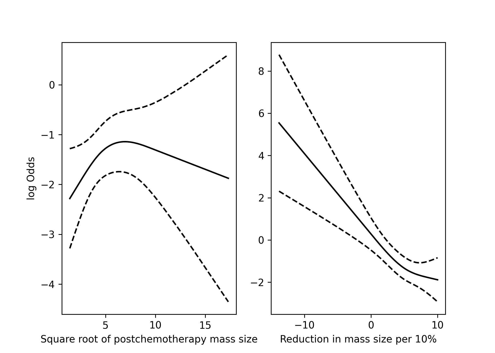
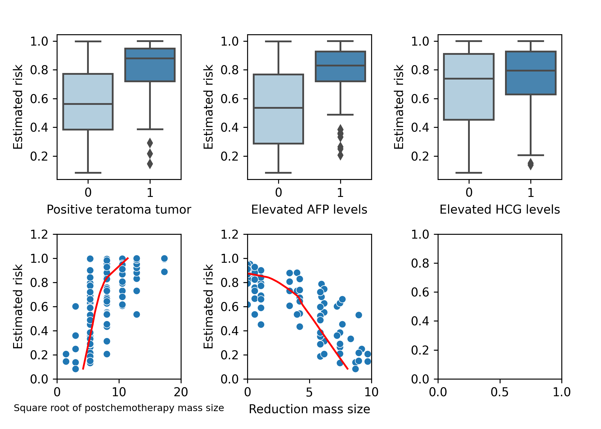

Development and validation of logistic regression risk prediction models
================

-   [Steps](#steps)
    -   [Installing and loading packages and import
        data](#installing-and-loading-packages-and-import-data)
    -   [Data description](#data-description)
        -   [Descriptive statistics](#descriptive-statistics)
-   [Goal 1 - Develop a logistic regression risk prediction
    model](#goal-1---develop-a-logistic-regression-risk-prediction-model)
    -   [1.1 Check non-linearity of continuous
        predictors](#11-check-non-linearity-of-continuous-predictors)
    -   [1.2 Examine the fit of the
        models](#12-examine-the-fit-of-the-models)
    -   [1.3 Plot of predictors vs estimated in the validation
        data](#13-plot-of-predictors-vs-estimated-in-the-validation-data)
-   [Goal 2 - Assessing performance of a logistic regression risk
    prediction
    model](#goal-2---assessing-performance-of-a-logistic-regression-risk-prediction-model)
    -   [2.1 Discrimination](#21-discrimination)

## Steps

The steps taken in this file are:  
1. To develop a logistic regression risk prediction model.  
2. To assess the performance of the model in terms of calibration,
discrimination and overall prediction error. We calculate the apparent,
internal (optimism-corrected) validation and the external validation.  
3. To assess the potential clinical utility the model using decision
curve analysis.

### Installing and loading packages and import data

The following libraries are used in this file, the code chunk below will
a) check whether you already have them installed, b) install them for
you if not already present, and c) load the packages into the session.

``` python
# Load libraries and data
import warnings
warnings.simplefilter(action = "ignore", category = FutureWarning)
warnings.filterwarnings("ignore", category = RuntimeWarning) # suppressing warnings
import pandas as pd
import numpy as np
import scipy as sp
import tableone as tb
import statsmodels.api as smf
import matplotlib.pyplot as plt
import sklearn as sk
import seaborn as sns


# Get work directory
# os.getcwd()
```

    ## C:\Users\DGIARD~1\AppData\Local\Programs\Python\PYTHON~1\lib\site-packages\seaborn\rcmod.py:82: DeprecationWarning: distutils Version classes are deprecated. Use packaging.version instead.
    ##   if LooseVersion(mpl.__version__) >= "3.0":
    ## C:\Users\DGIARD~1\AppData\Local\Programs\Python\PYTHON~1\lib\site-packages\setuptools\_distutils\version.py:351: DeprecationWarning: distutils Version classes are deprecated. Use packaging.version instead.
    ##   other = LooseVersion(other)

``` python
url_rdata = "https://raw.githubusercontent.com/danielegiardiello/ValLogRegMod/main/Data/rdata.csv"
url_vdata = "https://raw.githubusercontent.com/danielegiardiello/ValLogRegMod/main/Data/vdata.csv"
# NOTE: go to 
# "https://github.com/danielegiardiello/ValLogRegMod/blob/main/Data/vdata.csv"
# then click" Raw" button to the upper right corner of the file preview.
# Copy and paste the url link to have the raw gitHub version of the data
rdata = pd.read_csv(url_rdata)
vdata = pd.read_csv(url_vdata)
# Inspect data:
# print(rdata.head(5)) # print the first five rows
# print(vdata.head(5)) # print the first five rows
# rdata.info() # inspect data as in R str()
# vdata.info() # inspect data as in R str()

## Data manipulation ----
# Development data 
# Converting categorical variables to dummies
rdata = pd.get_dummies(data = rdata, 
                       columns = ["ter_pos", "preafp", "prehcg"])
# Dropping columns not needed
rdata.drop(["ter_pos_No", "preafp_No", "prehcg_No"], 
           axis = 1, inplace = True)

# Validation data 
vdata = pd.get_dummies(data = vdata, 
                       columns=["ter_pos", "preafp", "prehcg"])
# Dropping columns not needed
vdata.drop(["ter_pos_No", "preafp_No", "prehcg_No"],
            axis = 1,
            inplace = True)
```

### Data description

Men with metastatic non-seminomatous testicular cancer can often be
cured nowadays by cisplatin based chemotherapy. After chemotherapy,
surgical resection is a generally accepted treatment to remove remnants
of the initial metastases, since residual tumor may still be present. In
the absence of tumor, resection has no therapeutic benefits, while it is
associated with hospital admission, and risks of permanent morbidity and
mortality. Logistic regression models were developed to predict the
presence of residual tumor, combining well-known predictors, such as the
histology of the primary tumor, pre-chemotherapy levels of tumor
markers, and (reduction in) residual mass size.  
We first consider a data set (rdata) with 544 patients to develop a
prediction model that includes 5 predictors. We then extend this model
with the pre-chemotherapy level of the tumor marker lactate
dehydrogenase (LDH). This illustrates ways to assess the incremental
value of a marker. LDH values were log transformed, after standardizing
by dividing by the local upper levels of normal values, after
examination of non-linearity with restricted cubic spline functions.

We first consider a data set with 544 patients to develop a prediction
model that includes 5 predictors (rdata). In a later study, we
externally validated the 5 predictor model in 273 patients from a
tertiary referral center (vdata). We illustrate ways to assess the
usefulness of a model in a new setting.  
We then extend the developed model with the pre-chemotherapy level of
the tumor marker lactate dehydrogenase (LDH). Since the validation data
(vdata) did not have information about LDH, we assess the prediction
performances of the basic model in the development (rdata) and in the
validation data (vdata). Thus, we loaded the development data (rdata)
and the validation data (vdata).  
More details about development and validation data are provided in the
manuscript [“Assessing the performance of prediction models: a framework
for some traditional and novel
measures”](https://www.ncbi.nlm.nih.gov/pmc/articles/PMC3575184/) by
Steyerberg et al. (2010).

#### Descriptive statistics

    FALSE ╒══════════════════════════════════════════════════╤═════╤════════════════════╤═══════════════════╕
    FALSE │                                                  │     │ Development data   │ Validation data   │
    FALSE ╞══════════════════════════════════════════════════╪═════╪════════════════════╪═══════════════════╡
    FALSE │ n                                                │     │ 544                │ 273               │
    FALSE ├──────────────────────────────────────────────────┼─────┼────────────────────┼───────────────────┤
    FALSE │ Residual tumor resection, n (%)                  │ 0   │ 245 (45.0)         │ 76 (27.8)         │
    FALSE ├──────────────────────────────────────────────────┼─────┼────────────────────┼───────────────────┤
    FALSE │                                                  │ 1   │ 299 (55.0)         │ 197 (72.2)        │
    FALSE ├──────────────────────────────────────────────────┼─────┼────────────────────┼───────────────────┤
    FALSE │ Primary tumor teratoma positive, n (%)           │ No  │ 252 (46.3)         │ 104 (38.1)        │
    FALSE ├──────────────────────────────────────────────────┼─────┼────────────────────┼───────────────────┤
    FALSE │                                                  │ Yes │ 292 (53.7)         │ 169 (61.9)        │
    FALSE ├──────────────────────────────────────────────────┼─────┼────────────────────┼───────────────────┤
    FALSE │ Elevated prechemotherapy AFP, n (%)              │ No  │ 186 (34.2)         │ 68 (24.9)         │
    FALSE ├──────────────────────────────────────────────────┼─────┼────────────────────┼───────────────────┤
    FALSE │                                                  │ Yes │ 358 (65.8)         │ 205 (75.1)        │
    FALSE ├──────────────────────────────────────────────────┼─────┼────────────────────┼───────────────────┤
    FALSE │ Elevated Prechemotherapy HCG, n (%)              │ No  │ 205 (37.7)         │ 75 (27.5)         │
    FALSE ├──────────────────────────────────────────────────┼─────┼────────────────────┼───────────────────┤
    FALSE │                                                  │ Yes │ 339 (62.3)         │ 198 (72.5)        │
    FALSE ├──────────────────────────────────────────────────┼─────┼────────────────────┼───────────────────┤
    FALSE │ Square root of mass size, median [min,max]       │     │ 4.5 [1.4,17.3]     │ 8.0 [1.4,17.3]    │
    FALSE ├──────────────────────────────────────────────────┼─────┼────────────────────┼───────────────────┤
    FALSE │ Reduction in mass size per 10%, median [min,max] │     │ 5.2 [-13.8,10.0]   │ 1.1 [-15.0,9.7]   │
    FALSE ├──────────────────────────────────────────────────┼─────┼────────────────────┼───────────────────┤
    FALSE │ log(LDH), median [min,max]                       │     │ 0.3 [-1.1,2.8]     │ nan [nan,nan]     │
    FALSE ╘══════════════════════════════════════════════════╧═════╧════════════════════╧═══════════════════╛

## Goal 1 - Develop a logistic regression risk prediction model

### 1.1 Check non-linearity of continuous predictors

Here we investigate the potential non-linear relation between continuous
predictors and the outcomes. We apply three-knot restricted cubic
splines (details are given in e.g. Frank Harrell’s book ‘Regression
Model Strategies (second edition)’, page 27. We assess the potential
non-linearity graphically (plotting the two continuous predictors
against the log odds (XB or linear predictor) of both event types. Also,
we compare the models with and without splines based on the AIC.

<details>
<summary>
Click to expand code
</summary>

``` python
# Formula restricted cubic spline
# k = #knots
# X1 = X
# X_j+1 = (X - t_j)_+**3 - (X - t_k-1)_+**3 * (t_k - t_j) / (t_k - t_k-1)
# + (X - t_k)_+**3 (t_k-1 - t_j)((t_k - t_k-1))
# Models without splines

# Models with splines
# Create function to calculate restricted cubic splines with three knots
def rcs_3(x):
    res_x = np.zeros((len(rdata), 1))
    qknots = [.1, .5, .9]
    knots = np.quantile(x, q = qknots)
    res_x[:, 0] = (np.power(np.clip((x - knots[0]), a_min = 0, a_max = None), 3) - np.power(np.clip((x - knots[1]), a_min = 0, a_max = None), 3) *((knots[2] - knots[0])/(knots[2] - knots[1])) + np.power(np.clip((x - knots[2]), a_min = 0, a_max = None), 3) * ((knots[1] - knots[0])/(knots[2] - knots[1]))) / ((knots[2] - knots[0])**2)
    return(res_x)
# NOTE: to be extended for 4,5, 6 and 7 knots

# Add splines to data frame
rdata["sq_rcs1"] = rcs_3(rdata.sqpost)
rdata["reduc10_rcs1"] = rcs_3(rdata.reduc10)

# Predictors data with splines
X =  rdata[["ter_pos_Yes", "preafp_Yes", "prehcg_Yes", 
            "sqpost", "sq_rcs1", "reduc10", "reduc10_rcs1"]]
X = X.assign(intercept = 1.0)

# Predictors without splines
X2 =  rdata[["ter_pos_Yes", "preafp_Yes", "prehcg_Yes", 
            "sqpost", "reduc10"]]
X2 = X2.assign(intercept = 1.0)
 
# Fitting Generalised linear model on transformed dataset
fit_rcs = smf.GLM(rdata.tum_res, X,  family = smf.families.Binomial()).fit()
fit = smf.GLM(rdata.tum_res, X2, family = smf.families.Binomial()).fit()

# Save predictors of the validation model
coeff_rcs = fit_rcs.params
cov_rcs = X         

# Calculating the linear predictor (X*beta)
lp_rcs = np.matmul(cov_rcs, coeff_rcs)

# Non-lineary of sqpost adjusted for the other predictors
cov_rcs = cov_rcs.assign(ter_pos_Yes = 0,
                         preafp_Yes = 0,
                         prehcg_Yes = 0,
                         reduc10 = np.median(rdata.reduc10),
                         reduc10_rcs1 = np.median(rdata.reduc10_rcs1))


# Calculating the lp of sqpost adjusted for the other predictors
lp_rcs_sq = np.matmul(cov_rcs, coeff_rcs)

# Calculating standard errors
vcov = fit_rcs.cov_params()

# Matrix X *%* vcov *%* t(X) (sqrt of the diagonal)
std_err = np.power(np.diagonal(cov_rcs.dot(vcov).dot(pd.DataFrame.transpose((cov_rcs)))), 1/2)

# Save to df
alpha = 0.05
df_rcs_sq = pd.DataFrame(
  {"sq" : rdata.sqpost,
   "lp_rcs_sq" : lp_rcs_sq,
   "std_err" : std_err,
   'lower_95' :  lp_rcs_sq - sp.stats.norm.ppf(1 - alpha / 2) * std_err,
   'upper_95' : lp_rcs_sq + sp.stats.norm.ppf(1 - alpha / 2) * std_err}
)

# Sorting by sqpost
df_rcs_sq = df_rcs_sq.sort_values(by = ['sq']) # sort
# df_rcs = pd.Series({c: df_rcs[c].unique() for c in df_rcs}) # unique values

# Non-lineary assessment of reduc10 adjusted for the other covariates
cov_rcs = cov_rcs.assign(ter_pos_Yes = 0,
                         preafp_Yes = 0,
                         prehcg_Yes = 0,
                         sqpost = np.median(rdata.sqpost),
                         sq_rcs1 = np.median(rdata.sq_rcs1),
                         reduc10 = rdata.reduc10,
                         reduc10_rcs1 = rdata.reduc10_rcs1)

lp_rcs_reduc10 = np.matmul(cov_rcs, coeff_rcs)

# Matrix X *%* vcov *%* t(X) (sqrt of the diagonal)
std_err = np.power(np.diagonal(cov_rcs.dot(vcov).dot(pd.DataFrame.transpose((cov_rcs)))), 1/2)

# Save to df
alpha = 0.05
df_rcs_rd = pd.DataFrame(
  {"reduc10" : rdata.reduc10,
   "lp_rcs_reduc10" : lp_rcs_reduc10,
   "std_err" : std_err,
   'lower_95' :  lp_rcs_reduc10 - sp.stats.norm.ppf(1 - alpha / 2) * std_err,
   'upper_95' : lp_rcs_reduc10 + sp.stats.norm.ppf(1 - alpha / 2) * std_err}
)

df_rcs_rd = df_rcs_rd.sort_values(by = ['reduc10']) # sort

# Plotting
fig, (ax1, ax2) = plt.subplots(1, 2)

# First plot - predictor: sq ---
ax1.plot(df_rcs_sq.sq, df_rcs_sq.lp_rcs_sq, "-", 
         color = "black")
ax1.plot(df_rcs_sq.sq, df_rcs_sq.lower_95, "--", 
         color = "black")
ax1.plot(df_rcs_sq.sq, df_rcs_sq.upper_95, "--", 
         color = "black")
plt.setp(ax1, xlabel = 'Square root of postchemotherapy mass size')
plt.setp(ax1, ylabel = 'log Odds')

# Second plot - predictor: reduc10 ---
ax2.plot(df_rcs_rd.reduc10, df_rcs_rd.lp_rcs_reduc10, "-", 
         color = "black")
ax2.plot(df_rcs_rd.reduc10, df_rcs_rd.lower_95, "--", 
         color = "black")
ax2.plot(df_rcs_rd.reduc10, df_rcs_rd.upper_95, "--", 
         color = "black")
plt.setp(ax2, xlabel = 'Reduction in mass size per 10%')
plt.show()
plt.clf()
plt.cla()
plt.close('all')
```

</details>



    ## |    |   AIC without splines |   AIC with splines |
    ## |---:|----------------------:|-------------------:|
    ## |  0 |               573.871 |             574.55 |

Both the graphical comparison and the AIC comparison suggested no
relevant departure from linear relations between the continuous
predictors (square root of post-chemotherapy mass size and reduction in
mass size) and the risk of residual tumor at post-chemotherapy
resection.

### 1.2 Examine the fit of the models

-   Logistic regression risk prediction model without LDH

<!-- -->

    ## <class 'statsmodels.iolib.summary.Summary'>
    ## """
    ##                  Generalized Linear Model Regression Results                  
    ## ==============================================================================
    ## Dep. Variable:                tum_res   No. Observations:                  544
    ## Model:                            GLM   Df Residuals:                      538
    ## Model Family:                Binomial   Df Model:                            5
    ## Link Function:                  Logit   Scale:                          1.0000
    ## Method:                          IRLS   Log-Likelihood:                -280.94
    ## Date:                Wed, 04 May 2022   Deviance:                       561.87
    ## Time:                        17:39:35   Pearson chi2:                     520.
    ## No. Iterations:                     5   Pseudo R-squ. (CS):             0.2908
    ## Covariance Type:            nonrobust                                         
    ## ===============================================================================
    ##                   coef    std err          z      P>|z|      [0.025      0.975]
    ## -------------------------------------------------------------------------------
    ## intercept      -0.3016      0.549     -0.550      0.583      -1.377       0.774
    ## ter_pos_Yes     0.9955      0.208      4.782      0.000       0.587       1.403
    ## preafp_Yes      0.8592      0.228      3.766      0.000       0.412       1.306
    ## prehcg_Yes      0.5541      0.219      2.531      0.011       0.125       0.983
    ## sqpost          0.0737      0.066      1.120      0.263      -0.055       0.203
    ## reduc10        -0.2644      0.049     -5.346      0.000      -0.361      -0.167
    ## ===============================================================================
    ## """

-   Logistic regression risk prediction model with LDH

<!-- -->

    ## <class 'statsmodels.iolib.summary.Summary'>
    ## """
    ##                  Generalized Linear Model Regression Results                  
    ## ==============================================================================
    ## Dep. Variable:                tum_res   No. Observations:                  544
    ## Model:                            GLM   Df Residuals:                      537
    ## Model Family:                Binomial   Df Model:                            6
    ## Link Function:                  Logit   Scale:                          1.0000
    ## Method:                          IRLS   Log-Likelihood:                -268.61
    ## Date:                Wed, 04 May 2022   Deviance:                       537.21
    ## Time:                        17:39:37   Pearson chi2:                     546.
    ## No. Iterations:                     5   Pseudo R-squ. (CS):             0.3222
    ## Covariance Type:            nonrobust                                         
    ## ===============================================================================
    ##                   coef    std err          z      P>|z|      [0.025      0.975]
    ## -------------------------------------------------------------------------------
    ## intercept      -1.5521      0.602     -2.578      0.010      -2.732      -0.372
    ## ter_pos_Yes     0.9094      0.214      4.250      0.000       0.490       1.329
    ## preafp_Yes      0.9025      0.233      3.868      0.000       0.445       1.360
    ## prehcg_Yes      0.7827      0.230      3.396      0.001       0.331       1.234
    ## sqpost          0.2915      0.081      3.578      0.000       0.132       0.451
    ## reduc10        -0.1576      0.052     -3.038      0.002      -0.259      -0.056
    ## lnldhst        -0.9854      0.209     -4.717      0.000      -1.395      -0.576
    ## ===============================================================================
    ## """

The coefficients of the models indicated that positive tumor teratoma,
elevated prechemoterapy AFP levels, elevated prechemoterapy HCG levels,
postchemotherapy mass size (mm) (expressed in square root) are
associated with higher risk to residual tumor after resection. Reduction
in mass size is associated with a reduced risk to have residual tumor
after resection.

### 1.3 Plot of predictors vs estimated in the validation data

To get further insight into the effect of the covariates, we plot the
covariate values observed in the validation set against the estimated
absolute risk of having residual tumor after resection. This gives an
idea of the size of the effects.

<details>
<summary>
Click to expand code
</summary>

``` python
# Models -------------
X =  rdata[["ter_pos_Yes", "preafp_Yes", "prehcg_Yes", "sqpost", "reduc10"]]
X = X.assign(intercept = 1.0)

fit_lrm = smf.GLM(rdata.tum_res, X, family = smf.families.Binomial()).fit()

# Predictors - validation data                
X_val =  vdata[["ter_pos_Yes", "preafp_Yes", "prehcg_Yes", "sqpost", "reduc10"]]
X_val = X_val.assign(intercept = 1.0)

# Predicted probabilities estimated by the model in the validation data
vdata = vdata.assign(pred = fit_lrm.predict(X_val))

fig, (ax1, ax2) = plt.subplots(nrows = 2, ncols = 3)
fig.tight_layout(pad = 2.5) 
# Or:
# subplots_adjust(left = None, bottom = None, right = None, top = None, 
#                 wspace = None, hspace=None) # to modify margins
#

# Positive teratoma tumor
sns.boxplot(x = "ter_pos_Yes", y = "pred", 
            data = vdata, palette = "Blues", ax = ax1[0]).set(
      xlabel = "Positive teratoma tumor",
      ylabel = "Estimated risk"
            )
            
## Elevated AFP levels           
sns.boxplot(x = "preafp_Yes",
            y = "pred",
            data = vdata, palette = "Blues", ax = ax1[1]).set(
              xlabel = "Elevated AFP levels",
              ylabel = "Estimated risk"
            )
            
# Elevated HCG
sns.boxplot(x = "prehcg_Yes",
            y = "pred",
            data = vdata, palette = "Blues", ax = ax1[2]).set(
              xlabel = "Elevated HCG levels",
              ylabel = "Estimated risk"
)
            
# Square root of postchemotherapy mass size
# Perform lowess
lowess = smf.nonparametric.lowess
fit_lowess = lowess(vdata.sqpost,
                    vdata.pred,
                    frac = 2/3,
                    it = 0) # same f and iter parameters as R
sns.scatterplot(x = "sqpost",
                y = "pred",
                data = vdata, ax = ax2[0])
ax2[0].set_xlim(0, 20)
ax2[0].set_ylim(0, 1.2)
ax2[0].set_xlabel("Square root of postchemotherapy mass size", fontsize = 8)
ax2[0].set_ylabel("Estimated risk")
ax2[0].plot(fit_lowess[:, 1], fit_lowess[:, 0], "-", color = "red")

           
# Reduction mass size
# Perform lowess
lowess = smf.nonparametric.lowess
fit_lowess = lowess(vdata.reduc10,
                    vdata.pred, 
                    frac = 2/3,
                    it = 0) # same f and iter parameters as R
sns.scatterplot(x = "reduc10",
                y = "pred",
                data = vdata, ax = ax2[1]).set(
                  xlabel = "Reduction mass size",
                  ylabel = "Estimated risk"
)
ax2[1].set_xlim(0, 10)
ax2[1].set_ylim(0, 1.2)
ax2[1].plot(fit_lowess[:, 1], fit_lowess[:, 0], "-", color = "red")
plt.show()
plt.clf()
plt.cla()
plt.close('all')
```

</details>

    ## (0.0, 20.0)

    ## (0.0, 1.2)

    ## (0.0, 10.0)

    ## (0.0, 1.2)



## Goal 2 - Assessing performance of a logistic regression risk prediction model

Here we evaluate the performance of the prediction model in terms of
discrimination, calibration and overall prediction error. We assess the
prediction performance of the developed model not including LDH
internally and in an external data.

### 2.1 Discrimination

We here calculate:

-   The c-statistic: it is a rank order statistic for predictions
    against true outcomes. The concordance (c) statistic is the most
    commonly used performance measure to indicate the discriminative
    ability of generalized linear regression models. For a binary
    outcome, c is identical to the area under the Receiver Operating
    Characteristic (ROC) curve, which plots the sensitivity (true
    positive rate) against 1 – (false positive rate) for consecutive
    cutoffs for the probability of an outcome. Accurate predictions
    discriminate between those with and those without the outcome.

-   Discrimination slope: it can be used as a simple measure for how
    well subjects with and without the outcome are separated. It is
    calculated as the absolute difference in average predictions for
    those with and without the outcome. Visualization is readily
    possible with a box plot or a histogram, which will show less
    overlap between those with and those without the outcome for a
    better discriminating model.

More details are in [“Assessing the performance of prediction models: a
framework for some traditional and novel
measures”](https://www.ncbi.nlm.nih.gov/pmc/articles/PMC3575184/) by
Steyerberg et al. (2010);
